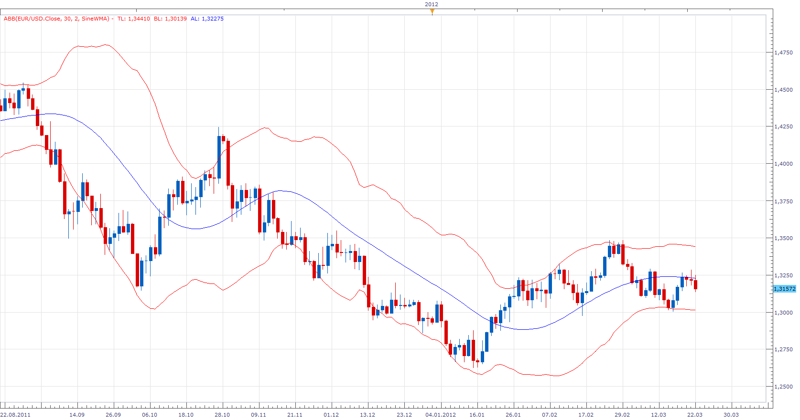

# Averages Bollinger Band

> Source: https://fxcodebase.com/code/viewtopic.php?f=17&t=15030  
> Forum: 17 · Topic 15030 · 13 post(s)

---

## Averages Bollinger Band

**Apprentice** · Thu Mar 22, 2012 6:02 am

Standard Bollinger Band uses SMA a.k.a. MVA for smoothing.
This version uses Averages indicator, which gives you a great variety of methods.

 [ABB.lua](files/28465/ABB.lua)

To work install 20 in 1 Moving Average Indicator a.k.a. Averages
[viewtopic.php?f=17&t=2430](https://fxcodebase.com/code/viewtopic.php?f=17&t=2430)

---

## Re: Averages Bollinger Band

**Hailkayy** · Thu Mar 22, 2012 9:10 am

Nice App
Hailkay.
(Check e-mail soon;-)

---

## Re: Averages Bollinger Band

**Saree2015** · Sun Nov 22, 2015 9:56 am

is there a MetaTrader 4 version of this indicator?

---

## Re: Averages Bollinger Band

**Apprentice** · Tue Nov 24, 2015 4:19 am

Unfortunately no.
Averages is not available for MT4.

---

## Re: Averages Bollinger Band

**DanPhi74** · Mon May 09, 2016 11:39 am

Hi Apprentice,
could you add the CMA2 to the list of "averages" in ABB ?

Best regards
Daniel

---

## Re: Averages Bollinger Band

**Apprentice** · Tue May 10, 2016 3:20 am

Your request is added development list.

---

## Re: Averages Bollinger Band

**DanPhi74** · Fri Sep 01, 2017 11:18 am

Hi Apprentice,
Please, could you add the CMA2 to the ABB list ?

Best regards
Daniel

---

## Re: Averages Bollinger Band

**Apprentice** · Sat Sep 02, 2017 4:41 am

Can you provide CMA2 web reference?

---

## Re: Averages Bollinger Band

**DanPhi74** · Thu Sep 07, 2017 4:39 am

Apprentice,
[viewtopic.php?f=27&t=24441&p=42111&hilit=cma2#p42111](http://www.fxcodebase.com/code/viewtopic.php?f=27&t=24441&p=42111&hilit=cma2#p42111)

best regards
Daniel

---

## Re: Averages Bollinger Band

**Apprentice** · Thu Sep 07, 2017 3:36 pm

Your request is added to the development list, Under Id Number 3885
 If someone is interested to do this task, please contact me.

---

## Re: Averages Bollinger Band

**Apprentice** · Tue Sep 12, 2017 4:03 am

[ABB.lua](files/114811/ABB.lua)

 [Averages.lua](files/114811/Averages.lua)

Try this version.

---

## Re: Averages Bollinger Band

**DanPhi74** · Wed Sep 20, 2017 8:23 am

Thanks !

---

## Re: Averages Bollinger Band

**Apprentice** · Sat Sep 08, 2018 10:14 am

The Indicator was revised and updated.
