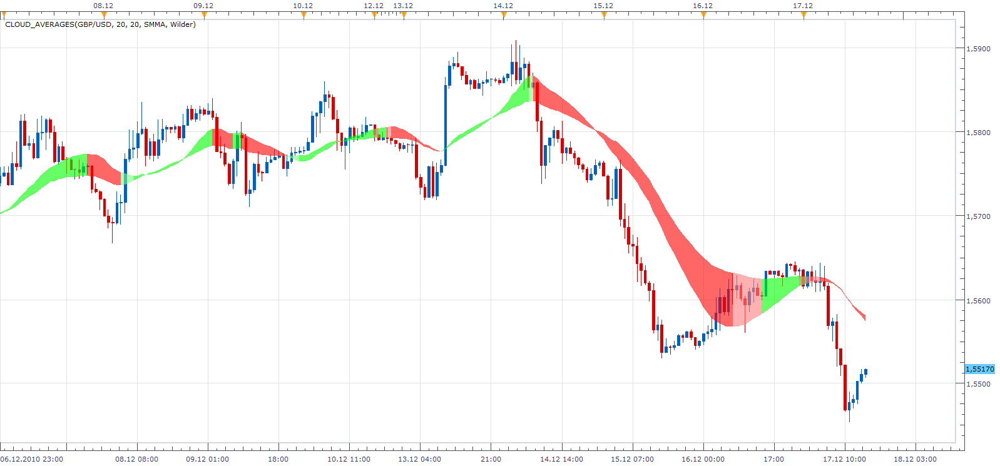

# Averages Cloud

> Source: https://fxcodebase.com/code/viewtopic.php?f=17&t=2982  
> Forum: 17 · Topic 2982 · 9 post(s)

---

## Averages Cloud

**Apprentice** · Sat Dec 18, 2010 12:52 pm

The relationship between moving average determines the color of the clouds.
We distinguish 4 cases.
Short & Long Growing
Growing Short & Long Falling
Falling Short & Long Growing
Short & Long Falling

 [Cloud_Averages.lua](files/6852/Cloud_Averages.lua)

To work install 20 in 1 Moving Average Indicator a.k.a. Averages
[viewtopic.php?f=17&t=2430](https://fxcodebase.com/code/viewtopic.php?f=17&t=2430)

The indicator was revised and updated

---

## Re: Averages Cloud

**Apprentice** · Mon Dec 20, 2010 5:55 am

Update

---

## Re: Averages Cloud

**luigifx** · Wed Jun 22, 2011 9:42 pm

Very nice work Apprentice ! Is it possible to have it on multitimeframe , with longer timeframe more transparent than short timeframe?
Thanks

---

## Re: Averages Cloud

**carlhans** · Thu Jun 23, 2011 4:48 am

Hi, any chance that averages cloud working with build in averages in TSII.?I like the charting very much at the moment....
regards,
carl

---

## Re: Averages Cloud

**Apprentice** · Thu Jun 23, 2011 6:34 am

 [BTF Averages Cloud.lua](files/11983/BTF%20Averages%20Cloud.lua)

---

## Re: Averages Cloud

**luigifx** · Thu Jun 23, 2011 4:44 pm

wow so fast !! Thanks a lot Apprentice it is perfect for me

---

## Re: Averages Cloud

**jsi@jp** · Tue Aug 09, 2011 5:30 am

Thank you very much for this indicator.

The "BF Averages" and the "BTF Averages cloud" are different.
Can the position of the "BTF Averages cloud" be corrected?

---

## Re: Averages Cloud

**alex2011uk** · Tue Jun 26, 2012 7:26 am

Hey! I simply need to color tha area between 2 moving avarage, in relationship of the fast MA crossing the slow MA.
Do u know anything who can help?
thanks
ALex

---

## Re: Averages Cloud

**Apprentice** · Tue Apr 11, 2017 5:14 am

Indicator was revised and updated.
