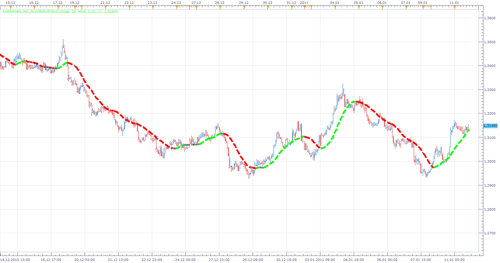
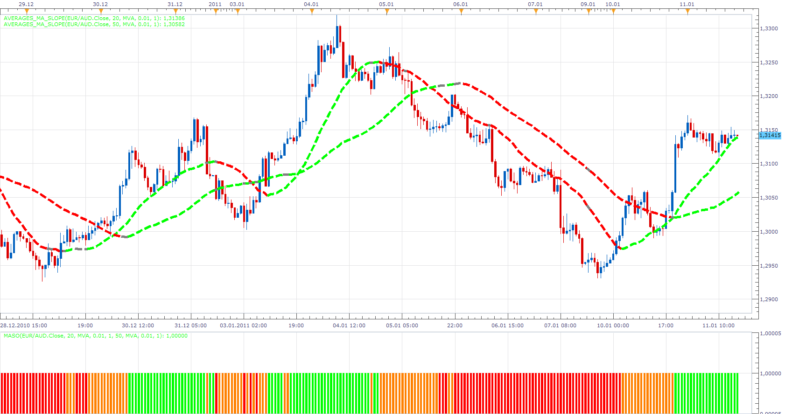

# Averages MA Slope

> Source: https://fxcodebase.com/code/viewtopic.php?f=17&t=3145  
> Forum: 17 · Topic 3145 · 5 post(s)

---

## Averages MA Slope

**Apprentice** · Tue Jan 11, 2011 2:57 pm

MA indicator that changes color according to a pre-selected level of SLOPE (pips per minute).

 [Averages_MA_Slope.lua](files/7375/Averages_MA_Slope.lua)

To work install 20 in 1 Moving Average Indicator a.k.a. Averages
[viewtopic.php?f=17&t=2430](https://fxcodebase.com/code/viewtopic.php?f=17&t=2430)

---

## Re: Averages MA Slope

**Apprentice** · Tue Jan 11, 2011 4:00 pm

Averages MA Slope Oscilator give a summary indication of the two Averages MA Slope Indicator.

 [Averages_MASO.lua](files/7376/Averages_MASO.lua)

To work install 20 in 1 Moving Average Indicator a.k.a. Averages
[viewtopic.php?f=17&t=2430](https://fxcodebase.com/code/viewtopic.php?f=17&t=2430)

---

## Re: Averages MA Slope

**laners303** · Tue Jan 11, 2011 8:38 pm

Hey Apprentice,

I downloaded this indicator and the averages indicator also, but when I apply the indicator to the chart it stays neutral. Do you know why?

Thanks,
Laners303

---

## Re: Averages MA Slope

**Apprentice** · Wed Jan 12, 2011 2:58 am

Set Slope to 0.01 or other lower value.
Or increase Bars period.

This should help.
I used the original values.
I'll probably change this option.

---

## Re: Averages MA Slope

**Apprentice** · Mon Feb 05, 2018 9:53 am

The Indicator was revised and updated.
