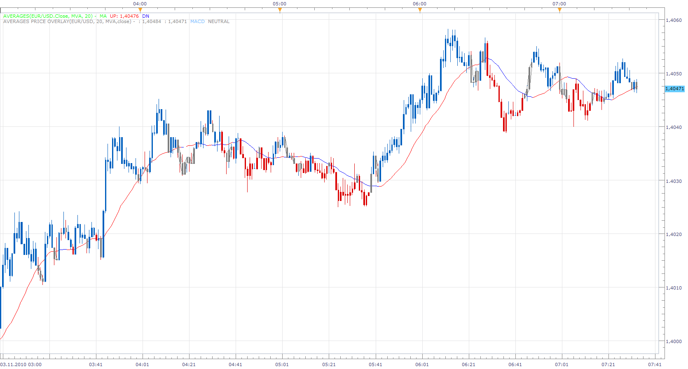
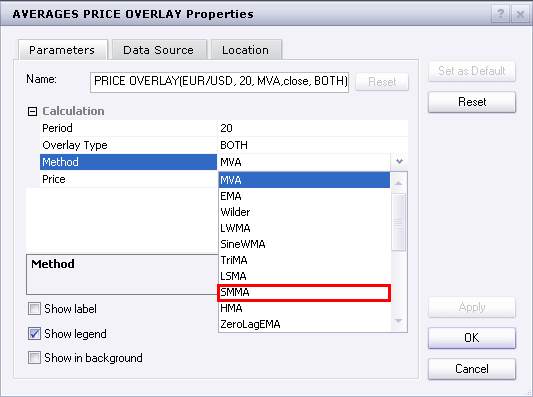
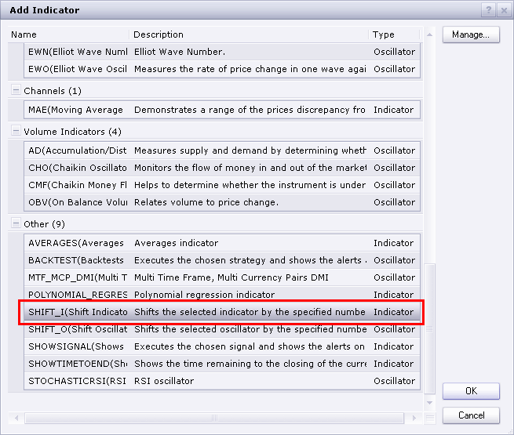
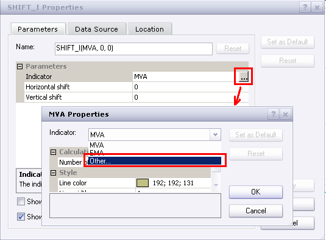
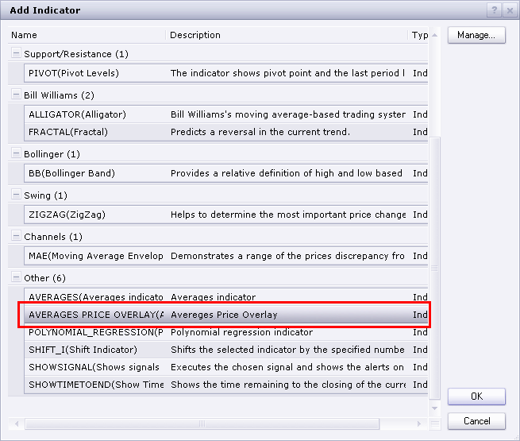
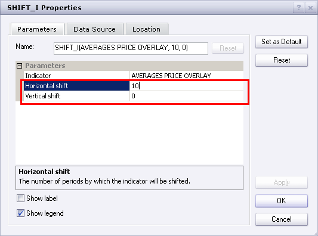
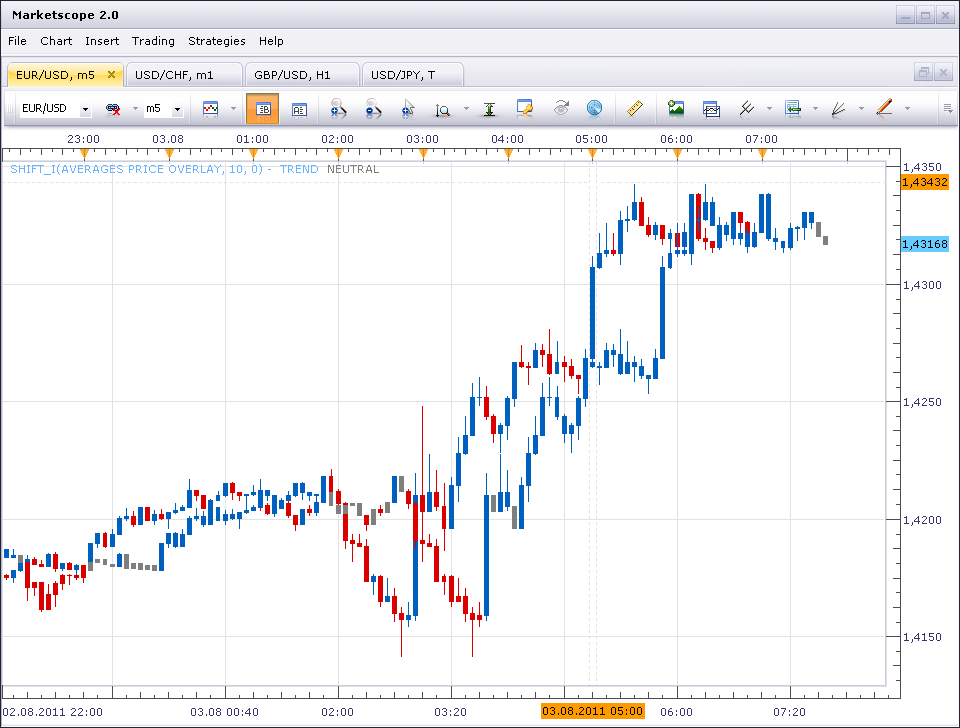

# Averages Price Overlay

> Source: https://fxcodebase.com/code/viewtopic.php?f=17&t=2583  
> Forum: 17 · Topic 2583 · 12 post(s)

---

## Averages Price Overlay

**Apprentice** · Wed Nov 03, 2010 6:41 am

Price Overlay offers three modes of operation.

Price
Indicates whether the closing is below or above the moving average.
MA
Indicates whether MA is falling or rising.
Both.
Both, the previous modes, must agree.

 [Averages Price Overlay.lua](files/5777/Averages%20Price%20Overlay.lua)

To work install:
 Moving Average Indicator: 20 in 1: [viewtopic.php?f=17&t=2430](https://fxcodebase.com/code/viewtopic.php?f=17&t=2430)

---

## Re: AVEREGES Price Overlay

**sedraude** · Wed Nov 03, 2010 8:15 am

Hi Apprentice,

Good work and very fast respon... great indi. But for another method not work, display message like this:

Thank in advance

---

## Re: AVEREGES Price Overlay

**Apprentice** · Wed Nov 03, 2010 8:56 am

Sorry, the inconvenience, it seems that I uploaded the wrong , in development, version.

---

## Re: Averages Price Overlay

**Byron8848** · Tue Aug 02, 2011 10:29 am

is there display moving average overlay of SMMA ?

---

## Re: Averages Price Overlay

**sunshine** · Wed Aug 03, 2011 4:16 am

You can choose the SMMA method in the indicator properties:

 

---

## Re: Averages Price Overlay

**Byron8848** · Wed Aug 03, 2011 4:30 am

Not overlay the SMMA
overlay the SMMA that shift to right N preiod
Overlay the DMA

---

## Re: Averages Price Overlay

**sunshine** · Wed Aug 03, 2011 6:00 am

You can shift the indicator in the following way:

1. Open the **Add Indicator** dialog, and select Shift_I:

 

2. Click OK.
3. In the appeared dialog, click in the indicator field and then click the appeared button. In the appeared indicator properties window choose **Other** in the indicator box.

 

4. The indicators list will appear. Select the Average Price Overlay and then click OK:

 

5. In the properties of Shift indicator, specify Horizontal/Vertical Shift:

 

6. Click OK.
As the result you'll get the shifted overlay:

 

I hope this will help.

---

## Re: Averages Price Overlay

**Byron8848** · Wed Aug 03, 2011 8:30 am

Well thanks for your reply
But you are not understand my request
Just like if I want to overlay a allgator how to set this indicators
I not want displace the overlayed indicator but i want overlay a displaced indicators
Sorry for my poor English

---

## Re: Averages Price Overlay

**Jeffreyvnlk** · Wed Jul 10, 2013 1:03 am

May I just have the first 2 bars painted when the price start being above the moving average, not all following ones ?

---

## Re: Averages Price Overlay

**Apprentice** · Wed Jul 10, 2013 6:26 am

Your request is added to the development list.

---

## Re: Averages Price Overlay

**Apprentice** · Mon Jul 13, 2015 4:13 am

Bump Up.

---

## Re: Averages Price Overlay

**Apprentice** · Mon Oct 29, 2018 7:05 am

The indicator was revised and updated.
