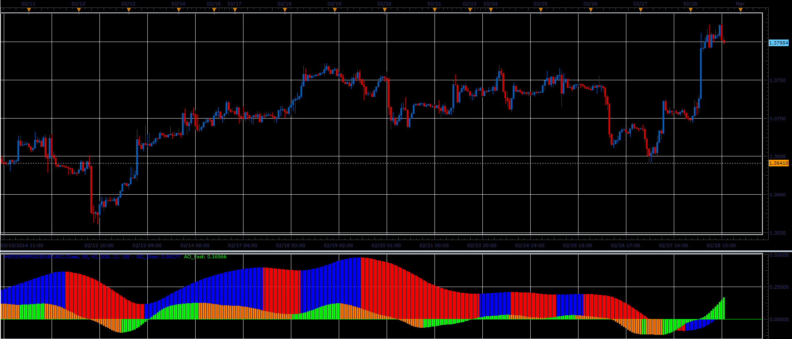

# Awesome Modified

> Source: https://fxcodebase.com/code/viewtopic.php?f=17&t=60389  
> Forum: 17 · Topic 60389 · 5 post(s)

---

## Awesome Modified

**Alexander.Gettinger** · Mon Mar 03, 2014 9:53 am

This indicator is a ported MQL5 indicator from [http://www.mql5.com/en/code/2134](http://www.mql5.com/en/code/2134).

Formulas:
AO_Fast = MVA(100*(Short_EMA/Medium_EMA-1), AO_Fast_Period),
AO_Slow = MVA(100*(Medium_EMA/Long_EMA-1), AO_Slow_Period).

 

Download:

 [AwesomeMod.lua](files/92989/AwesomeMod.lua)

 

If both Fast and Slow values are greater than Zero Line, Green Arrow up
If both Fast and Slow values are less than Zero Line, Red Arrow down

 [MTF MCP Awesome Modified List.lua](files/92989/MTF%20MCP%20Awesome%20Modified%20List.lua)

---

## Re: Awesome Modified

**Alexander.Gettinger** · Mon Mar 03, 2014 9:55 am

MQL4 version of Awesome Modified oscillator: [viewtopic.php?f=38&t=60390](https://fxcodebase.com/code/viewtopic.php?f=38&t=60390).

---

## Re: Awesome Modified

**Coondawg71** · Tue Apr 28, 2015 10:19 am

Can we please request additional versions to this indicator:

1. ) Can we please request Alert functions added to this indicator. Alerts would be triggered upon both the Fast and the Slow oscillator values being of positive or negative value.

Buy: Fast and Slow value greater than Zero Line.
Sell: Fast and Slow value greater than Zero Line.

2.) Can we please request MTF MCP Awesome Modified List:
Arrow per time frame indicating trend for Awesome Modified value,
If both Fast and Slow values are greater than Zero Line, Green Arrow up
If both Fast and Slow values are less than Zero Line, Red Arrow down
If conflicting values, grey.

Thanks!!!

sjc

---

## Re: Awesome Modified

**Apprentice** · Thu Apr 30, 2015 2:14 pm

MTF MCP Awesome Modified List Added.

---

## Re: Awesome Modified

**Apprentice** · Fri Jun 29, 2018 7:01 am

The indicator was revised and updated.
