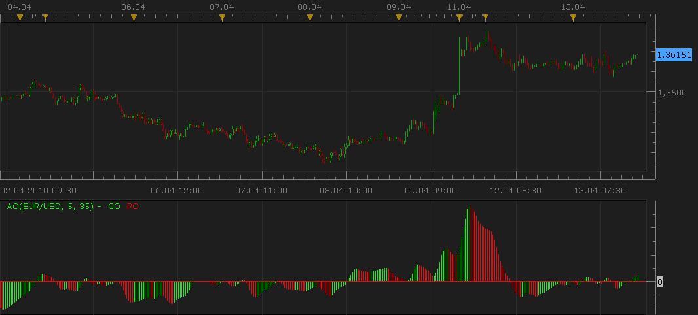
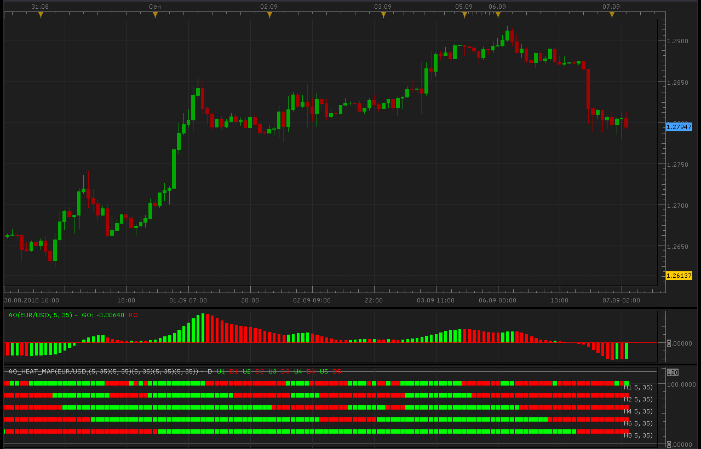

# Awesome Oscillator (AO) (Last upd: Apr, 13 2010)

> Source: https://fxcodebase.com/code/viewtopic.php?f=17&t=19  
> Forum: 17 · Topic 19 · 14 post(s)

---

## Awesome Oscillator (AO) (Last upd: Apr, 13 2010)

**admin** · Tue Oct 20, 2009 2:56 pm

**DESCRIPTION:**

Awesome Oscillator (AO) is the difference between the 34 period and 5 period simple moving averages of the candle’s/ bar’s middle points. Basically: (High+Low) / 2.

AO Indicator calculates and determines market momentum at a given time when comparing the last five bars to last thirty four bars.

Awesome Oscillator (AO) is displayed on the chart as a histogram. Awesome Oscillator can present us with three buy signals and also three sell signals, but its not recommended to use them until the first fractal buy or sell signal is triggered outside the Alligator's mouth.

**CALCULATION:**

MEDIAN = (HIGH+LOW)/2
AO = MVA(MEDIAN, 5) - MVA(MEDIAN, 34)

**SCREENSHOT:**

 



Download indicator (New version):

 [AO.lua](files/20/AO.lua)

Apr, 13 2010, ng:
In the new version of the indicator:
1) By default the covering line is not shown. An additional parameter is added to show the covering line (It may be useful for applying indicator on the AO results or for using the indicators
in another indicator).

2) In case the bar has the same size as the previous bar, the bar will have the same color (in the previous version the equal bar was always green).

```lua
function Init()
    indicator:name("Awesome Oscillator");
    indicator:description("");
    indicator:requiredSource(core.Bar);
    indicator:type(core.Oscillator);

    indicator.parameters:addInteger("FM", "Fast Moving Average", "The number of periods to calculate the fast moving average of the median price", 5, 2, 10000);
    indicator.parameters:addInteger("SM", "Slow Moving Average", "The number of periods to calculate the slow moving average of the median price", 35, 2, 10000);
    indicator.parameters:addBoolean("SC", "Show the covering line", "Shows line trough the tops of bars", false);
    indicator.parameters:addColor("CL_color", "Color for covering line", "Color for covering line", core.rgb(255, 255, 255));
    indicator.parameters:addColor("GO_color", "Color for higher bars", "Color for higher bars", core.rgb(0, 255, 0));
    indicator.parameters:addColor("RO_color", "Color for lower bars", "Color for lower bars", core.rgb(255, 0, 0));
end

local FM;
local SM;
local SC;

local first;
local source = nil;

-- Streams block
local CL = nil;
local GO = nil;
local RO = nil;

local MEDIAN = nil;
local FMVA = nil;
local SMVA = nil;

function Prepare()
    FM = instance.parameters.FM;
    SM = instance.parameters.SM;
    SC = instance.parameters.SC;

    assert(FM < SM, "Fast moving average parameter must be less than slow moving average");

    source = instance.source;
    first = source:first() + SM;

    -- Create the median stream
    MEDIAN = instance:addInternalStream(0, 0);
    FMVA = core.indicators:create("MVA", MEDIAN, FM);
    SMVA = core.indicators:create("MVA", MEDIAN, SM);

    local name = profile:id() .. "(" .. source:name() .. ", " .. FM .. ", " .. SM .. ")";
    instance:name(name);
    if SC then
        CL = instance:addStream("AO", core.Line, name .. ".AO", "AO", instance.parameters.CL_color, first);
    else
        CL = instance:addInternalStream(first, 0);
    end
    GO = instance:addStream("GO", core.Bar, name .. ".GO", "GO", instance.parameters.GO_color, first);
    RO = instance:addStream("RO", core.Bar, name .. ".RO", "RO", instance.parameters.RO_color, first);
    if SC then
        CL:addLevel(0);
    else
        GO:addLevel(0);
    end
end

function Update(period, mode)
    MEDIAN[period] = (source.high[period] + source.low[period]) / 2;
    FMVA:update(mode);
    SMVA:update(mode);

    if (period >= first) then
        CL[period] = FMVA.DATA[period] - SMVA.DATA[period];
    end
    if (period >= first + 1) then
        if (CL[period] > CL[period - 1]) then
            GO[period] = CL[period];
        elseif (CL[period] < CL[period - 1]) then
            RO[period] = CL[period];
        elseif GO[period - 1] > 0 then
            GO[period] = CL[period];
        else
            RO[period] = CL[period];
        end
    end
end
```

Old version:

Tags: Awesome, indicator, Marketscope, Trading Station, FXCM, dbFX

---

## Re: Awesome Oscillator (AO) (Last upd: Apr, 13 2010)

**Nikolay.Gekht** · Tue Apr 13, 2010 4:48 pm

Updated.

---

## Re: Awesome Oscillator (AO) (Last upd: Apr, 13 2010)

**zekelogan** · Thu May 27, 2010 11:08 pm

Can this be made into a signal? Personally, I'm interested in zero-line crossing, but any other parameters are welcome.

Thanks!

---

## Re: Awesome Oscillator (AO) (Last upd: Apr, 13 2010)

**Foothills Trader** · Mon May 31, 2010 11:08 am

I, too, would be very interested in either this indicator or the Elliott Wave Oscillator (EWO) as a signal, with the zero line cross (i.e., red to green or vice versa).

---

## Re: Awesome Oscillator (AO) (Last upd: Apr, 13 2010)

**Apprentice** · Mon May 31, 2010 11:56 am

AO signal can be found
[http://fxcodebase.com/code/viewtopic.php?f=29&t=1224#p2320](https://fxcodebase.com/code/viewtopic.php?f=29&t=1224#p2320)

---

## Re: Awesome Oscillator (AO) (Last upd: Apr, 13 2010)

**Alexander.Gettinger** · Tue Sep 07, 2010 2:29 am

AO multi-timeframe heat map.

 



```lua
-- Adds AO parameter
function AddMvaParam(id, frame, FM, SM, level)
    indicator.parameters:addString("B" .. id, "Time frame for avegage " .. id, "", frame);
    indicator.parameters:setFlag("B" .. id, core.FLAG_PERIODS);
    indicator.parameters:addInteger("FM" .. id, "Fast Moving Average " .. id .. " parameter", "", FM);
    indicator.parameters:addInteger("SM" .. id, "Slow Moving Average " .. id .. " parameter", "", SM);
    indicator.parameters:addDouble("Level" .. id, "Level value " .. id .. " parameter", "", level);
end

function Init()
    indicator:name("Multitimeframe AO Heat Map");
    indicator:description("");
    indicator:requiredSource(core.Bar);
    indicator:type(core.Oscillator);

    indicator.parameters:addGroup("Calculation");
    AddMvaParam(1, "H1", 5, 35, 0.);
    AddMvaParam(2, "H2", 5, 35, 0.);
    AddMvaParam(3, "H4", 5, 35, 0.);
    AddMvaParam(4, "H6", 5, 35, 0.);
    AddMvaParam(5, "H8", 5, 35, 0.);
    indicator.parameters:addGroup("Display");
    indicator.parameters:addColor("clrUP", "Up color 1", "", core.rgb(0, 255, 0));
    indicator.parameters:addColor("clrDN", "Down color 1", "", core.rgb(255, 0, 0));
    indicator.parameters:addColor("clrLBL", "Label color", "", core.COLOR_LABEL);
end

-- list of streams
local streams = {}
-- the indicator source
local source;
local day_offset, week_offset;
local dummy;
local host;
local U = {};
local D = {};
local L = {};
local AO = nil;

function Prepare()
    source = instance.source;
    host = core.host;

    day_offset = host:execute("getTradingDayOffset");
    week_offset = host:execute("getTradingWeekOffset");

    CheckBarSize(1);
    CheckBarSize(2);
    CheckBarSize(3);
    CheckBarSize(4);
    CheckBarSize(5);

    local i;
    local name = profile:id() .. "(" .. source:name() .. ",";
    for i = 1, 5, 1 do
        name = name .. "(" ..
                       instance.parameters:getInteger("FM" .. i).. ", " .. instance.parameters:getInteger("SM" .. i) .. ")";
        L[i] = instance.parameters:getString("B" .. i) .. " " .. instance.parameters:getString("FM" .. i).. ", " .. instance.parameters:getString("SM" .. i) .. ")";
    end
    name = name .. ")";
    instance:name(name);
    dummy = instance:addStream("D", core.Line, name .. ".D", "D", instance.parameters.clrLBL, 20);
    dummy:addLevel(0);
    dummy:addLevel(120);
    for i = 1, 5, 1 do
        U[i] = instance:createTextOutput ("U" .. i, "U" .. i, "Wingdings", 10, core.H_Center, core.V_Center, instance.parameters.clrUP, 0);
        D[i] = instance:createTextOutput ("D" .. i, "D" .. i, "Wingdings", 10, core.H_Center, core.V_Center, instance.parameters.clrDN, 0);
    end
end

function CheckBarSize(id)
    local s, e, s1, e1;
    s, e = core.getcandle(source:barSize(), core.now(), 0, 0);
    s1, e1 = core.getcandle(instance.parameters:getString("B" .. id), core.now(), 0, 0);
    assert ((e - s) <= (e1 - s1), "The chosen time frame must be equal to or bigger than the chart time frame!");
end

function Update(period, mode)
    local i, p, loading;
    -- request for data and create MVA's if they do not exist yet.
    if AO == nil then
        AO = {};
        for i = 1, 5, 1 do
            stream = registerStream(i, instance.parameters:getString("B" .. i), instance.parameters:getInteger("SM" .. i));
            AO[i] = core.indicators:create("AO", getPriceStream(stream), instance.parameters:getInteger("FM" .. i), instance.parameters:getInteger("SM" .. i),false);
        end
    end

    for i = 1, 5, 1 do
        p, loading = getPeriod(i, period);
        if p ~= -1 then
            AO[i]:update(mode);
            if AO[i].GO:hasData(p) then
            U[i]:set(period, (6 - i) * 20, "\110");
            end    
            if AO[i].RO:hasData(p) then
            D[i]:set(period, (6 - i) * 20, "\110");
            end    
        end
    end

    if period == source:size() - 1 then
        for i = 1, 5, 1 do
            host:execute("drawLabel", i, source:date(period), (6 - i) * 20, L[i]);
        end
    end
end

function getPriceStream(stream)
    local s = instance.parameters.S;
    return stream;
end

-- register stream
-- @param barSize       Stream's bar size
-- @param extent        The size of the required exten
-- @return the stream reference
function registerStream(id, barSize, extent)
    local stream = {};
    local s1, e1, length;
    local from, to;

    s1, e1 = core.getcandle(barSize, core.now(), 0, 0);
    length = math.floor((e1 - s1) * 86400 + 0.5);

    -- the size of the source
    if barSize == source:barSize() then
        stream.data = source;
        stream.barSize = barSize;
        stream.external = false;
        stream.length = length;
        stream.loading = false;
        stream.extent = extent;
        stream.loading = false;
    else
        stream.data = nil;
        stream.barSize = barSize;
        stream.external = true;
        stream.length = length;
        stream.loading = false;
        stream.extent = extent;
        local from, dataFrom
        from, dataFrom = getFrom(barSize, length, extent);
        if (source:isAlive()) then
            to = 0;
        else
            t, to = core.getcandle(barSize, source:date(source:size() - 1), day_offset, week_offset);
        end
        stream.loading = true;
        stream.loadingFrom = from;
        stream.dataFrom = dataFrom;
        stream.data = host:execute("getHistory", id, source:instrument(), barSize, from, to, source:isBid());
        setBookmark(0);
    end
    streams[id] = stream;
    return stream.data;
end

function getPeriod(id, period)
    local stream = streams[id];
    assert(stream ~= nil, "Stream is not registered");
    local candle, from, dataFrom, to;
    if stream.external then
        candle = core.getcandle(stream.barSize, source:date(period), day_offset, week_offset);
        if candle < stream.dataFrom then
            setBookmark(period);
            if stream.loading then
                return -1, true;
            end
            from, dataFrom = getFrom(stream.barSize, stream.length, stream.extent);
            stream.loading = true;
            stream.loadingFrom = from;
            stream.dataFrom = dataFrom;
            host:execute("extendHistory", id, stream.data, from, stream.data:date(0));
            return -1, true;
        end

        if (not(source:isAlive()) and candle > stream.data:date(stream.data:size() - 1)) then
            setBookmark(period);
            if stream.loading then
                return -1, true;
            end
            stream.loading = true;
            from = bf_data:date(bf_data:size() - 1);
            to = candle;
            host:execute("extendHistory", id, stream.data, from, to);
        end

        local p;
        p = findDateFast(stream.data, candle, true);
        return p, stream.loading;
    else
        return period;
    end
end

function setBookmark(period)
    local bm;
    bm = dummy:getBookmark(1);
    if bm < 0 then
        bm = period;
    else
        bm = math.min(period, bm);
    end
    dummy:setBookmark(1, bm);

end

-- get the from date for the stream using bar size and extent and taking the non-trading periods
-- into account
function getFrom(barSize, length, extent)
    local from, loadFrom;
    local nontrading, nontradingend;

    from = core.getcandle(barSize, source:date(source:first()), day_offset, week_offset);
    loadFrom = math.floor(from * 86400 - length * extent + 0.5) / 86400;
    nontrading, nontradingend = core.isnontrading(from, day_offset);
    if nontrading then
        -- if it is non-trading, shift for two days to skip the non-trading periods
        loadFrom = math.floor((loadFrom - 2) * 86400 - length * extent + 0.5) / 86400;
    end
    return loadFrom, from;
end

-- the function is called when the async operation is finished
function AsyncOperationFinished(cookie)
    local period;
    local stream = streams[cookie];
    if stream == nil then
        return ;
    end
    stream.loading = false;
    period = dummy:getBookmark(1);
    if (period < 0) then
        period = 0;
    end
    loading = false;
    instance:updateFrom(period);
end

-- find the date in the stream using binary search algo.
function findDateFast(stream, date, precise)
    local datesec = nil;
    local periodsec = nil;
    local min, max, mid;

    datesec = math.floor(date * 86400 + 0.5)

    min = 0;
    max = stream:size() - 1;

    if max < 1 then
        return -1;
    end

    while true do
        mid = math.floor((min + max) / 2);
        periodsec = math.floor(stream:date(mid) * 86400 + 0.5);
        if datesec == periodsec then
            return mid;
        elseif datesec > periodsec then
            min = mid + 1;
        else
            max = mid - 1;
        end
        if min > max then
            if precise then
                return -1;
            else
                return min - 1;
            end
        end
    end
end
```

 [AO_Heat_Map.lua](files/4270/AO_Heat_Map.lua)

---

## Re: Awesome Oscillator (AO) (Last upd: Apr, 13 2010)

**Blackcat2** · Tue Sep 07, 2010 5:55 am

How to read/use the heat map?

---

## Re: Awesome Oscillator (AO) (Last upd: Apr, 13 2010)

**pawelas** · Tue Sep 21, 2010 6:04 pm

heat map doesn't work correctly in all indicators because it doesn't update each tick, only at the beginning of the candle, so if during this candle price dramatically, heat map stays the same. Even bigger problem is for higher time frames because output has to be updated for the highest time frame number of periods on your chart. I pointed out this problem before but so far it wasn't resolved.

---

## Re: Awesome Oscillator (AO) (Last upd: Apr, 13 2010)

**virgilio** · Wed Sep 22, 2010 7:31 am

Is it possible to have the "custom signals" automatically generate and execute buy/sell orders? Or, like in the case of the AO signal, a signal is just to show on the chart how the strategy would have worked?

---

## Re: Awesome Oscillator (AO) (Last upd: Apr, 13 2010)

**Apprentice** · Mon Jan 10, 2011 9:04 am

AO multi-timeframe heat map is updated,
in order it could work with the new version of platform.

---

## Re: Awesome Oscillator (AO) (Last upd: Apr, 13 2010)

**vstrelnikov** · Tue Oct 25, 2011 5:30 pm

New version "AO_Heat_Map2.lua" with improved performance was added.
Indicator uses different visualization method, so I add it as a separate indicator.
Please use it with newer versions of platform.

---

## Re: Awesome Oscillator (AO) (Last upd: Apr, 13 2010)

**Coondawg71** · Fri Sep 19, 2014 5:40 am

Can we please request an amendment to the Awesome Oscillator indicator.

I would like to plot a Signal line which is a moving average of the difference between Slow and Fast Lengths. Signal line would be created using "Averages Indicator" assortment of moving averages depending on user preference. Ideally the Signal line would change color when slope changes just like Averages Indicator.

calculation for Signal line : (Slow length-Fast length)/2

example of settings: Awesome Oscillator with Signal Slow=30, Fast=4, Signal=13

This Signal line serves the purpose of highlighting 1.) heavy price action pressure created when gap is created between AO slope change and Signal line 2.) Identify tops/bottoms of waves when AO slope change and Signal line slope change converge. 3.) Divergence between overall slope trend and singular price bar.

I would also like an Alert function added to this amendment. Alert function would be based solely on Signal line slope change.

((Question to development team: Is it possible for Alert to be created when AO histogram value CROSSES Signal line value?))

Please see attached image for illustration pertaining to this request.

Thanks!

sjc

---

## Re: Awesome Oscillator (AO) (Last upd: Apr, 13 2010)

**Apprentice** · Sun Sep 21, 2014 6:17 am

Requested can be found here.
[viewtopic.php?f=17&t=61196](https://fxcodebase.com/code/viewtopic.php?f=17&t=61196)
(First Part)

---

## Re: Awesome Oscillator (AO) (Last upd: Apr, 13 2010)

**Apprentice** · Mon Sep 24, 2018 9:56 am

The indicator was revised and updated.
