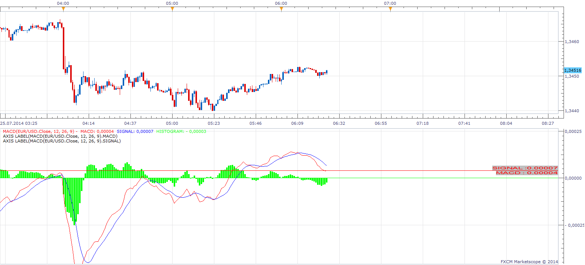

# Axis Label

> Source: https://fxcodebase.com/code/viewtopic.php?f=17&t=60973  
> Forum: 17 · Topic 60973 · 2 post(s)

---

## Axis Label

**Apprentice** · Fri Jul 25, 2014 5:27 am

This helper can draw a label and current value on the right axis,
or horizontal line, for any output stream.

 [Axis Label.lua](files/95121/Axis%20Label.lua)

The indicator was revised and updated

---

## Re: Axis Label

**Apprentice** · Tue Jul 11, 2017 2:10 pm

The indicator was revised and updated.
