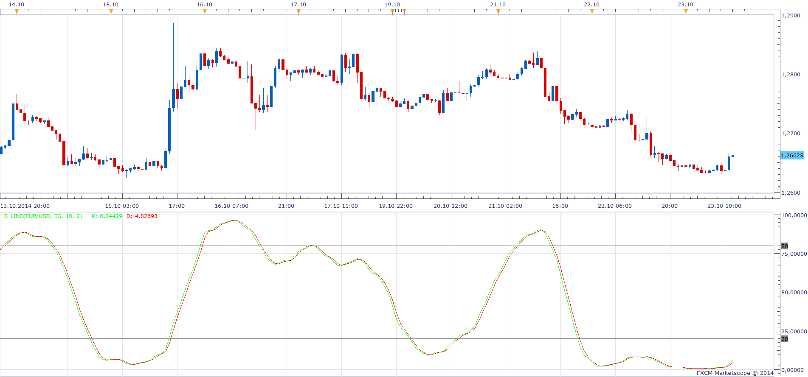

# B-Line

> Source: https://fxcodebase.com/code/viewtopic.php?f=17&t=61361  
> Forum: 17 · Topic 61361 · 7 post(s)

---

## B-Line

**Apprentice** · Thu Oct 23, 2014 4:24 am

Based on the request.
[viewtopic.php?f=27&t=61352](https://fxcodebase.com/code/viewtopic.php?f=27&t=61352)

 [B-Line.lua](files/96688/B-Line.lua)

The indicator was revised and updated

---

## Re: B-Line

**md2324** · Tue Oct 28, 2014 12:04 pm

Hi Apprentice, thank you so much for coding the B-line Indicator. I really appreciate that

I had a quick question please, relating to the Indicator....

I have attached 3 different screen shots of the Two sets of Stochastics that I would like to have super-imposed onto the same sub-window as the B-Line ( if that would be possible )

The Stochastics settings are....
9,3,3
and
5,3,3

And if the coding wouldn't be to problematic, could we make the Stochastics with the " Ribbon " look to them, if this can be implemented via MarketScope ?

Thanks again for all the help and coding, Can't thank you enough - Michael

---

## Re: B-Line

**Apprentice** · Wed Oct 29, 2014 4:19 am

Can u provide higher resolution screen shot, or better yet working MT4 indicator.

---

## Re: B-Line

**md2324** · Fri Nov 07, 2014 1:52 pm

Hi Apprentice, I uploaded another screenshot of the Indicator ( emphasis on the Stochastics )

If you need further detail or more screenshots , please don't hesitate to let me know

And thank you again, I really appreciate all of your help with this Indicator

Thanks again - Michael

---

## Re: B-Line

**Apprentice** · Sat Nov 08, 2014 6:05 am

Unfortunately, this is not enough information for me to start to work on this task.
I need a clear description or example of implementation for another platform.

---

## Re: B-Line

**md2324** · Thu Jan 15, 2015 1:48 pm

Good afternoon,
I went back on the NT forums and found some more information on the topic of the B-Line , and am hoping that what I have found, will allow for the implementation of the 2 ' Rainbow " stochastics to be super-imposed on the same sub-window as the B-Line is

Here's what I found.....

the B-line, which is a kind of LT stochastic indicator, this is the TS code of the B-line.....

Input: Price(Close), Length1(35), Length2(10), Length3(1), OverBought(80), OverSold(20),
MidColor(White),OBOSColor(Red);
Variables: KFast(0), KFull(0), DFull(0), LL(O), HH(0);
LL = Lowest((High+Low)/2, Length1);
HH = Highest((High+Low)/2, Length1);
KFast = 100 * IFF(HH-LL=0,0,(((High+Low)/2) - LL)/(HH- LL));
KFull = Average(KFast, Length2);
DFull = Average(KFull, Length3);
If KFull <= 80 and KFull >= 20 then
Plot1(KFull,"Stoc",MidColor,Default,2) else
Plot1(KFull,"Stoc",OBOSColor,Default,2);
Plot3(OverBought, "OverBought");
Plot4(OverSold, "OverSold");

I have also attached 2 of the template files, as well as a screenshot of all the Individual Indicators and their settings

Hopefully this will help and make the coding in adding the Stochastics to the B-Line easier

Apprentice, as always, Thanks so much
appreciate all you do

---

## Re: B-Line

**Apprentice** · Sun Jul 02, 2017 12:55 pm

The indicator was revised and updated.
