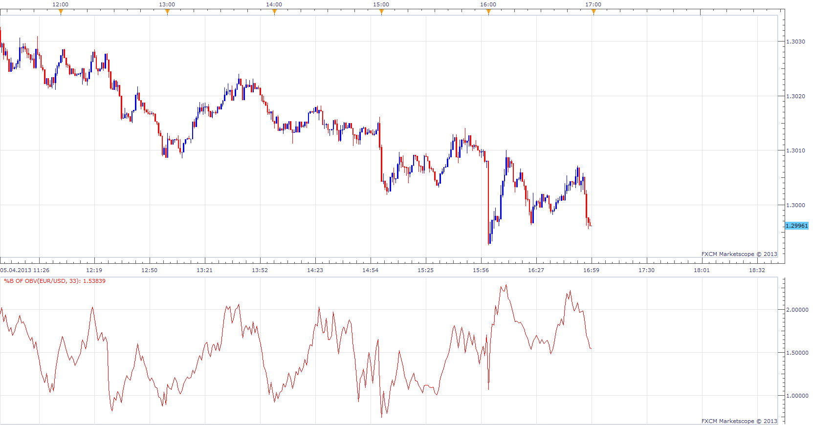

# %B of On-Balance Volume

> Source: https://fxcodebase.com/code/viewtopic.php?f=17&t=34141  
> Forum: 17 · Topic 34141 · 2 post(s)

---

## %B of On-Balance Volume

**Apprentice** · Sat Apr 06, 2013 9:43 am

 [%B of OBV.lua](files/58057/B%20of%20OBV.lua)

The indicator was revised and updated

---

## Re: %B of On-Balance Volume

**Apprentice** · Mon Dec 03, 2018 1:39 pm

The indicator was revised and updated
