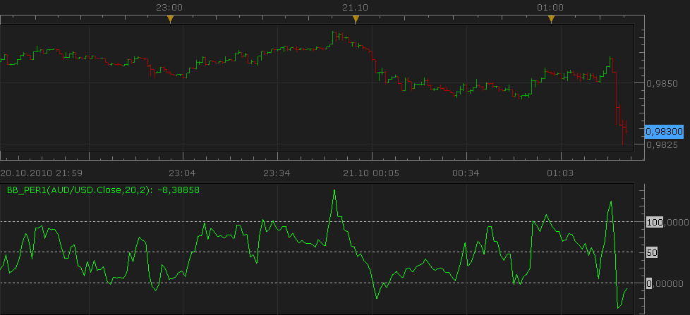
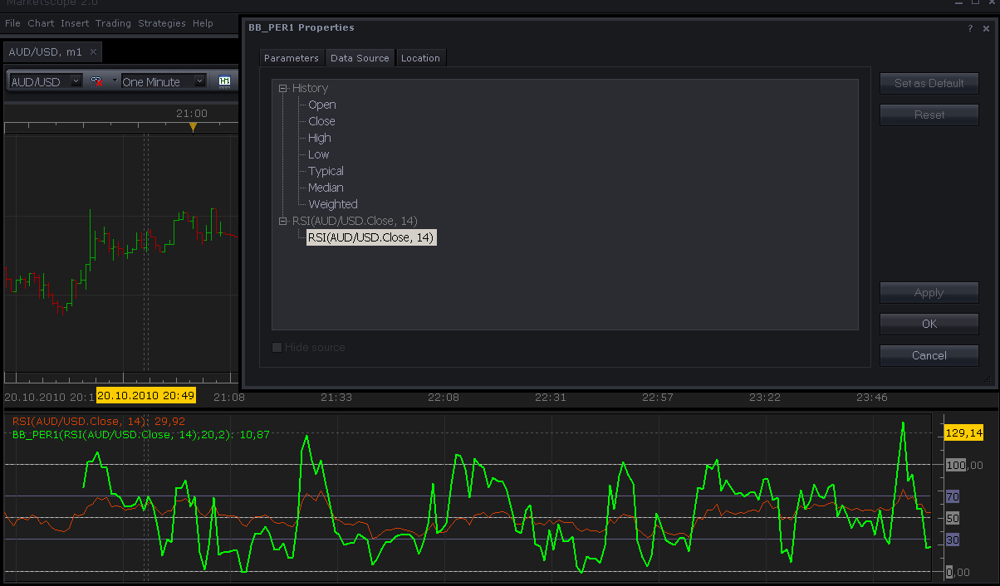

# %B (percent b) updated version.

> Source: https://fxcodebase.com/code/viewtopic.php?f=17&t=2464  
> Forum: 17 · Topic 2464 · 14 post(s)

---

## %B (percent b) updated version.

**Nikolay.Gekht** · Wed Oct 20, 2010 8:32 pm

This is the update version of the %B (percent b) indicator.

The indicator formula is

%b = (price − BB(price).lower) / (BB(price).upper − BB(price).lower)

where BB is Bollinger Band

Comparing the [older version](http://www.fxcodebase.com/code/viewtopic.php?f=17&t=226)
this version supports many new features:

1) fractional deviation.
2) line styles
3) three standard (0/50/100%) and two additional custom levels to show
4) now the name of the indicator is standard, so you can the the source and the parameters of the indicator in it's label

 

Please do not forget that you can apply this (as well as many other indicators) not only to close price, but at any price (including median, typical and weighted) price and even on the results of another indicator. Just go to the "Source" tab of the indicator properties and choose the right source:

 

Download indicator:

 [bb_per1.lua](files/5389/bb_per1.lua)

Source code:

Code: [Select all](https://fxcodebase.com/code/)
`-- The indicator corresponds to the Bollinger Bands indicator in MetaTrader.
-- The formula is described in the Kaufman "Trading Systems and Methods" chapter 5 "Trend System" (page 91-94)

-- Indicator profile initialization routine
-- Defines indicator profile properties and indicator parameters
function Init()
    indicator:name("Bollinger Band - Percentage Oscillator");
    indicator:description("Provides a percentage display between two Bollinger Bands.");
    indicator:requiredSource(core.Tick);
    indicator:type(core.Oscillator);

    indicator.parameters:addGroup("Parameters");
    indicator.parameters:addInteger("N", "Number of periods", "Number of periods", 20);
    indicator.parameters:addDouble("Dev", "Number of standard deviations", "Number of standard deviations", 2);
    indicator.parameters:addGroup("Style");
    indicator.parameters:addColor("clrBBP", "Line color", "", core.rgb(0, 255, 0));
    indicator.parameters:addInteger("widthBBP", "Line width", "", 1, 1, 5);
    indicator.parameters:addInteger("styleBBP", "Line style", "", core.LINE_SOLID);
    indicator.parameters:setFlag("styleBBP", core.FLAG_LINE_STYLE);

    indicator.parameters:addGroup("Levels");
    indicator.parameters:addColor("clrL", "Line color", "", core.rgb(192, 192, 192));
    indicator.parameters:addInteger("widthL", "Line width", "", 1, 1, 5);
    indicator.parameters:addInteger("styleL", "Line style", "", core.LINE_DOT);
    indicator.parameters:setFlag("styleL", core.FLAG_LINE_STYLE);
    indicator.parameters:addBoolean("customLevels", "Show Custom Levels", "You can specify two levels in addition to 0/50/100", false);
    indicator.parameters:addDouble("customLevel1", "First custom level", "", 40, 0, 100);
    indicator.parameters:addDouble("customLevel2", "Second custom level", "", 60, 0, 100);
end

-- Indicator instance initialization routine
-- Processes indicator parameters and creates output streams
-- Parameters block
local N;
local D;

local firstPeriod;
local source = nil;

-- Streams block
local TL = nil;
local AL = nil;
local BL = nil;

local PL = nil;

-- Routine
function Prepare()
    N = instance.parameters.N;
    D = instance.parameters.Dev;
    source = instance.source;
    firstPeriod = source:first() + N - 1;

    local name;
    name = profile:id() .. "(" .. source:name() .. "," .. N .. "," .. D .. ")";
    instance:name(name);

    -- TOP LINE AND BOTTOM LINE INTERNAL STREAMS
    TL = instance:addInternalStream(firstPeriod)
    BL = instance:addInternalStream(firstPeriod)
    AL = instance:addInternalStream(firstPeriod)

    -- PERCENTAGE LINE
    PL = instance:addStream("P", core.Line, name .. ".P", "P", instance.parameters.clrBBP, firstPeriod);
    PL:setWidth(instance.parameters.widthBBP);
    PL:setStyle(instance.parameters.styleBBP);

    PL:addLevel(0, instance.parameters.styleL, instance.parameters.widthL, instance.parameters.clrL);
    PL:addLevel(50, instance.parameters.styleL, instance.parameters.widthL, instance.parameters.clrL);
    PL:addLevel(100, instance.parameters.styleL, instance.parameters.widthL, instance.parameters.clrL);

    if (instance.parameters.customLevels) then
        PL:addLevel(instance.parameters.customLevel1, instance.parameters.styleL, instance.parameters.widthL, instance.parameters.clrL);
        PL:addLevel(instance.parameters.customLevel2, instance.parameters.styleL, instance.parameters.widthL, instance.parameters.clrL);
    end
end

-- Indicator calculation routine
function Update(period)
    -- CALCULATE "Bollinger Bands" INTERNAL STREAMS
    if(period >= firstPeriod) then
        local p = core.rangeTo(period, N);
        local ml = core.avg(source, p);
        local d = core.stdev(source, p);

        TL[period] = ml + D * d;
        BL[period] = ml - D * d;
        AL[period] = ml;
    end

    -- CALCULATE "Bollinger Bands" PERCENTAGE STREAM
    if(period >= firstPeriod) then
        PL[period] = ((source[period] - BL[period]) / (TL[period] - BL[period])) * 100;
    end
end`

---

## Re: %B (percent b) updated version.

**Zodiac** · Wed Dec 15, 2010 3:53 am

Great work! I noticed the indicator is out of sync. Here's a fix.

Code: [Select all](https://fxcodebase.com/code/)
`-- CALCULATE "Bollinger Bands" PERCENTAGE STREAM
    if(period >= N) then
        PL[period] = ((source[period] - BL[period]) / (TL[period] - BL[period])) * 100;
    end`

---

## Re: %B (percent b) updated version.

**Gregopat** · Sat Jul 16, 2011 10:05 pm

hello
 can make a strategy with this indicator because it does not work with buil strategy
 thank you.

---

## Re: %B (percent b) updated version.

**Apprentice** · Sun Jul 17, 2011 3:33 am

Can you define the conditions that your strategy should follow.

---

## Re: %B (percent b) updated version.

**Gregopat** · Fri Jul 22, 2011 9:15 pm

hello
the ame of the rsi strategy with a macd please.

thank you for you very good works.

---

## Re: %B (percent b) updated version.

**Apprentice** · Sat Jul 23, 2011 7:11 am

From what I understand you want to combine the MACD, RSI and B%.
If your problem is language.
Write your request in French.

I am interested in is not it, that is the major indicators.
Or all indicators have equal status.

Like, ON MACD crossover of Zero / signal line Open Long Position ... but only if and B% is ...., and RSI is .... or If all three indicators give a positive signal to Open Long Position.

Conditions for B % and RSI must be defined,
 which line you use as a signal for MACD indicator signal Signal or zero Line.

---

## Re: %B (percent b) updated version.

**Gregopat** · Tue Aug 16, 2011 3:29 am

bonjour aprentice
effectivement j ai des problemes avec l anglais.
pour la strategie je voulais simplement la meme que la rsi.
merci

---

## Re: %B (percent b) updated version.

**Gregopat** · Tue Aug 30, 2011 10:00 pm

Hello apprentice
 can you do me the strategy BB_PER1
 I would have to level 2.
 A level from 0 to 100 in a single order and acchat closure with limits.
 A level of 100 to 0 in a single purchase order and close-limit.
 thank you.

---

## Re: %B (percent b) updated version.

**Apprentice** · Wed Aug 31, 2011 2:00 am

Regarding your first request.
If I understood you.
You Want signal generated by the RSI and B% of RSI.

Signals are generated by the RSI / B% Crossover?
Or?

---

## Re: %B (percent b) updated version.

**Gregopat** · Wed Aug 31, 2011 4:25 am

excuse me but i change my strategy
i just want a B% strategy only with two level
one level from 0 to 100 Must B
and one level from 100 to 0 Must S.
i protect and close my psosition with stop and limit

---

## Re: %B (percent b) updated version.

**Apprentice** · Wed Aug 31, 2011 9:14 am

I'll try to write this one very soon.

---

## Re: %B (percent b) updated version.

**Apprentice** · Thu Sep 01, 2011 3:28 am

Requested can be found here.
[viewtopic.php?f=31&t=6229](https://fxcodebase.com/code/viewtopic.php?f=31&t=6229)

---

## Re: %B (percent b) updated version.

**gnarlyarbitrage** · Sun Jul 07, 2013 8:08 pm

I'm requesting an alternative regarding this indicator: price distance from top/bottom band(s) in pips. Below-chart, two lines: top band - price = x, price - bottom band = y.

Thanks!

---

## Re: %B (percent b) updated version.

**Apprentice** · Mon May 07, 2018 1:04 pm

Indicator was revised and updated.
