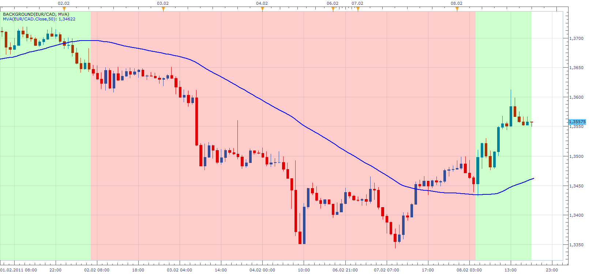

# Background

> Source: https://fxcodebase.com/code/viewtopic.php?f=17&t=3351  
> Forum: 17 · Topic 3351 · 19 post(s)

---

## Background

**Apprentice** · Tue Feb 08, 2011 6:56 pm

This simple indicator, paints the background depending on whether the chosen indicator is rising or falling.
This will help you have fewer indicators / oscillator on the chart.

 [Background.lua](files/8021/Background.lua)

 [Background with Filter.lua](files/8021/Background%20with%20Filter.lua)

 [TrendStop Background.lua](files/8021/TrendStop%20Background.lua)

TrendStop is available here.
[viewtopic.php?f=17&t=12728&hilit=TREND+STOP](https://fxcodebase.com/code/viewtopic.php?f=17&t=12728&hilit=TREND+STOP)

 [Two Indicator Background.lua](files/8021/Two%20Indicator%20Background.lua)

Up
1. Indicator > 2. Indicator
Down
1. Indicator < 2. Indicator
else
Neutral

Candle Overlay version.
[viewtopic.php?f=17&t=65957&p=118739#p118739](https://fxcodebase.com/code/viewtopic.php?f=17&t=65957&p=118739#p118739)

---

## Re: Background

**PipGrabber** · Mon Mar 07, 2011 8:05 pm

Hi Apprentice! How can we convert this to a strategy? This looks promising combined with other indicators for filtering..

---

## Re: Background

**Apprentice** · Tue Mar 08, 2011 7:05 am

This is not a classic indicator.
Strategies typically include one or more indicators.
Therefore, development of a strategy based on this indicator does not make sense.

If I'm wrong, convince me otherwise.

You can find two strategy that could help you
Composite and Strategy Builder.

---

## Re: Background

**PipGrabber** · Tue Mar 08, 2011 7:02 pm

> **Apprentice wrote:**
> This is not a classic indicator.
> Strategies typically include one or more indicators.
> Therefore, development of a strategy based on this indicator does not make sense.
>
> If I'm wrong, convince me otherwise.
>
> You can find two strategy that could help you
> Composite and Strategy Builder.

Hmmmm... But based on your sample thumbnail. Its a moving average indicator your basing it from. That's just what I needed. A simple moving average that determines the rising and falling for buy and sell. Tried to simulate the result via two moving averages cross. But the results are not the same as this background. Near, but not the same.

There's something wrong with the strategy builder. Got errors when running it.

Thanks!

---

## Re: Background

**Apprentice** · Mon Feb 13, 2017 12:49 pm

Indicator was revised and updated.

---

## Re: Background

**Sospool** · Fri Mar 24, 2017 4:56 pm

Hello Apprentice, is it possible to make the TrendStop.bin indicator compatible with the Backround.lua ?
Thanks for everything you do on this forum it helps us a lot every day.

---

## Re: Background

**Apprentice** · Sat Mar 25, 2017 6:40 am

TrendStop Background.lua added.

---

## Re: Background

**Sospool** · Sat Mar 25, 2017 1:32 pm

Thank you very much Apprentice for your help. But i'm sorry a small problem loading. I'm getting the error TrendStop Background.lua:71 unexpected symbol near 'Â'.

---

## Re: Background

**scandisk** · Sun Mar 26, 2017 12:38 am

Hi Apprentice

Could you add heikin ashi filter with the ability to select heikin ashi time frames so if I have a 5min chart open I can use a 1 hour or 4hour heikin ashi background..

Thanks

---

## Re: Background

**Apprentice** · Sun Mar 26, 2017 5:38 am

Ups wrong version.
TrendStop Background fixed.

---

## Re: Background

**Apprentice** · Sun Mar 26, 2017 6:08 am

> Could you add heikin ashi filter with the ability to select heikin ashi time frames so if I have a 5min chart open I can use a 1 hour or 4hour heikin ashi background..

For which indicator version?

---

## Re: Background

**Sospool** · Sun Mar 26, 2017 6:58 am

Thank you very much Apprentice, it works perfectly

---

## Re: Background

**scandisk** · Sun Mar 26, 2017 12:30 pm

> **Apprentice wrote:**
>
>
> > Could you add heikin ashi filter with the ability to select heikin ashi time frames so if I have a 5min chart open I can use a 1 hour or 4hour heikin ashi background..
>
>
> For which indicator version?

For Background version..

---

## Re: Background

**Apprentice** · Mon Mar 27, 2017 12:53 pm

Background with Filter added.

---

## Re: Background

**scandisk** · Mon Mar 27, 2017 2:11 pm

> **Apprentice wrote:**
> Background with Filter added.

Awesome thanks!!

---

## Re: Background

**scandisk** · Mon Mar 27, 2017 9:31 pm

Hi Apprentice

Is it possible to remove the neutral color on the background filter because it too much on the eye's! Just green or red depending up or down would be great thanks!

---

## Re: Background

**Apprentice** · Wed Mar 29, 2017 10:51 am

Try it now.

---

## Re: Background

**Cactus** · Fri Mar 02, 2018 1:30 pm

Hello
I like this a lot, indeed helps have less indicators on charts
Can you provide a version of Background with the following change:
Instead of coloring based on slope, let choose 2 indicators, and color based on whether the choosen stream of choosen indicator is less than or greater than another choosen stream of another indicator.

Example:
Indicator_**1**.Stream1[i] > Indicator_**2**.Stream3[i]

Instead of
Indicator_1.[i] > Indicator_1[i-1]

---

## Re: Background

**Apprentice** · Fri Mar 02, 2018 4:42 pm

Two Indicator Background.lua added.
