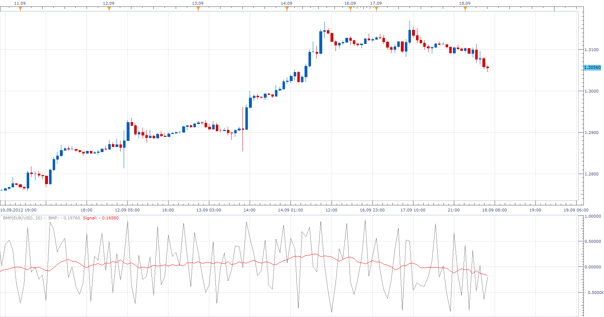

# Balance of Market Power

> Source: https://fxcodebase.com/code/viewtopic.php?f=17&t=23534  
> Forum: 17 · Topic 23534 · 8 post(s)

---

## Balance of Market Power

**Apprentice** · Tue Sep 18, 2012 5:20 am

The Balance of Market Power indicator, presented by Igor Livshin in his article "Balance of Market Power".

 [BMP.lua](files/40495/BMP.lua)

---

## Re: Balance of Market Power

**Alexander.Gettinger** · Mon Nov 17, 2014 4:53 pm

MQL4 version of Balance of Market Power oscillator: [viewtopic.php?f=38&t=61448](https://fxcodebase.com/code/viewtopic.php?f=38&t=61448).

---

## Re: Balance of Market Power

**HeloMech53** · Mon Apr 27, 2015 3:08 pm

Would someone be interested in creating the Balance of Market Power Indicator using the code below? This is the code I use in ProTA on my Macintosh. I'd like to have the same indicator for use with TS2. Thank you.

-- Created by Igor Livshin. Initially published in the August, 2001 issue of TASC magazine.
-- The Balance of Market Power (BOMP) indicator measures the strength of the bulls vs. the bears by accessing the ability of each to push price to an extreme level.
-- The idea of the BOMP calculation is to assign a score for both bulls and bears based on their daily performance related to price movement.
-- Igor recommends a period of 14 for short-term analysis and 95 for intermediate-term.

Code: [Select all](https://fxcodebase.com/code/)
`-- Code Begins Here

-- Period is user adjustable
Period:14;

-- Calculate Balance of Power Reward
BullsRewardBasedOnOpen = (High - Open) / (High - Low);
BearsRewardBasedOnOpen = (Open - Low) / (High - Low);

BullsRewardBasedOnClose = (Close - Low) / (High - Low);
BearsRewardBasedOnClose = (High - Close) / (High - Low);

BullsRewardBasedOnBoth = IF(Close > Open, (Close - Open) / (High - Low), 0);
BearsRewardBasedOnBoth = IF(Close > Open, 0, (Open - Close) / (High - Low));

BullRewardDaily = (BullsRewardBasedOnOpen + BullsRewardBasedOnClose + BullsRewardBasedOnBoth) / 3;

BearRewardDaily = (BearsRewardBasedOnOpen + BearsRewardBasedOnClose + BearsRewardBasedOnBoth) / 3;

-- Calculate Balance of Power

BalanceOfMarketPower := BullRewardDaily - BearRewardDaily;

-- Plot Balance of Market Power
-- Moving Average Type is user selectable (Simple, Exponential, Weighted, et cetera.)

MA(Period, Exponential, BalanceOfMarketPower);`

---

## Re: Balance of Market Power

**Apprentice** · Tue Apr 28, 2015 2:34 am

Code: [Select all](https://fxcodebase.com/code/)
`local THL;

if (source.high[period] -source.low[period]) == 0 then
THL=0.00001;
else
THL=source.high[period]-source.low[period];
end
   
 
local BuRBoO=(source.high[period]-source.open[period])/THL;
local BeRBoO=(source.open[period]-source.low[period])/THL;
 
local BuRBoC=(source.close[period]-source.low[period])/THL;
local BeRBoC=(source.high[period]-source.close[period])/THL;
 
local BuRBoOC;
if source.close[period] >source.open[period] then
BuRBoOC=(source.close[period]-source.open[period])/THL;
else
BuRBoOC=0;
end

--BeRBoOC:=If(C>O,0,(O-C)/(THL));
local BeRBoOC;
if source.close[period] >source.open[period] then
BeRBoOC=0;
else
BeRBoOC=(source.open[period]-source.close[period])/THL;
end

 MA:update(mode);
 
 
        BMP[period] = (BuRBoO+BuRBoC+BuRBoOC)/3 - (BeRBoO+BeRBoC+BeRBoOC)/3;
        Signal[period] = MA.DATA[period];`

If you compare these two implementations you will see that they are identical.

---

## Re: Balance of Market Power

**HeloMech53** · Tue Apr 28, 2015 6:42 am

Apprentice. I appreciate your feedback. The original post appears to be raw data with a moving average. The code I submitted displays a moving average of the data. The attached screenshot shows what BOMP looks like on my computer using ProTA. This is very different from the image posted with the original post. I was looking for a BOMP indicator for TS2 that is similar to the indicator I use in ProTA. Thank you.

---

## Re: Balance of Market Power

**HeloMech53** · Tue Apr 28, 2015 6:55 am

Apprentice. I copied this text from the Stocks & Commodities article on the BOMP indicator.

The author states:

"USAGE
For daily charts, I typically plot a 14-day moving average of the balance of power indicator, though the number of periods varies depending on the nature of the market and the time frame."

I have never seen or used a raw BOMP; only one plotted as a moving average of the raw data.

I hope this helped to clarifies things. Thank you.

---

## Re: Balance of Market Power

**Apprentice** · Wed Apr 29, 2015 4:19 am

Show Raw Data Option Added.

---

## Re: Balance of Market Power

**Apprentice** · Tue Jul 03, 2018 7:16 am

The indicator was revised and updated.
