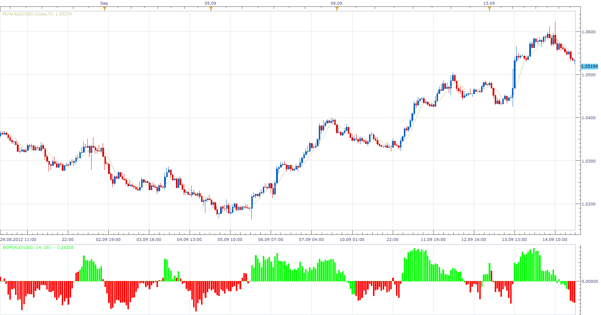

# Balance of Power

> Source: https://fxcodebase.com/code/viewtopic.php?f=17&t=23491  
> Forum: 17 · Topic 23491 · 3 post(s)

---

## Balance of Power

**Apprentice** · Mon Sep 17, 2012 4:07 am

This is my attempt to create new types of momentum indicators.
Use mementum on two different periods.

Price Action and Range.

Range Period will determine the trend.
Price Action Period will determine the short-term oscillations.

If the Price Action is below 50 percent of the Range shifts
will have a red color, if the Price action is above 50 percent Range shift,
will have a green color.

 [BOP.lua](files/40424/BOP.lua)

The indicator was revised and updated

---

## Re: Balance of Power

**Alexander.Gettinger** · Mon Nov 17, 2014 4:58 pm

MQL4 version of Balance of Power oscillator: [viewtopic.php?f=38&t=61449](https://fxcodebase.com/code/viewtopic.php?f=38&t=61449).

---

## Re: Balance of Power

**Apprentice** · Tue Jun 27, 2017 4:26 am

The indicator was revised and updated.
