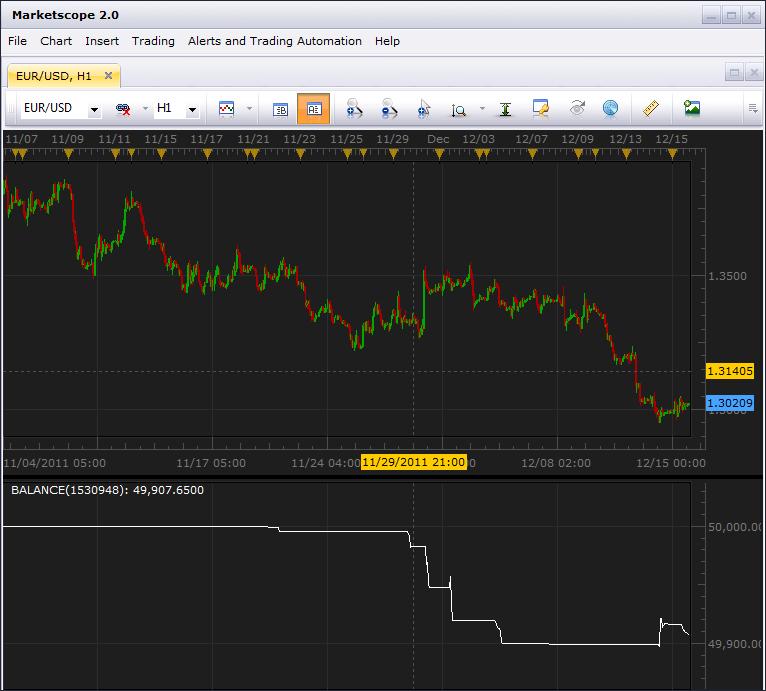

# Balance

> Source: https://fxcodebase.com/code/viewtopic.php?f=17&t=9755  
> Forum: 17 · Topic 9755 · 8 post(s)

---

## Balance

**vstrelnikov** · Thu Dec 15, 2011 6:00 pm

Indicator shows account balance historical levels. The information received with help of
lua report api library, therefore virtually any moment of time up to account creation can be traced.

 

Indicator requires [LuaLib](https://fxcodebase.com/code/viewtopic.php?f=28&t=9753) libraries to be installed.

 [BALANCE.lua](files/20773/BALANCE.lua)

The indicator was revised and updated 24 January 2018.

---

## Re: Balance

**pacer_** · Tue Dec 20, 2011 7:08 pm

Hi,

Does it track the balance or the equity ?

If it is tracking the balance, is there any indicator tracking the equity ?

Thanks

---

## Re: Balance

**fortesan9** · Mon Mar 15, 2021 2:57 pm

Dear Apprentice ^ Co

Can this indicator be re-engineered into one containing Balance / Equity / Day P/L / UsdMrgin

With the option to graph each data set in line,area or histogram.

bEST

fortesan9

---

## Re: Balance

**Apprentice** · Tue Mar 16, 2021 12:24 pm

Your request is added to the development list.
Development reference 276.

---

## Re: Balance

**Apprentice** · Wed Mar 17, 2021 1:44 pm

This downloaded from the server.
As I know, only balance is provided.

---

## Re: Balance

**fortesan9** · Wed Mar 17, 2021 5:49 pm

i cant fully install the lualibraries

please help

could this indicator be developed without the use of the lualibraries ?

---

## Re: Balance

**fortesan9** · Mon Apr 26, 2021 9:58 am

Hello FXCodebase ^ Co

Installed it succesfully, but does not show historical balance.

Please help,

---

## Re: Balance

**fortesan9** · Tue Oct 26, 2021 8:23 am

Any updates? seems impossiple to apply balance on TSII.. is there another method to track the balance on the charts without the lua libriaries ?
