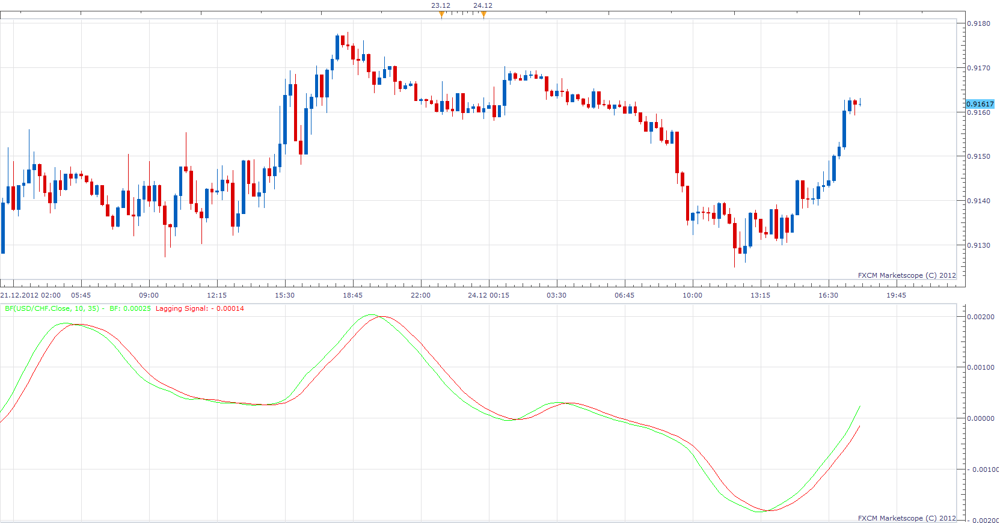
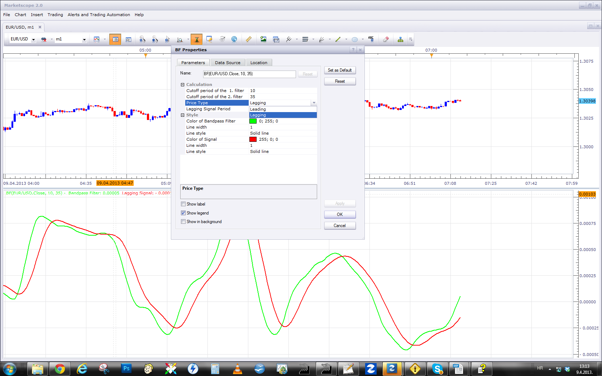

# BANDPASS FILTER

> Source: https://fxcodebase.com/code/viewtopic.php?f=17&t=27946  
> Forum: 17 · Topic 27946 · 5 post(s)

---

## BANDPASS FILTER

**Apprentice** · Mon Dec 24, 2012 12:13 pm

As described in the article The Bandpass Indicator by John F. Ehlers.

Bandpass Indicator is Leading indicator of market reversals based on the cycles
in the price data

In addition to specified Leading Signal line, I have added a Lagging signal line.

 [BF.lua](files/49039/BF.lua)

The indicator was revised and updated

---

## Re: BANDPASS FILTER

**StefPasc** · Tue Apr 09, 2013 7:17 am

dear Apprentice

I am a little bit confused...
In the picture you posted here I see in red color "Lagging signal"
I installed the bf.lua and I see instead of "Lagging", the word "Leading signal" in red.
Please can you check it as long as you have the time ?
Thanks in advance

---

## Re: BANDPASS FILTER

**Apprentice** · Tue Apr 09, 2013 7:31 am

You'll have different presentations,
for different input parameters, different signal line algorithms.

---

## Re: BANDPASS FILTER

**StefPasc** · Wed Apr 10, 2013 3:09 am

ah Thanks a lot Apprentice !
mea culpa !

---

## Re: BANDPASS FILTER

**Apprentice** · Wed May 10, 2017 5:09 am

Indicator was revised and updated.
