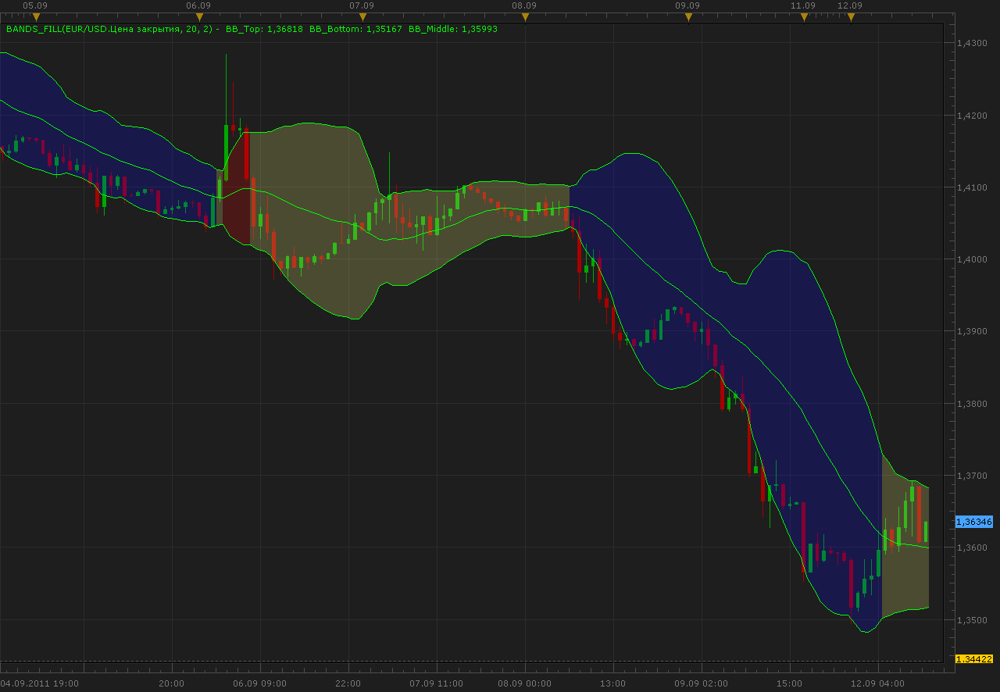

# Bands fill indicator

> Source: https://fxcodebase.com/code/viewtopic.php?f=17&t=6487  
> Forum: 17 · Topic 6487 · 18 post(s)

---

## Bands fill indicator

**Alexander.Gettinger** · Mon Sep 12, 2011 10:26 am

The indicator is a bollinger bands painted as follows.
If the price crosses the top band of the indicator is colored in UP color.
If the price crosses the bottom band of the indicator is colored in DN color.
If the price crosses the middle line of the indicator is colored in neutral color.

 

Download:

 [Bands_Fill.lua](files/14826/Bands_Fill.lua)

MT4 / MT5 version.
[https://fxcodebase.com/code/viewtopic.php?f=38&t=62403](https://fxcodebase.com/code/viewtopic.php?f=38&t=62403)

---

## Re: Bands fill indicator

**Jeffreyvnlk** · Tue Jul 09, 2013 11:20 pm

Great but could you give an option for mid line ? Thank

---

## Re: Bands fill indicator

**Apprentice** · Wed Jul 10, 2013 6:23 am

Explain ... Middle line indication is optional?

---

## Re: Bands fill indicator

**Jeffreyvnlk** · Thu Jul 11, 2013 7:21 pm

> **Apprentice wrote:**
> Explain ... Middle line indication is optional?

I would like to get rid of that mid line

---

## Re: Bands fill indicator

**Apprentice** · Sun Jul 14, 2013 2:45 am

Middle line On/Off optional Added.

---

## Re: Bands fill indicator

**Jeffreyvnlk** · Tue Jul 16, 2013 7:31 pm

> **Apprentice wrote:**
> Middle line On/Off optional Added.

Thanks

---

## Re: Bands fill indicator

**yk6267** · Fri Jul 03, 2015 11:42 pm

Hi,

Is that possible for you to code this to MT4? Thanks!

---

## Re: Bands fill indicator

**Apprentice** · Mon Jul 06, 2015 6:56 am

It is possible, yet complicated.
Your request is added to the development list.

---

## Re: Bands fill indicator

**Apprentice** · Mon Jul 06, 2015 8:31 am

Requested can be found here.
[viewtopic.php?f=38&t=62403](https://fxcodebase.com/code/viewtopic.php?f=38&t=62403)

---

## Re: Bands fill indicator

**yk6267** · Mon Jul 06, 2015 10:56 am

Hi admin,

This is very helpful. Thanks!

---

## Re: Bands fill indicator

**Apprentice** · Tue Jul 04, 2017 9:50 am

The indicator was revised and updated.

---

## Re: Bands fill indicator

**fx1954** · Sun Jun 28, 2020 1:22 pm

Is this indicator possible with the option to do not show the upper and lower lines. just only the colors?

---

## Re: Bands fill indicator

**Apprentice** · Mon Jun 29, 2020 7:06 am

Your request is added to the development list.
Development reference 1580.

---

## Re: Bands fill indicator

**Apprentice** · Wed Jul 01, 2020 10:39 am

Try it now.

---

## Re: Bands fill indicator

**fx1954** · Wed Jul 01, 2020 5:11 pm

Thanks, works very well.

---

## Re: Bands fill indicator

**fx1954** · Sat Aug 21, 2021 6:31 am

Hi

is it possible to code this last version of the indicator Bands_Fill also for MT5?

---

## Re: Bands fill indicator

**Apprentice** · Mon Aug 23, 2021 3:01 am

Your request is added to the development list.
Development reference 762.

---

## Re: Bands fill indicator

**Apprentice** · Tue Aug 24, 2021 3:10 am

MT4 / MT5 version.
[https://fxcodebase.com/code/viewtopic.php?f=38&t=62403](https://fxcodebase.com/code/viewtopic.php?f=38&t=62403)
