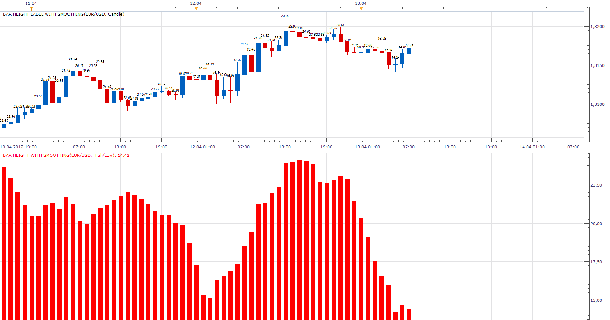

# Bar Height

> Source: https://fxcodebase.com/code/viewtopic.php?f=17&t=15639  
> Forum: 17 · Topic 15639 · 15 post(s)

---

## Bar Height

**Apprentice** · Fri Apr 06, 2012 9:13 am

As requested, I wrote this simple indicator.
It's basically very similar to the Tick Volume.
It shows the difference between the Open / Close and High / Low values ​​for a, period.
I have add additional algorithm What adds double the length of Wicks to Open / Close difference.

 [Bar Height.lua](files/29456/Bar%20Height.lua)

As a Option this indicator provides audio and Email Alerts.

Dec 14, 2015: Compatibility issue Fixed. _Alert helper is not longer needed.

If you want to use updated version of this indicator,
please make sure to use TS Version 01.14.101415. or higher.

 

 [Bar Height Overlay.lua](files/29456/Bar%20Height%20Overlay.lua)

The indicator was revised and updated

---

## Re: Bar Height

**Apprentice** · Fri Apr 06, 2012 9:46 am

 [Bar Height Label.lua](files/29461/Bar%20Height%20Label.lua)

---

## Re: Bar Height

**nazaar** · Mon Apr 09, 2012 4:03 pm

> **Apprentice wrote:**
> As requested, I wrote this simple indicator. It shows the difference between the Open / Close and High / Low values ​​for a period.

Thanks very kindly for writing this indicator. I think this simple indicator can be very useful for quickly showing the size of a candlestick in pips and the **frequency**in which it reaches a given level of pips. For example, on the 4-hour chart I have this indicator on plus I draw a horizontal line at the 50 pip level. This quickly shows the **frequency**of which 4 hour bars are greater than 50 pips.

Any other thoughts on building on this simple indicator?

---

## Re: Bar Height moving average

**nazaar** · Mon Apr 09, 2012 4:14 pm

Hello Apprentice, how are you?

May I request the option to display the moving average of the bar heights for X period back? That is the average pips per bar looking back at a chosen # of bars.

Thanks.

---

## Re: Bar Height

**Apprentice** · Fri Apr 13, 2012 7:58 am

 [Bar Height with Smoothing.lua](files/29893/Bar%20Height%20with%20Smoothing.lua)

 [Bar Height Label with Smoothing.lua](files/29893/Bar%20Height%20Label%20with%20Smoothing.lua)

---

## Re: Bar Height

**nazaar** · Sat Oct 13, 2012 12:40 pm

This is an excellent tool for reviewing what has happened in the forex market. It allows one to quickly see how frequently bars on a chosen time line reaches a given level of pips and how long it may take to achieve a given level of pips on average.

Could you please add an option to draw at least 2 horizontal lines at chosen pip levels. See attached.

Thanks.

---

## Re: Bar Height

**Apprentice** · Mon Oct 15, 2012 3:57 am

I have update Topmost post, in order to include these two additional lines.
As a bonus, and added, Audio / Email Alerts.

---

## Re: Bar Height

**Jeffreyvnlk** · Thu Nov 01, 2012 4:42 am

> **Apprentice wrote:**
>
>
> Bar Height.png
>
>
>
>
> Bar Height Label.lua

It could be lighter if you could allow setting for just 1 or 3 days. The chart would be nicer and neater.I usuallay trading 1h time frame. Tk

---

## Re: Bar Height

**Jeffreyvnlk** · Thu Nov 01, 2012 4:52 am

One more thing, it just marking a big candle only, anything else below 10 pips would not be labeled

---

## Re: Bar Height

**Samurai 24** · Thu Mar 12, 2015 8:03 am

Hello Mr. Apprentice, could you make this indicator only marking big candle only like this picture (sorry i can't edited the indicator, i only use photoshop to edit the image), below 25 pips would not be labeled. Thanks.

---

## Re: Bar Height

**Profit FX** · Sat May 30, 2015 2:30 pm

> **Apprentice wrote:**
>
>
> The attachment **Bar Height.png** is no longer available
>
>
>
>
> The attachment **Bar Height.png** is no longer available

Can you make these indicators only marking label candlestick body, for example in H1 time frame only marks body candlestick minimum of 30.0 pips, in H4 time frame minimum 70.0 pips and in daily time frame minimum 120.0 pips. Below this setting would not be labeled.

---

## Re: Bar Height

**Apprentice** · Sun Jun 07, 2015 4:47 am

Bar Height Overlay Added.

---

## Re: Bar Height

**nookie** · Mon Sep 21, 2015 6:21 am

If possible an addition to the first version to be added which is the following: based on previous bar range (for example 30 pips) and where the price has closed its measured what is the bar. If close is in the upper half strongly then its colour green, if close is in the lower half then its colour red.

Example: price open is 50.55, price low is 50.50 and close is 50.70, with a high of 50.80. Range is 30 pips, low is 50.50 so if close is below 50.65 then its red and as close is higher then 50.65 (its 50.70) then its green. So in the up example bar should be green based on close only.
There can be some variable of few pips in the middle where its neutral.

---

## Re: Bar Height

**Apprentice** · Mon Dec 14, 2015 6:54 am

Dec 14, 2015: Compatibility issue Fixed. _Alert helper is not longer needed.

If you want to use updated version of this indicator,
please make sure to use TS Version 01.14.101415. or higher.

---

## Re: Bar Height

**Apprentice** · Wed Aug 02, 2017 7:12 am

The indicator was revised and updated.
