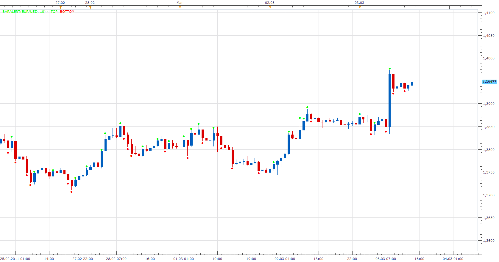

# BarAlert

> Source: https://fxcodebase.com/code/viewtopic.php?f=17&t=3596  
> Forum: 17 · Topic 3596 · 5 post(s)

---

## BarAlert

**Apprentice** · Fri Mar 04, 2011 5:15 pm

This are two simple indicators that you have requested.

 

BarAlert gives an indication if the candle is greater than the set level.
Checks Open / Close difference.
And prints its value.

 [BarAlert.lua](files/8631/BarAlert.lua)

 [BarAlert with Alert.lua](files/8631/BarAlert%20with%20Alert.lua)

Label calculates the following values.
The body of the candle. (Open-Close)
The length of wicks
Upper Wick
 High-max (Open, Close)
Lower Wick
min (Open, Close)-Low

 [Label.lua](files/8631/Label.lua)

---

## Re: BarAlert

**easytrading** · Sat Jan 10, 2015 10:29 pm

Hello Apprentice,

is it possibole to add an option parameter allow us to set the number of periods to show the label for them?
defult =0 will show label for all bars
and 1 for the last bar label
 2 for the last 2 bars label .....
your help is much appreciated as always.

---

## Re: BarAlert

**Apprentice** · Sun Jan 11, 2015 5:53 am

Lookback Period option Added to BarAlert.lua

---

## Re: BarAlert

**Apprentice** · Fri Aug 26, 2016 7:29 am

BarAlert with Alert.lua added.

---

## Re: BarAlert

**Apprentice** · Mon Aug 27, 2018 4:55 am

The indicator was revised and updated.
