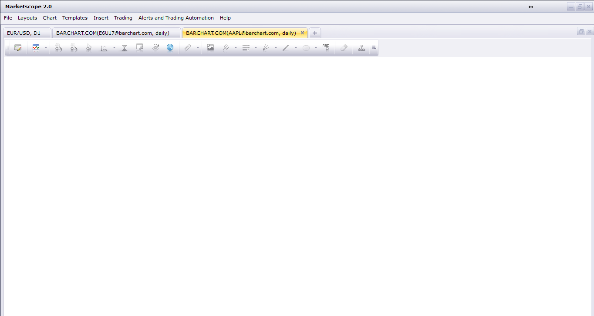
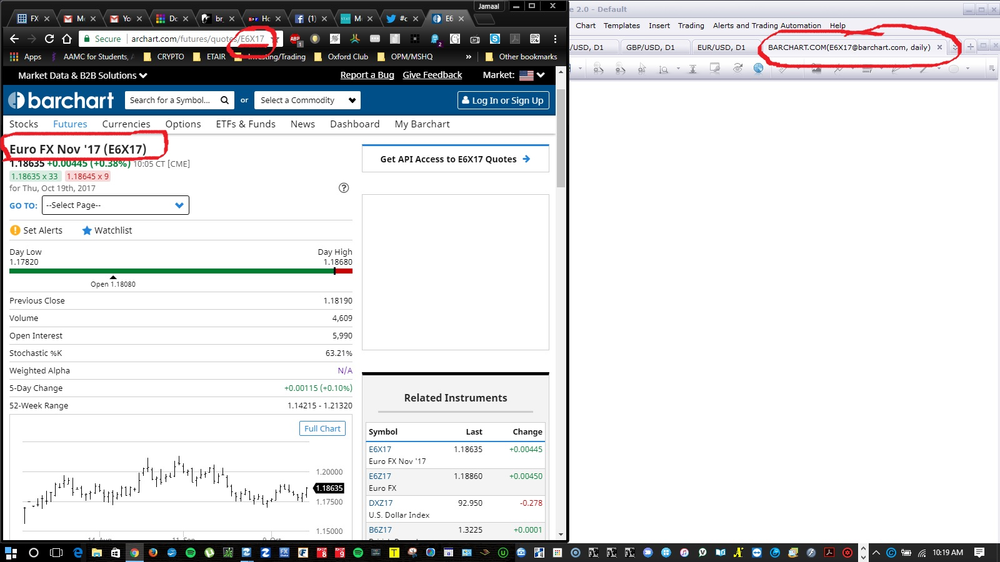

# Barchart.com view

> Source: https://fxcodebase.com/code/viewtopic.php?f=17&t=65064  
> Forum: 17 · Topic 65064 · 6 post(s)

---

## Barchart.com view

**Apprentice** · Wed Sep 06, 2017 4:53 pm

 [barchart.com.lua](files/114748/barchart.com.lua)

---

## Re: Barchart.com view

**jrichardson83** · Tue Sep 12, 2017 10:56 pm

Thanks, Apprentice.

Unfortunately, I'm not plotting in data?

 

---

## Re: Barchart.com view

**Apprentice** · Wed Sep 13, 2017 2:52 am

Will investigate this.

---

## Re: Barchart.com view

**Apprentice** · Sun Sep 17, 2017 6:11 am

Try it now.

---

## Re: Barchart.com view

**jrichardson83** · Thu Oct 19, 2017 12:13 pm

> **Apprentice wrote:**
> Try it now.

Still no luck....

 

---

## Re: Barchart.com view

**Apprentice** · Wed May 02, 2018 6:31 am

The Indicator was revised and updated.
