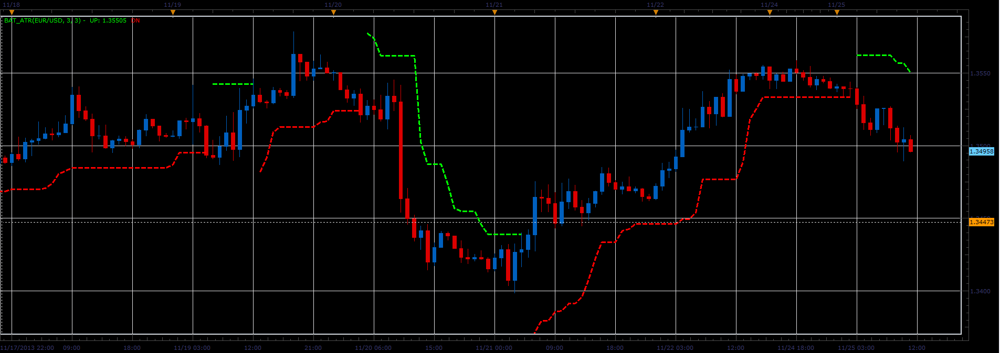
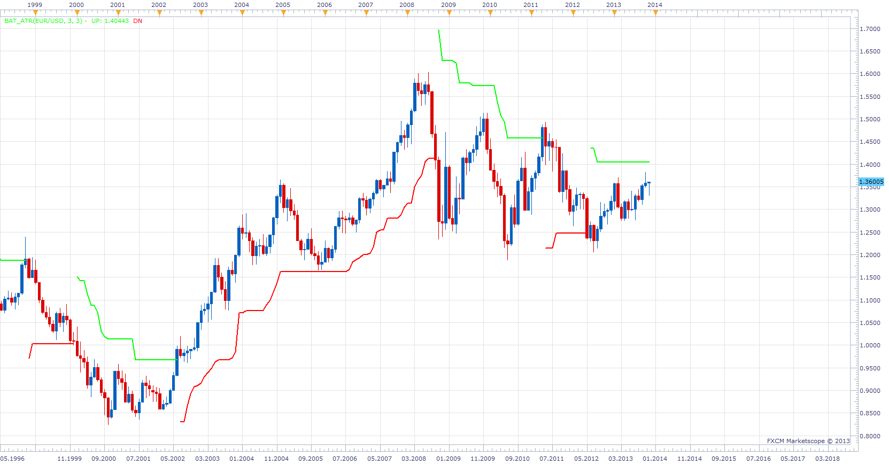

# BAT ATR indicator

> Source: https://fxcodebase.com/code/viewtopic.php?f=17&t=59994  
> Forum: 17 · Topic 59994 · 14 post(s)

---

## BAT ATR indicator

**Alexander.Gettinger** · Tue Nov 26, 2013 4:48 pm

This indicator is a ported MQL5 indicator from [http://www.mql5.com/en/code/1904](http://www.mql5.com/en/code/1904).

 

Download:

 [BAT_ATR.lua](files/91151/BAT_ATR.lua)

The indicator was revised and updated

---

## Re: BAT ATR indicator

**evgeniyn** · Wed Nov 27, 2013 5:28 am

Some BUG here. I can't see green stream at all.

---

## Re: BAT ATR indicator

**Apprentice** · Thu Nov 28, 2013 4:32 am

I did not managed to reproduce, which settings you use.

---

## Re: BAT ATR indicator

**evgeniyn** · Thu Nov 28, 2013 4:55 am

I use default settings. Trading Station version is 01.13.092613

---

## Re: BAT ATR indicator

**Apprentice** · Thu Nov 28, 2013 5:36 am

Indeed very strange.
I have no answer for you at this time.

---

## Re: BAT ATR indicator

**evgeniyn** · Thu Nov 28, 2013 6:03 am

I have tried to debug it. I set breakpoint on row 76 (LevelDn[period]=1000;) The problem comes after break on row 76 to next step break on row 80 (UP[period]=LevelDn[period];)

---

## Re: BAT ATR indicator

**Apprentice** · Thu Nov 28, 2013 6:30 am

Let me guess, you're using gold.
Try updated version.

---

## Re: BAT ATR indicator

**evgeniyn** · Thu Nov 28, 2013 6:42 am

> **Apprentice wrote:**
> Let me guess, you're using gold.
> Try updated version.

What do you mean - gold? And where get updated version?

---

## Re: BAT ATR indicator

**Apprentice** · Thu Nov 28, 2013 7:28 am

Problematic were instruments with a value greater than 1000 like Gold.
U can download new version of indicator from the topmost (first) post in this topic:

---

## Re: BAT ATR indicator

**evgeniyn** · Thu Nov 28, 2013 7:53 am

You right. I can see green stream on EUR/USD, but on "Indexes" - no. Regarding the updated version (topmost version) - it's exactly same file that I'm using. Thank you for idea - I've fixed by replacing in 76 row "1000" on "CurrDn" (LevelDn[period]= CurrDn)

---

## Re: BAT ATR indicator

**Apprentice** · Thu Nov 28, 2013 8:05 am

Trust me ot this.
It is not. Test it in the TS, will see the difference.

---

## Re: BAT ATR indicator

**evgeniyn** · Thu Nov 28, 2013 8:10 am

I have edited previous post pls see. In any case, I have tried with a new version - result same. Pls your opinion about LevelDn[period] = CurrDn;

---

## Re: BAT ATR indicator

**Alexander.Gettinger** · Thu Nov 28, 2013 9:27 am

In my opinion, everything is working correctly.
Please, attach a chart with an error.

---

## Re: BAT ATR indicator

**Apprentice** · Sat Jun 17, 2017 4:22 am

The indicator was revised and updated.
