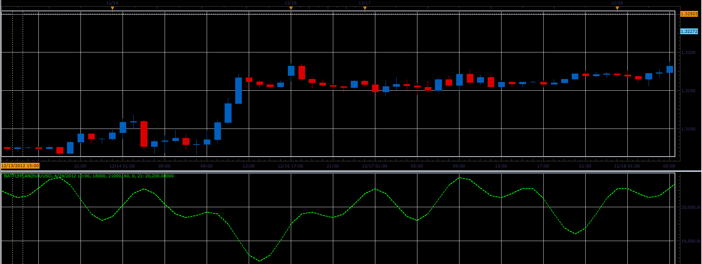
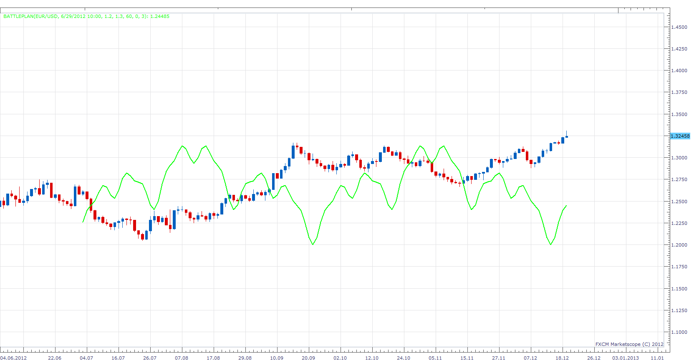
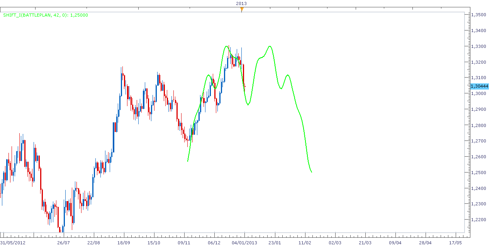
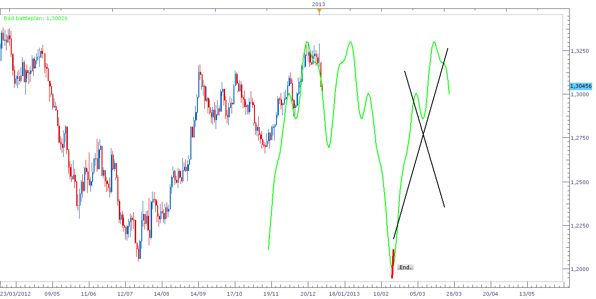

# Battleplan indicator

> Source: https://fxcodebase.com/code/viewtopic.php?f=17&t=27802  
> Forum: 17 · Topic 27802 · 18 post(s)

---

## Battleplan indicator

**Alexander.Gettinger** · Tue Dec 18, 2012 1:58 pm

This indicator is a ported MQL4 indicator from [viewtopic.php?f=27&t=27179&p=47443#p47443](https://fxcodebase.com/code/viewtopic.php?f=27&t=27179&p=47443#p47443)

 

Download:

 [Battleplan.lua](files/48719/Battleplan.lua)

The indicator was revised and updated

---

## Re: Battleplan indicator

**arstechnica** · Wed Dec 19, 2012 1:46 am

dear Alex,

Is not possible to plot the indicator over the chart? plotting also some additional periods respect the actual candle?

Please do. this is the only way to make prediction with battleplan indicator

Regards

Salvatore

---

## Re: Battleplan indicator

**Apprentice** · Wed Dec 19, 2012 2:40 pm

Try My Version.

 [Battleplan.lua](files/48770/Battleplan.lua)

---

## Re: Battleplan indicator

**transformer** · Wed Dec 19, 2012 4:07 pm

hi,

can you create a strategy based on this indicator

buy level:19250
sell level :20250

buy: battle plan cross over buy level
sell: battle plan cross under sell level

thank you very much for this nice indicator.

---

## Re: Battleplan indicator

**arstechnica** · Thu Dec 20, 2012 1:53 am

Is it possible to plot on the chart also the future? up to a desired date?

---

## Re: Battleplan indicator

**Apprentice** · Thu Dec 20, 2012 3:11 am

transformer
Your request is added to the development list.

arstechnica
You can do this already.
Use MarketScope Shift functionality.

Is this satisfactory?

---

## Re: Battleplan indicator

**Tigre3** · Thu Dec 20, 2012 6:33 pm

Hi, thanks for the indicator.

> **Apprentice wrote:**
> You can do this already.
> Use MarketScope Shift functionality.
>
> Is this satisfactory?

Where is this function?

---

## Re: Battleplan indicator

**Apprentice** · Fri Dec 21, 2012 2:55 am

You can find them as SHIFT_O and SHIFT_I Indicators.
They have possibility of horizontal and vertical displacement.

---

## Re: Battleplan indicator

**Blackcat2** · Fri Dec 21, 2012 6:00 am

Hi Apprentice,
Can you please modify the indicator so it'll show the buy and sell level and make it adjustable? Just like what Transformer said..

Thanks heaps
BC

---

## Re: Battleplan indicator

**arstechnica** · Fri Dec 21, 2012 8:30 am

If I use Shift _O battleplan does not apper among the list of oscillators and I can't load to include it

---

## Re: Battleplan indicator

**Apprentice** · Sat Dec 22, 2012 3:56 am

Shift _O will work with version from Alex.
For my version try to use Shift _I.

---

## Re: Battleplan indicator

**Tigre3** · Fri Jan 04, 2013 11:42 am

Is possible to make a version where appears only one "M" (basic shape of battleplan) at a time and it appears also where there's not price yet?

For example:
Looking at today chart I add a battleplan indicator wich starts at 13/11. At this time it writes the M until the end (Also where there're not candles yet).

Like this:

 

When price will reach the end of the "M" it will write another one "M" and so on.

____________________

I need this change because using SHIF_I most of the time I have this result:

 

____

Thanks

---

## Re: Battleplan indicator

**Apprentice** · Sat Jan 05, 2013 7:07 am

Although this is more cosmetic modifications,
If I am incorrect, correct me,
I'll try to find the time.

---

## Re: Battleplan indicator

**Tigre3** · Sat Jan 05, 2013 12:37 pm

> **Apprentice wrote:**
> Although this is more cosmetic modifications,
> If I am incorrect, correct me,
> I'll try to find the time.

It's not an aspect change but mainly a practical change. Without it I have to spend time to calculate where make the battlepan start in relation to where I want make it really start, etc.

Thanks in advance.

---

## Re: Battleplan indicator

**Steven Smith** · Fri Jan 18, 2013 2:02 am

Can you please modify the indicator so it'll show the buy and sell level and make it adjustable?
Just like what Transformer said..

---

## Re: Battleplan indicator

**Apprentice** · Sat Jan 19, 2013 5:50 pm

Can you specify, how to determine these levels.
This is a cyclical indicator, trying to determine the turning point.

Something like this.
Buy, if we are in a low point of Cycle,
Sell ​​if we are in peak value of current Cycle.

---

## Re: Battleplan indicator

**Tigre3** · Sun Aug 25, 2013 8:12 am

> **Tigre3 wrote:**
> Is possible to make a version where appears only one "M" (basic shape of battleplan) at a time and it appears also where there's not price yet?
>
> For example:
> Looking at today chart I add a battleplan indicator wich starts at 13/11. At this time it writes the M until the end (Also where there're not candles yet).
>
> Like this:
>
>
> goodbat.png
>
>
> When price will reach the end of the "M" it will write another one "M" and so on.
>
> ____________________
>
> I need this change because using SHIF_I most of the time I have this result:
>
>
>
> Bad_batteplan.png
>
>
> ____
>
> Thanks

Any news about?

---

## Re: Battleplan indicator

**Apprentice** · Sun Jun 04, 2017 6:22 am

The indicator was revised and updated.
