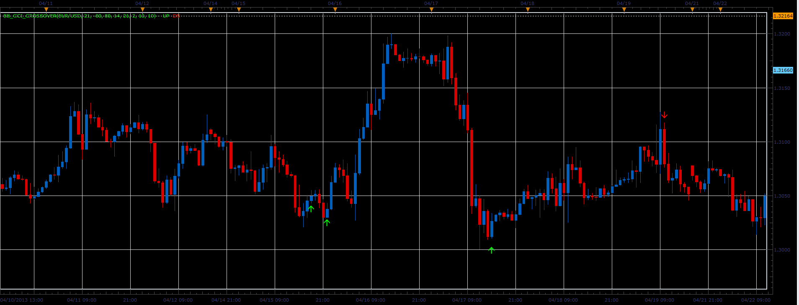

# BB_CCI_CrossOver indicator

> Source: https://fxcodebase.com/code/viewtopic.php?f=17&t=36263  
> Forum: 17 · Topic 36263 · 2 post(s)

---

## BB_CCI_CrossOver indicator

**Alexander.Gettinger** · Thu May 02, 2013 10:26 am

This indicator is a ported MQL5 indicator from [http://www.mql5.com/ru/code/1657](http://www.mql5.com/ru/code/1657) (in Russian).

 

Download:

 [BB_CCI_CrossOver.lua](files/60890/BB_CCI_CrossOver.lua)

The indicator was revised and updated

---

## Re: BB_CCI_CrossOver indicator

**Apprentice** · Thu May 11, 2017 1:23 pm

Indicator was revised and updated.
