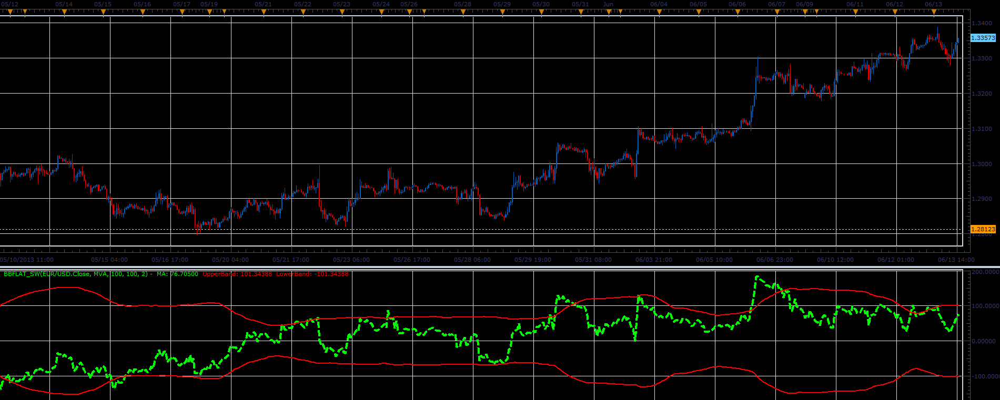

# BB flat oscillator

> Source: https://fxcodebase.com/code/viewtopic.php?f=17&t=41316  
> Forum: 17 · Topic 41316 · 2 post(s)

---

## BB flat oscillator

**Alexander.Gettinger** · Tue Jun 18, 2013 3:07 pm

This indicator is a ported MQL5 indicator from [http://www.mql5.com/ru/code/1729](http://www.mql5.com/ru/code/1729) (in Russian).

Formulas:
MA[i] = Price[i] - Moving average[i],
Upper band, Lower band - range of bollinger bands.

 

Download:

 [BBflat_sw.lua](files/67545/BBflat_sw.lua)

For this indicator must be installed Averages indicator ([viewtopic.php?f=17&t=2430](https://fxcodebase.com/code/viewtopic.php?f=17&t=2430)).

The indicator was revised and updated

---

## Re: BB flat oscillator

**Apprentice** · Sat May 27, 2017 11:55 am

Indicator was revised and updated.
