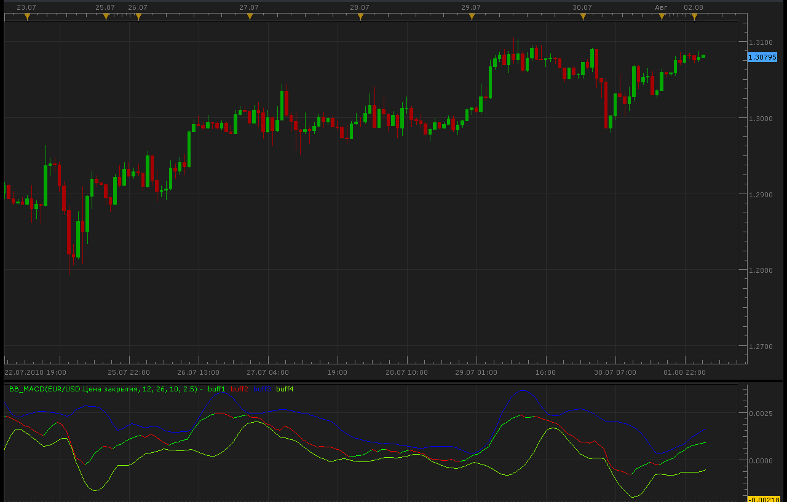

# BB MACD indicator

> Source: https://fxcodebase.com/code/viewtopic.php?f=17&t=1637  
> Forum: 17 · Topic 1637 · 4 post(s)

---

## BB MACD indicator

**Alexander.Gettinger** · Mon Aug 02, 2010 1:08 am

[viewtopic.php?f=27&t=1631](https://fxcodebase.com/code/viewtopic.php?f=27&t=1631)

 

Indicator "Standard Deviation" ([viewtopic.php?f=17&t=870&p=1577&hilit=StdDev#p1577](https://fxcodebase.com/code/viewtopic.php?f=17&t=870&p=1577&hilit=StdDev#p1577)) must be downloaded.

The indicator was revised and updated

---

## Re: BB MACD indicator

**wizardpro** · Mon Oct 25, 2010 5:07 am

I failed to understand what is this for? What the differnet between the normal MACD indicator as compare to your ? Improvement version of adjust with pos or neg divergence?

---

## Re: BB MACD indicator

**Apprentice** · Mon Oct 25, 2010 7:40 am

Some Traders prefer to applied Bullinger bands on oscillators.
This indicator provides just that.
Bullinger Bands on MACD

---

## Re: BB MACD indicator

**Apprentice** · Mon Jan 30, 2017 7:16 am

Indicator was revised and updated.
