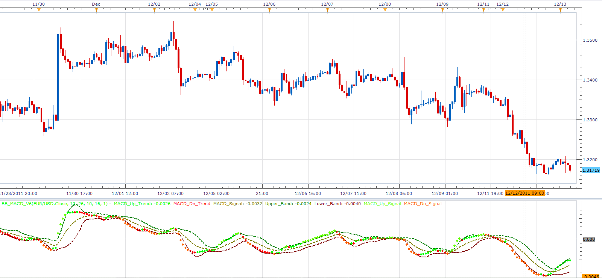

# BB_MACD oscillator

> Source: https://fxcodebase.com/code/viewtopic.php?f=17&t=9559  
> Forum: 17 · Topic 9559 · 6 post(s)

---

## BB_MACD oscillator

**Alexander.Gettinger** · Tue Dec 13, 2011 4:21 am

This indicator is a ported MQL4 indicators from [viewtopic.php?f=27&t=9166&p=20018#p20018](https://fxcodebase.com/code/viewtopic.php?f=27&t=9166&p=20018#p20018)

 

Download:

 [BB_MACD_v6.lua](files/20501/BB_MACD_v6.lua)

For this indicator must be installed StdDev2 indicator from [viewtopic.php?f=17&t=870&p=1577](https://fxcodebase.com/code/viewtopic.php?f=17&t=870&p=1577).

The strategy based on this indicator is available here.
[viewtopic.php?f=31&t=64684](https://fxcodebase.com/code/viewtopic.php?f=31&t=64684)

The indicator was revised and updated

---

## Re: BB_MACD oscillator

**rose123** · Fri Dec 14, 2012 11:47 am

hi,

can you create a strategy based on this indicator.

buy level:0
sell level : 0

buy: lower band cross over buy level
sell : upper band cross under sell level

thank you.

---

## Re: BB_MACD oscillator

**Apprentice** · Sat Dec 15, 2012 4:06 am

Your request is added to the development list.

---

## Re: BB_MACD oscillator

**mulligan** · Thu Dec 27, 2012 11:11 am

I would also like to request a strategy. Above or below zero line would be a nice optional filter, however, I believe the purpose of the indicator is to signal buy when MACD UP signal dots are above the upper band and sell when MACD DN signal dots are below the lower band. One of your "highly adabtable" versions of a strategy which included options for both MACD trend and signal dots would be amazing if possible. Thanks for your consideration.

---

## Re: BB_MACD oscillator

**Apprentice** · Thu Apr 27, 2017 4:24 am

Indicator was revised and updated.

---

## Re: BB_MACD oscillator

**Apprentice** · Sat May 27, 2017 5:52 am

The strategy based on this indicator is available here.
[viewtopic.php?f=31&t=64684](https://fxcodebase.com/code/viewtopic.php?f=31&t=64684)
