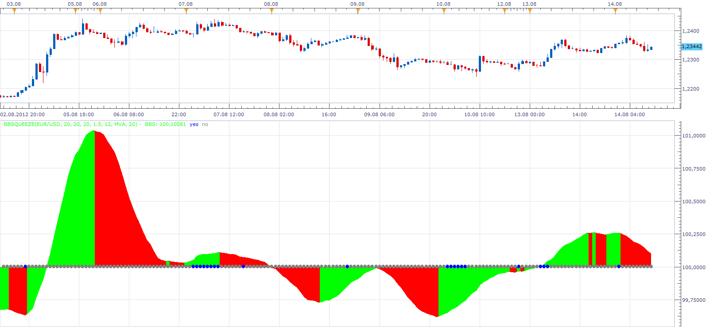

# BB Squeeze

> Source: https://fxcodebase.com/code/viewtopic.php?f=17&t=22407  
> Forum: 17 · Topic 22407 · 11 post(s)

---

## BB Squeeze

**Apprentice** · Tue Aug 14, 2012 9:12 am

The premise of this indicator.
You should only take trades when the Bollinger band is inside the Keltner Channel.
If this condition is met.
Presented on the chart with yes and no circles.
Only then You should take a trade in the direction of momemtum indicators.

 [bbsqueeze.lua](files/38683/bbsqueeze.lua)

 

 [MTF MCP BB Squeeze List.lua](files/38683/MTF%20MCP%20BB%20Squeeze%20List.lua)

 [bbsqueeze with Alert.lua](files/38683/bbsqueeze%20with%20Alert.lua)

---

## Re: BB Squeeze

**transformer** · Fri Dec 21, 2012 9:24 am

hi,

can you create strategy based on this indicator:

settings:

bollingerbands period:20
bollinger band deviation:2.0
kelter period:20
kelterfactor: 1.5
momentum period:34
momentum smoothening method: ema
momentum smoothening period:50

buy: bollinger band with in kelter band and momentum >0 and price cross over upper band of bollinger band

sell: bollinger band with in kelter band and momentum<0 and price cross under lower band of bollinger band

---

## Re: BB Squeeze

**Apprentice** · Sat Dec 22, 2012 3:57 am

Your request is added to the development list.

---

## Re: BB Squeeze

**amazon1a** · Sun Aug 03, 2014 7:41 pm

Hi Apprentice,

Would it be possible to create a BB Squeeze list indi, or better still a MCP MTF BB Squeeze list?

Many thanks, AG

---

## Re: BB Squeeze

**Apprentice** · Mon Aug 04, 2014 8:28 am

What information should be displayed on such a list.
Squeeze Yes/No and Direction Up/Down

---

## Re: BB Squeeze

**amazon1a** · Mon Aug 04, 2014 1:20 pm

Thanks Apprentice,

I am mostly interested in Yes/No, but any additional information might be of interest to others as well. Perhaps a choice of colors would make it easier on the eyes. Eg. Green for yes, Red for no, but maybe this might not be easy to accomplish.

If we have a choice of additional info eg Up in an Up Trend, Dn in an Up Trend etc, I would like to be able to choose to display it, or not, via a drop down list like some other indis since I am primarily interested in Yes/No.

Best, AG

---

## Re: BB Squeeze

**Apprentice** · Tue Aug 05, 2014 5:40 am

MTF MCP BB Squeeze List Added.
Please Re-Download BB Squeeze.

---

## Re: BB Squeeze

**amazon1a** · Tue Aug 05, 2014 12:36 pm

Thanks Apprentice,

This is just what I was looking for. It seems to be resource intense but runs fine on my VPS.

Best, AG

---

## Re: BB Squeeze

**Apprentice** · Thu Oct 19, 2017 3:52 am

BB Squeeze based strategy can be found here.
[viewtopic.php?f=31&t=65184&p=115490#p115490](https://fxcodebase.com/code/viewtopic.php?f=31&t=65184&p=115490#p115490)

The indicator was revised and updated.

---

## Re: BB Squeeze

**amazon1a** · Sat Jul 14, 2018 3:22 pm

Hi Apprentice,

Would it be possible to add an Alert to the basic indicator. Just for when Squeeze goes "on".

Thanks, AG

---

## Re: BB Squeeze

**Apprentice** · Sun Jul 15, 2018 7:00 am

bbsqueeze with Alert added.
