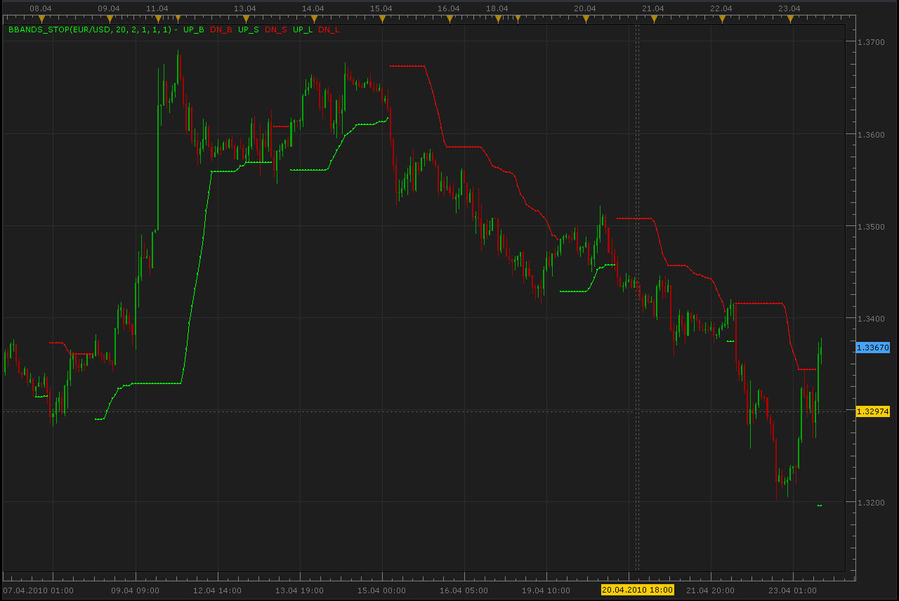

# BBands_Stop indicator

> Source: https://fxcodebase.com/code/viewtopic.php?f=17&t=757  
> Forum: 17 · Topic 757 · 23 post(s)

---

## BBands_Stop indicator

**Alexander.Gettinger** · Fri Apr 23, 2010 10:42 am

> moh2001 wrote:
> [http://forex-indicators.net/mt4-indicators/bbands_stop](http://forex-indicators.net/mt4-indicators/bbands_stop)
> can you please convert into Tradding Station II

 

Download:

 [BBands_Stop.lua](files/1394/BBands_Stop.lua)

 [BBands_Stop with Alert.lua](files/1394/BBands_Stop%20with%20Alert.lua)

This indicator will provides Audio / Email Alerts if and when BBands_Stop indication is changed.

The indicator was revised and updated

BB stops stochastic
[viewtopic.php?f=17&t=68191](https://fxcodebase.com/code/viewtopic.php?f=17&t=68191)

---

## Re: BBands_Stop indicator

**moh2001** · Fri Apr 23, 2010 7:45 pm

thanks so much

---

## Re: BBands_Stop indicator

**moh2001** · Sat Apr 24, 2010 6:05 pm

can you make into a signal? since i should get an alert..

thanks

---

## Re: BBands_Stop indicator

**Frederic** · Mon Apr 26, 2010 11:53 am

Hello,
Your indicator look like "super trend" but is not exactly the same.
Can you make the "super trend"?
 Thank you.

---

## Re: BBands_Stop indicator

**Frederic** · Mon Apr 26, 2010 12:22 pm

Hello,
Your indicator look like the "super trend".
Can you convert the "super trend"
Thank you.

---

## Re: BBands_Stop indicator

**Alexander.Gettinger** · Mon Apr 26, 2010 10:44 pm

> **moh2001 wrote:**
> can you make into a signal? since i should get an alert..

Signal you may find here: [viewtopic.php?f=29&t=852](https://fxcodebase.com/code/viewtopic.php?f=29&t=852)

---

## Re: BBands_Stop indicator

**Merchantprince** · Sun Aug 29, 2010 6:17 pm

I asked in the thread for the signal version of this about an email feature update. But now I'm wondering if, given the nature of the new TS II with it's new "Strategies" category, that it would also be a good idea to ask here. Is it possible to update this indicator to make use of the new email alert feature in the latest TS update?

Thank You!

---

## Re: BBands_Stop indicator

**Apprentice** · Mon Aug 30, 2010 3:04 am

Added to developmen cue.

---

## Re: BBands_Stop indicator

**Merchantprince** · Mon Aug 30, 2010 7:06 am

> **Apprentice wrote:**
> Added to developmen cue.

Sorry to bother you again, but might it also be possible to add the new line thickness feature to this tool, as well? If it's too much trouble, I'd still be very happy with just adding the email functionality.

Thanks!

---

## Re: BBands_Stop indicator

**4xtr8r** · Fri Sep 03, 2010 2:23 pm

Anyone have the Fibonacci Bollinger Bands indicator??

---

## Re: BBands_Stop indicator

**Apprentice** · Fri Sep 03, 2010 7:10 pm

I believe that this version has not yet been developed.

---

## Re: BBands_Stop indicator

**wizardpro** · Mon Oct 25, 2010 5:04 am

Hi
 I failes to understand the concept what is the principal is trying to address? BB band break out ?

---

## Re: BBands_Stop indicator

**luigipg** · Wed Apr 27, 2011 10:47 am

Hi, it's possible the bigger time frame of this indicator? Thanks a lot. Luigi!!!

---

## Re: BBands_Stop indicator

**Apprentice** · Thu Apr 28, 2011 5:49 am

Your request has been added to developmental cue.

---

## Re: BBands_Stop indicator

**4xtr8r** · Wed Jun 08, 2011 1:27 pm

Hi,

Any chance this could be done as a strategy?

---

## Re: BBands_Stop indicator

**Apprentice** · Thu Jun 09, 2011 10:56 am

Your request has been added to developmental cue.

---

## Re: BBands_Stop indicator

**Apprentice** · Thu Jun 09, 2011 12:31 pm

Already done.
This strategy can be found here.
[viewtopic.php?f=31&t=4672](https://fxcodebase.com/code/viewtopic.php?f=31&t=4672)

---

## Re: BBands_Stop indicator

**cersoz** · Thu Jan 30, 2014 2:21 am

this indicator have line and tickness selectable but cant work? please fix it.

---

## Re: BBands_Stop indicator

**Apprentice** · Thu Jan 30, 2014 4:14 am

Style Option Added.

---

## Re: BBands_Stop indicator

**Apprentice** · Mon Mar 24, 2014 4:39 am

BBands_Stop with Alert.lua Added.

---

## Re: BBands_Stop indicator

**mulligan** · Mon Mar 24, 2014 10:34 am

Thanks so much for the BBands_Stop with Alert. I have the "show alert, sound, and recurrent sound" turned on. Show alert works fine, but the sound options are not working. Thanks again.

---

## Re: BBands_Stop indicator

**Apprentice** · Tue Mar 25, 2014 3:49 am

Do you have an active _Alert helper?
On your chart (single instance) for currency pair in subject.

---

## Re: BBands_Stop indicator

**Apprentice** · Fri Jun 16, 2017 7:31 am

The indicator was revised and updated.
