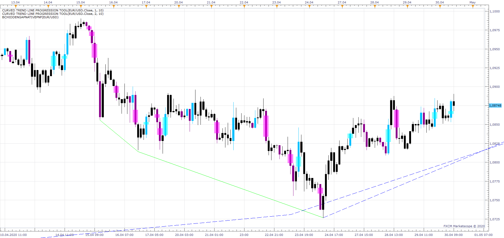

# bcHiddenGapNativePnF

> Source: https://fxcodebase.com/code/viewtopic.php?f=17&t=69764  
> Forum: 17 · Topic 69764 · 7 post(s)

---

## bcHiddenGapNativePnF

**Apprentice** · Thu Apr 30, 2020 5:08 am

Based on request.
[viewtopic.php?f=27&t=69736](https://fxcodebase.com/code/viewtopic.php?f=27&t=69736)

 [bcHiddenGapNativePnF.lua](files/133354/bcHiddenGapNativePnF.lua)

---

## Re: bcHiddenGapNativePnF

**nbats7979** · Fri May 01, 2020 4:42 am

Thank you this is great!

---

## Re: bcHiddenGapNativePnF

**nbats7979** · Mon May 04, 2020 1:25 pm

Hi Apprentice,

I'm just having a problem with this indicator- when I refresh the chart sometimes the bar colors are removed. Also sometimes this indicator just completely removes itself from being displayed. It is still there if I check which indicators are on the chart but it isn't displayed at all. Any ideas what might be going on?

Thanks,
Nick

---

## Re: bcHiddenGapNativePnF

**Apprentice** · Tue May 05, 2020 4:18 am

Your request is added to the development list.
Development reference 1220.

---

## Re: bcHiddenGapNativePnF

**Apprentice** · Tue May 05, 2020 5:21 am

Take a look in the events log. Do you have any errors?

---

## Re: bcHiddenGapNativePnF

**nbats7979** · Tue May 05, 2020 5:31 am

Hi,

No errors in the events log. Here is an example of what I mean. The down bar is colored, then I hit f5 to refresh the chart and that color disappears as a false signal.

---

## Re: bcHiddenGapNativePnF

**Apprentice** · Wed May 06, 2020 5:48 am

F5 reloads all data from the server. That data is not the same as the data build on ticks. You will get a slightly different chart. Maybe that's enough for some signals to become invalid and they are not showing anymore
