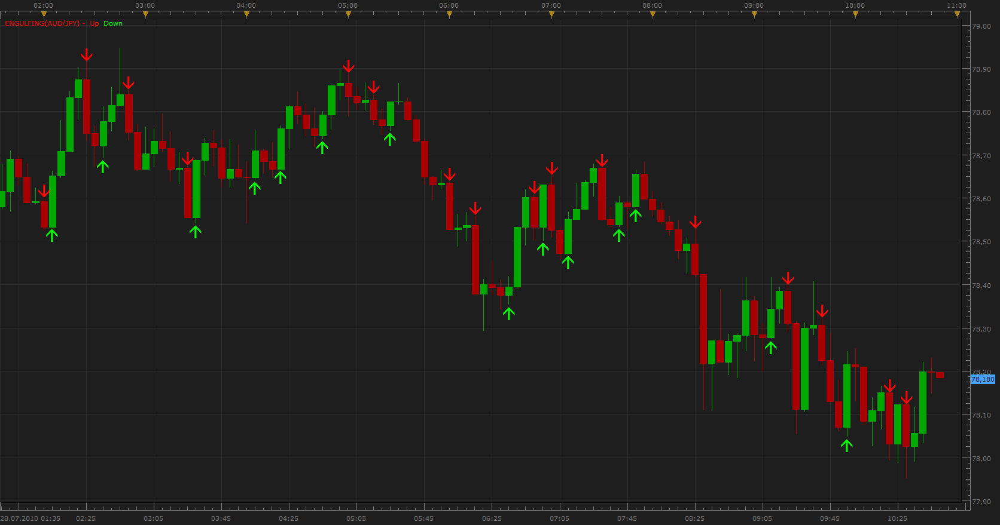

# Bearish/Bullish Engulfing Patterns

> Source: https://fxcodebase.com/code/viewtopic.php?f=17&t=1613  
> Forum: 17 · Topic 1613 · 57 post(s)

---

## Bearish/Bullish Engulfing Patterns

**Apprentice** · Thu Jul 29, 2010 8:43 am

 [Engulfing.lua](files/3186/Engulfing.lua)

 [Engulfing with Alert.lua](files/3186/Engulfing%20with%20Alert.lua)

Same Color Filter
If it is used, both candles must have the same color.

MA Filter
If it is used Engulfing must be,
above MA for bullish Alert,
below MA for bearish Alert.

The indicator was revised and updated

Engulfing.lua based Dashboard
[viewtopic.php?f=17&t=66847&p=121673#p121673](https://fxcodebase.com/code/viewtopic.php?f=17&t=66847&p=121673#p121673)

---

## Re: Bearish/Bullish Engulfing Patterns

**leftcoaster** · Mon Aug 02, 2010 2:06 am

Hi!

I'm new so pardon my inquiry. I downloaded this indicator but nothing's showing up on my chart. It appears that the indicator loaded but I am not getting the colored arrows.

Thanks for your help!
Leftcoaster

---

## Re: Bearish/Bullish Engulfing Patterns

**leftcoaster** · Mon Aug 02, 2010 3:33 am

I just noticed that on a 5 minute chart, I am getting the arrows.

To clarify, this indicator has a strict definition of 'Engulfing'. The prior candle's body + wick must be engulfed by the present candle body. Correct?

Thanks!

---

## Re: Bearish/Bullish Engulfing Patterns

**Apprentice** · Mon Aug 02, 2010 3:34 am

Strange, try to change, Complet candle option.

---

## Re: Bearish/Bullish Engulfing Patterns

**Apprentice** · Mon Aug 02, 2010 3:41 am

Yes, By changing these options, the indicator uses a slightly broader definition.

The body of the previous candle is Engulft by Engulfing bar.

---

## Re: Bearish/Bullish Engulfing Patterns

**leftcoaster** · Mon Aug 02, 2010 3:48 am

That did it! I changed 'Complete Candle' to False and a ton of signals popped up....too many really, even on the 4 hour chart...thus the need for the 3 candle signal. Nevertheless, this indicator does help and works well! Thanks....

---

## Re: Bearish/Bullish Engulfing Patterns

**Apprentice** · Mon Aug 02, 2010 3:58 am

I'm glad I can help

---

## Re: Bearish/Bullish Engulfing Patterns

**leftcoaster** · Mon Aug 02, 2010 4:19 am

Me too! I really appreciate it!

---

## Re: Bearish/Bullish Engulfing Patterns

**raulbanda1** · Mon Aug 23, 2010 12:17 am

I am getting an error message when I try to download on FXCM. Any suggestions?

---

## Re: Bearish/Bullish Engulfing Patterns

**Apprentice** · Mon Aug 23, 2010 3:46 am

Can you specify the error message.
I tried an indicator, it works perfectly.

---

## Re: Bearish/Bullish Engulfing Patterns

**raulbanda1** · Mon Aug 23, 2010 8:34 am

The error message Im getting reads "Error in File (String Engulfing) Attemp to index global indicator (a nil value)

---

## Re: Bearish/Bullish Engulfing Patterns

**Nikolay.Gekht** · Mon Aug 23, 2010 9:20 am

This error usually appears when you try install an indicator as a signal. Please follow the instruction on how to install the indicator here:
[viewtopic.php?f=17&t=17](https://fxcodebase.com/code/viewtopic.php?f=17&t=17)

---

## Re: Bearish/Bullish Engulfing Patterns

**MrDavide79** · Wed Oct 10, 2012 10:44 am

Perfect Indicator

thanks a lot

---

## Re: Bearish/Bullish Engulfing Patterns

**MrDavide79** · Wed Oct 10, 2012 10:46 am

hello,
is it possible to have a **Engulfing_Strategy.lua** ?

thanks

---

## Re: Bearish/Bullish Engulfing Patterns

**Apprentice** · Wed Oct 10, 2012 11:31 am

Can you give me conditions for this strategy,
Also, can you test this strategy.
[viewtopic.php?f=31&t=4846&p=19026&hilit=Patterns#p19026](https://fxcodebase.com/code/viewtopic.php?f=31&t=4846&p=19026&hilit=Patterns#p19026)

---

## Re: Bearish/Bullish Engulfing Patterns

**MrDavide79** · Wed Oct 10, 2012 4:17 pm

> **Apprentice wrote:**
> Can you give me conditions for this strategy,
> Also, can you test this strategy.
> [viewtopic.php?f=31&t=4846&p=19026&hilit=Patterns#p19026](https://fxcodebase.com/code/viewtopic.php?f=31&t=4846&p=19026&hilit=Patterns#p19026)

strategy where BUY with Bullish Engulfing and SELL Bearish Engulfing.

---

## Re: Bearish/Bullish Engulfing Patterns

**Apprentice** · Mon Oct 15, 2012 5:13 am

Requested can be found here.
[viewtopic.php?f=31&t=24466](https://fxcodebase.com/code/viewtopic.php?f=31&t=24466)

---

## Re: Bearish/Bullish Engulfing Patterns

**Apprentice** · Tue Jan 01, 2013 7:19 am

Modified Engulfing Added.
Engulfing bar Indicator updated.

---

## Re: Bearish/Bullish Engulfing Patterns

**trendwatch** · Thu Mar 28, 2013 4:04 am

Really helpfull indy. Maybe a color candle option would be nice to reduce clutter on the screen?

---

## Re: Bearish/Bullish Engulfing Patterns

**speakinmymind** · Thu Mar 28, 2013 10:14 am

Can you add the ability to modify size of both the looked at and current candle?

I think this along with a SMA option would allow better strategy optimization.

---

## Re: Bearish/Bullish Engulfing Patterns

**Apprentice** · Fri Mar 29, 2013 2:17 pm

SMA option, can you clarify.
Color candle option is on.

---

## Re: Bearish/Bullish Engulfing Patterns

**speakinmymind** · Fri Mar 29, 2013 5:58 pm

> **Apprentice wrote:**
> SMA option, can you clarify.
> Color candle option is on.

I mean if the price is above the selected moving average it will only show bullish signals, if it is below the selected SMA, it will be restricted to bearish signals

---

## Re: Bearish/Bullish Engulfing Patterns

**Apprentice** · Mon Apr 01, 2013 7:07 am

Your request is added to the development list.

---

## Re: Bearish/Bullish Engulfing Patterns

**Apprentice** · Wed Apr 03, 2013 6:35 am

Color candle & MA Filter options added.

---

## Re: Bearish/Bullish Engulfing Patterns

**speakinmymind** · Wed Apr 03, 2013 10:03 am

Can the same MA filter be added to the Modified Engulfing indicator? I can't find the URL to the indicator to post this comment to.

---

## Re: Bearish/Bullish Engulfing Patterns

**speakinmymind** · Wed Apr 03, 2013 8:23 pm

nevermind about the modified, i see thats what the color filter is for... whoops

---

## Re: Bearish/Bullish Engulfing Patterns

**Apprentice** · Thu Apr 04, 2013 5:11 am

Modified engulfing indicator, is no more.
I have merged this two versions in one indicator.

---

## Re: Bearish/Bullish Engulfing Patterns

**DAVIDR** · Fri Nov 14, 2014 11:09 am

Hi, do you happen to have this indicator as an MT4 .exe file?

All the best

---

## Re: Bearish/Bullish Engulfing Patterns

**DAVIDR** · Fri Nov 14, 2014 2:35 pm

Hi,

Can we have this as an MT4 .exe file?

All the best.

---

## Re: Bearish/Bullish Engulfing Patterns

**Apprentice** · Sat Nov 15, 2014 5:44 am

Will add your request to the development list.

---

## Re: Bearish/Bullish Engulfing Patterns

**congok** · Mon Mar 09, 2015 7:34 pm

Love this indi...Can we add an option for alert?

---

## Re: Bearish/Bullish Engulfing Patterns

**Apprentice** · Tue Mar 10, 2015 3:32 am

Your request is added to the development list.

---

## Re: Bearish/Bullish Engulfing Patterns

**mwmarks1** · Tue Mar 24, 2015 4:17 pm

> **Apprentice wrote:**
> Yes, By changing these options, the indicator uses a slightly broader definition.
>
> The body of the previous candle is Engulft by Engulfing bar.

Hi can we add an alert to this indicator when an engulfing candle is formed?

---

## Re: Bearish/Bullish Engulfing Patterns

**DAVIDR** · Tue Mar 31, 2015 4:41 pm

Hi, Anyone know if this is yet available as an MT4 indicator????

---

## Re: Bearish/Bullish Engulfing Patterns

**Apprentice** · Wed Apr 01, 2015 3:43 am

Not that I know.
Added to development list.

---

## Re: Bearish/Bullish Engulfing Patterns

**Stance** · Thu Jul 23, 2015 3:48 am

Can reverse signal types be added to this indicator to show BUY when price is below MA and SELL when price is above MA?

---

## Re: Bearish/Bullish Engulfing Patterns

**stainer** · Sat May 28, 2016 10:13 pm

Hi just checking up will the alert ever be ready for this indi. It would save me a massive amount of time checking through all the charts every hour if we could have a alert as engulfing candles are a huge part of my strategy.
Thanks

---

## Re: Bearish/Bullish Engulfing Patterns

**Apprentice** · Mon May 30, 2016 2:08 pm

Engulfing with Alert.lua Added

---

## Re: Bearish/Bullish Engulfing Patterns

**stainer** · Tue May 31, 2016 9:04 am

Thank you Apprentice

---

## Re: Bearish/Bullish Engulfing Patterns

**gpfd1985** · Thu Jun 09, 2016 11:29 am

Turn off opposite candle arrow.
What I mean by that is if I'm clearly in a trend say, an uptrend and I get a bullish engulfing candle is there a way to turn off the bearish candles so they don't clutter the chart. And of course bearish candles if in a down trend.
 Thank you as always for you awesome help

---

## Re: Bearish/Bullish Engulfing Patterns

**Apprentice** · Fri Jun 10, 2016 2:43 am

Your request is added to the development list.
Bugzilla Bug 3537

---

## Engulfing with Alert.lua

**gpfd1985** · Mon Sep 26, 2016 11:29 am

Would you please add a filter to the above so it only alerts on the close of the candle.
As always thank you for your hard work

---

## Re: Bearish/Bullish Engulfing Patterns

**Apprentice** · Tue Sep 27, 2016 12:03 pm

Trend Filter added.

> Would you please add a filter to the above so it only alerts on the close of the candle.

Please use "End of Turn" parameter.

---

## Re: Bearish/Bullish Engulfing Patterns

**gpfd1985** · Tue Oct 04, 2016 2:47 pm

Would it be poss to change alert function where it only alerts when the candle has closed.

---

## Re: Bearish/Bullish Engulfing Patterns

**Avignon** · Wed Oct 05, 2016 3:20 am

The answer is above your question.

---

## Re: Bearish/Bullish Engulfing Patterns

**Apprentice** · Tue Mar 13, 2018 10:56 am

The indicator was revised and updated

---

## Re: Bearish/Bullish Engulfing Patterns

**jackyeg** · Mon Jul 29, 2019 12:37 pm

> **Apprentice wrote:**
> The indicator was revised and updated

I love this indicator, would it be possible to have it on mt4? The option to paint the candle helps a lot to identify fast the engulfing. Defining also "complete candle" very important.

---

## Re: Bearish/Bullish Engulfing Patterns

**Apprentice** · Wed Jul 31, 2019 6:27 am

Try this version.
[viewtopic.php?f=38&t=67332](https://fxcodebase.com/code/viewtopic.php?f=38&t=67332)

---

## Re: Bearish/Bullish Engulfing Patterns

**jackyeg** · Thu Aug 08, 2019 6:21 pm

> **Apprentice wrote:**
> Try this version.
> [viewtopic.php?f=38&t=67332](https://fxcodebase.com/code/viewtopic.php?f=38&t=67332)

Thank you, but the mt4 version only shows the typical arrows, not the options that FXCM's provides.
Thank you

---

## Re: Bearish/Bullish Engulfing Patterns

**Apprentice** · Fri Aug 09, 2019 5:02 pm

Your request is added to the development list under Id Number 4831

---

## Re: Bearish/Bullish Engulfing Patterns

**Apprentice** · Tue Aug 13, 2019 7:44 am

Try this version.
[viewtopic.php?f=38&t=68780](https://fxcodebase.com/code/viewtopic.php?f=38&t=68780)

---

## Re: Bearish/Bullish Engulfing Patterns

**zhlongji** · Tue May 05, 2020 3:03 pm

Hello!I'm new here, can you help edit

 [Engulfing.lua](files/133583/Engulfing.lua)

 this metric shown below? The rules are as follows：
1. When the price does not touch the area consisting of the green and red lines in the engulfed candle, the green and red lines are shown.
2. If the price has touched this area, the two lines turn grey.
3、These two lines are cancelled when the price breaks through this area.
Everything else remains the same, just add the three rules above.

Thanks here! All the best!

 

---

## Re: Bearish/Bullish Engulfing Patterns

**Apprentice** · Tue May 05, 2020 7:20 pm

Your request is added to the development list.
Development reference 1227.

---

## Re: Bearish/Bullish Engulfing Patterns

**Apprentice** · Wed May 06, 2020 5:48 am

Try this version.
[viewtopic.php?f=17&t=69809](https://fxcodebase.com/code/viewtopic.php?f=17&t=69809)

---

## Re: Bearish/Bullish Engulfing Patterns

**jackyeg** · Fri May 27, 2022 10:09 am

Any possibility to review this link?
[https://fxcodebase.com/code/download/fi ... &mode=view](https://fxcodebase.com/code/download/file.php?id=25746&mode=view)
The request is to convert to mt4 the engulfing.lua file as is, to allow the selection of a full engulfing of a candle and the possibility to color the candle instead of using pointing arrows. Thank you.

---

## Re: Bearish/Bullish Engulfing Patterns

**Apprentice** · Fri May 27, 2022 11:43 am

We have added your request to the development list.
Development reference 315.

---

## Re: Bearish/Bullish Engulfing Patterns

**Apprentice** · Fri Jun 17, 2022 2:25 am

Try this version.
[https://fxcodebase.com/code/viewtopic.php?f=38&t=72394](https://fxcodebase.com/code/viewtopic.php?f=38&t=72394)
