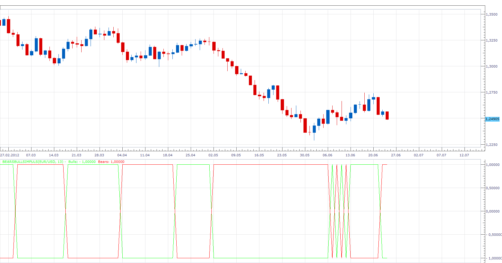

# Bears Bulls Impuls

> Source: https://fxcodebase.com/code/viewtopic.php?f=17&t=20561  
> Forum: 17 · Topic 20561 · 3 post(s)

---

## Bears Bulls Impuls

**Apprentice** · Mon Jun 25, 2012 2:59 am

Indicator is based on the Elder-Rays Bulls & Bears Power indicators.
Bull + Bear > 0
Bulls = 1
Bears = -1

Bull + Bear < 0
Bulls =-1
Bears = 1

 [BearsBullsImpuls.lua](files/36016/BearsBullsImpuls.lua)

The indicator was revised and updated

---

## Re: Bears Bulls Impuls

**Alexander.Gettinger** · Tue Nov 18, 2014 11:52 am

MQL4 version of Bears Bulls Impuls: [viewtopic.php?f=38&t=61467](https://fxcodebase.com/code/viewtopic.php?f=38&t=61467).

---

## Re: Bears Bulls Impuls

**Apprentice** · Wed Jun 28, 2017 5:37 am

The indicator was revised and updated.
