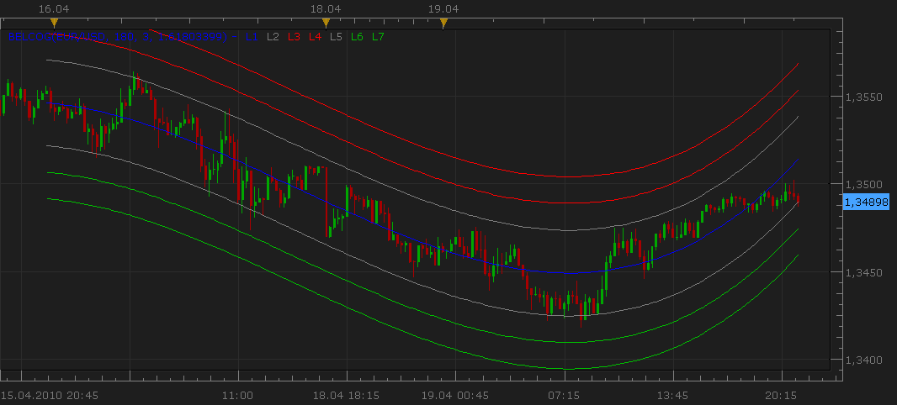
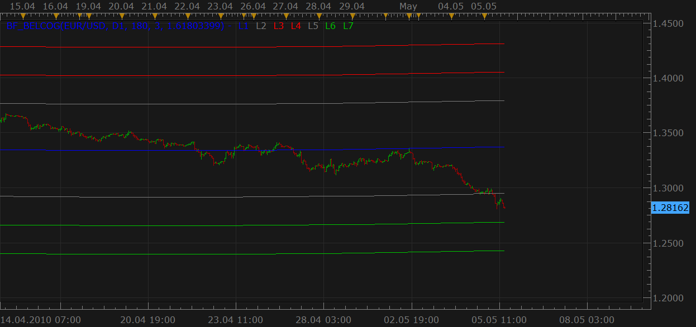

# Belkhayate's Center Of Gravity

> Source: https://fxcodebase.com/code/viewtopic.php?f=17&t=706  
> Forum: 17 · Topic 706 · 37 post(s)

---

## Belkhayate's Center Of Gravity

**Nikolay.Gekht** · Mon Apr 19, 2010 8:26 pm

The indicator can be used to detect the direction of the trade. Looks, for example the following [trade system](http://forex-strategies-revealed.com/scalping/center-of-gravity) for details.

 

Download the indicator:

 [BELCOG.lua](files/1278/BELCOG.lua)

See also the [bigger time frame version](https://fxcodebase.com/code/viewtopic.php?f=17&t=706&p=1775#p1775)

 

Finite Belkhayates center of gravity can be located anywhere on chart.

 [Finite Belkhayates Center Of Gravity.lua](files/1278/Finite%20Belkhayates%20Center%20Of%20Gravity.lua)

MT4/MQ4 version.
[viewtopic.php?f=38&t=68929](https://fxcodebase.com/code/viewtopic.php?f=38&t=68929)

---

## Re: Belkhayate's Center Of Gravity

**barishn** · Sun May 02, 2010 11:02 pm

Hi,

Thanks so much for this indicator, it works really well, my only query is how come it doesn't load for the entire length of a chart..it seems to only show for a short time length..is it suppose to be that way?

Thanks

---

## Re: Belkhayate's Center Of Gravity

**Nikolay.Gekht** · Mon May 03, 2010 7:57 am

Yes. The indicator is drawn for the last N (where N is the first parameter of the indicator) bars only. Moreover, the indicator completely redraws all last N bars when a new bar appears.

---

## Bigger time frame version

**Nikolay.Gekht** · Wed May 05, 2010 2:37 pm

The bigger time frame version of the indicator:

 

 [BF_BELCOG.lua](files/1775/BF_BELCOG.lua)

(the [BELCOG.lua](https://fxcodebase.com/code/viewtopic.php?f=17&t=706) must be also installed!)

---

## Re: Belkhayate's Center Of Gravity

**aarons_alive** · Wed May 05, 2010 7:41 pm

Ahhhh yes. A 'selling into strength' system... just what my bank account needs!

---

## Re: Belkhayate's Center Of Gravity

**jefftrader** · Tue Jul 13, 2010 4:20 pm

any possibility of getting a version of this indicator that doesn't repaint on every new bar?

---

## Re: Belkhayate's Center Of Gravity

**Nikolay.Gekht** · Tue Jul 13, 2010 10:02 pm

No, because such class of the indicator (the same is, for example for any approximation indicators or to the wave analysis) always does it. It is specific of the method.

---

## Re: Belkhayate's Center Of Gravity

**Poupouille** · Wed Nov 09, 2011 4:54 pm

Hello. I search the indicator "Belkhayate Timer" (and not Belkhayate Timing) with Marketscope 2.0 from FXCM ! Can you help me ?
Thanks.

---

## Re: Belkhayate's Center Of Gravity

**Apprentice** · Wed Nov 09, 2011 5:53 pm

Can you provide me code for this indicator or a web reference.

---

## Re: Belkhayate's Center Of Gravity

**Karlo_Karlo** · Mon Feb 27, 2012 3:33 pm

This indicator seems to work quite well. I tried to make a signal but my knowledge is not enough for this task. Here is the code which does not work correctly. It generates signals but not in the right places. Signals must be generated when price touches L3 (L4) or L6 (L7).

Dear Nikolay, maybe you can help?

Code: [Select all](https://fxcodebase.com/code/)
`-- Indicator profile initialization routine
-- Defines indicator profile properties and indicator parameters
function Init()
    strategy:name("Gravity signal");
    strategy:description("Signals when Price hits Gravity Edges");

    strategy.parameters:addGroup("Gravity parameters");
    strategy.parameters:addInteger("N", "Number of bars", "", 120);
    strategy.parameters:addInteger("O", "Order", "", 3);
    strategy.parameters:addDouble("E", "Eccart value", "", 1.61803399);

    strategy.parameters:addGroup("Price parameters");
    strategy.parameters:addString("Period", "Time frame", "", "m1");
    strategy.parameters:setFlag("Period", core.FLAG_PERIODS);

    strategy.parameters:addGroup("Signal parameters");
    strategy.parameters:addBoolean("ShowAlert", "Show Alert", "", true);
    strategy.parameters:addBoolean("PlaySound", "Play Sound", "", false);
    strategy.parameters:addFile("SoundFile", "Sound file", "", "");
    strategy.parameters:setFlag("SoundFile", core.FLAG_SOUND);
    strategy.parameters:addBoolean("Recurrent", "RecurrentSound", "", false);

    strategy.parameters:addGroup("Email Parameters");
    strategy.parameters:addBoolean("SendEmail", "Send email", "", false);
    strategy.parameters:addString("Email", "Email address", "", "");
    strategy.parameters:setFlag("Email", core.FLAG_EMAIL);
end

-- Indicator instance initialization routine
-- Processes indicator parameters and creates output streams
-- Parameters block
local gSource;
local BELCOG;

local SoundFile;
local RecurrentSound;
local Email;
local ShowAlert;
local name;

local N;
local O;
local E;

-- Streams block
local L1;
local L2;
local L3;
local L4;
local L5;
local L6;
local L7;

-- Routine
function Prepare(onlyName)

    N = instance.parameters.N;
    O = instance.parameters.O;
    E = instance.parameters.E;

    ShowAlert = instance.parameters.ShowAlert;
    if instance.parameters.PlaySound then
        SoundFile = instance.parameters.SoundFile;
    else
        SoundFile = nil;
    end

    assert(not(PlaySound) or (PlaySound and SoundFile ~= ""), "Sound file must be specified");

    RecurrentSound = instance.parameters.Recurrent;
    local SendEmail = instance.parameters.SendEmail;
    if SendEmail then
        Email = instance.parameters.Email;
    else
        Email = nil;
    end
    assert(not(SendEmail) or (SendEmail and Email ~= ""), "Email address must be specified");

    name = profile:id() .. "(" .. instance.bid:instrument()  .. "," .. N .. "," .. O .. "," .. E .. ")";
    instance:name(name);

    if onlyName then
        return ;
    end

    assert(instance.parameters.Period ~= "t1", "Can't be applied on ticks!");

    gSource = ExtSubscribe(1, nil, instance.parameters.Period, true, "bar");
    BELCOG = core.indicators:create("BELCOG", gSource, N, O, E);

end

function ExtUpdate(id, source, period)
    if id == 1 then
        BELCOG:update(core.UpdateLast);

        if period >= BELCOG.DATA:first() + 1 then
            local message = nil;

            if core.crossesOver( gSource.high, BELCOG.L3, period) then
                message = "Gravity OverBought";
            elseif core.crossesUnder( gSource.low, BELCOG.L6, period) then
                message = "Gravity OverSold";
            end

            if message ~= nil then
               if ShowAlert then
                   terminal:alertMessage(instance.bid:instrument(), instance.bid[NOW], message, instance.bid:date(NOW));
               end

               if SoundFile ~= nil then
                   terminal:alertSound(SoundFile, RecurrentSound);
               end

               if Email ~= nil then
                   terminal:alertEmail(Email, name, name .. "(" .. core.formatDate(instance.bid:date(NOW)) .. ") : " .. message);
               end
            end
        end
    end
end

dofile(core.app_path() .. "\\strategies\\standard\\include\\helper.lua");`

---

## Re: Belkhayate's Center Of Gravity

**Hug Coder** · Mon Feb 27, 2012 6:18 pm

Karlo_Karlo:
See if this works. I haven't tested it.

Code: [Select all](https://fxcodebase.com/code/)
`-- Indicator profile initialization routine
    -- Defines indicator profile properties and indicator parameters
    function Init()
    strategy:name("Gravity signal");
    strategy:description("Signals when Price hits Gravity Edges");

    strategy.parameters:addGroup("Gravity parameters");
    strategy.parameters:addInteger("N", "Number of bars", "", 120);
    strategy.parameters:addInteger("O", "Order", "", 3);
    strategy.parameters:addDouble("E", "Eccart value", "", 1.61803399);

    strategy.parameters:addGroup("Price parameters");
    strategy.parameters:addString("Period", "Time frame", "", "m1");
    strategy.parameters:setFlag("Period", core.FLAG_PERIODS);

    strategy.parameters:addGroup("Signal parameters");
    strategy.parameters:addBoolean("ShowAlert", "Show Alert", "", true);
    strategy.parameters:addBoolean("PlaySound", "Play Sound", "", false);
    strategy.parameters:addFile("SoundFile", "Sound file", "", "");
    strategy.parameters:setFlag("SoundFile", core.FLAG_SOUND);
    strategy.parameters:addBoolean("Recurrent", "RecurrentSound", "", false);

    strategy.parameters:addGroup("Email Parameters");
    strategy.parameters:addBoolean("SendEmail", "Send email", "", false);
    strategy.parameters:addString("Email", "Email address", "", "");
    strategy.parameters:setFlag("Email", core.FLAG_EMAIL);
    end

    -- Streams/Indicators
    local gSource, gTick;
    local BELCOG;
    local name;

    -- Parameters
    local SoundFile;
    local RecurrentSound;
    local Email;
    local ShowAlert;

    local N;
    local O;
    local E;

    -- Variables

    -- Init Routine
    function Prepare(onlyName)

       N = instance.parameters.N;
       O = instance.parameters.O;
       E = instance.parameters.E;

       ShowAlert = instance.parameters.ShowAlert;
       if instance.parameters.PlaySound then
       SoundFile = instance.parameters.SoundFile;
       else
       SoundFile = nil;
       end

       assert(not(PlaySound) or (PlaySound and SoundFile ~= ""), "Sound file must be specified");

       RecurrentSound = instance.parameters.Recurrent;
       local SendEmail = instance.parameters.SendEmail;
       if SendEmail then
       Email = instance.parameters.Email;
       else
       Email = nil;
       end
       assert(not(SendEmail) or (SendEmail and Email ~= ""), "Email address must be specified");

       name = profile:id() .. "(" .. instance.bid:instrument() .. "," .. N .. "," .. O .. "," .. E .. ")";
       instance:name(name);

       if onlyName then
          return;
       end

       assert(instance.parameters.Period ~= "t1", "Can't be applied on ticks!");

       gSource = ExtSubscribe(1, nil, instance.parameters.Period, true, "bar");
       gTick = ExtSubscribe(2, nil, "t1", true, "close");
       BELCOG = core.indicators:create("BELCOG", gSource, N, O, E);

    end

    -- Process data routine
    function ExtUpdate(id, source, period)

       -- If ticksource, use bar period
       if id == 2 then
          period = gSource:size() - 1;
       else
          return;
       end
       
       if period < BELCOG.DATA:first() + 1 then
          return;
       end
       
       BELCOG:update(core.UpdateLast);

       if core.crossesOver(gSource.high, BELCOG.L3, period) then
          Signal("Gravity OverBought");
       elseif core.crossesUnder(gSource.low, BELCOG.L6, period) then
          Signal("Gravity OverSold");
       end

    end

    function Signal(Label)
        if ShowAlert then
            terminal:alertMessage(instance.bid:instrument(), instance.bid[NOW],  Label, instance.bid:date(NOW));
        end

        if SoundFile ~= nil then
            terminal:alertSound(SoundFile, RecurrentSound);
        end

        if Email ~= nil then
            terminal:alertEmail(Email, Label, profile:id() .. "(" .. instance.bid:instrument() .. ")" .. instance.bid[NOW]..", " .. Label..", " .. instance.bid:date(NOW));
        end
    end

    dofile(core.app_path() .. "\\strategies\\standard\\include\\helper.lua");`

---

## Re: Belkhayate's Center Of Gravity

**virgilio** · Tue Feb 28, 2012 5:49 pm

Hello developer(s), this is truly a nice treat. There is also another indicator that should be used with this Center of Gravity. It is a timing indicator that reinforces the Center of Gravity's entry and exit points. It can be viewed at the bottom of page 2 in the attached pdf document (Hot to use Belkhayate). The indicator is is called Belkhayate Timing. Is this something you would you be able to replicate and offer in conjunction with the Center of Gravity?
If so, then we have a formidable tool to use.
Thank you!

---

## Re: Belkhayate's Center Of Gravity

**Hug Coder** · Wed Feb 29, 2012 4:35 am

virgilio:
This [viewtopic.php?f=17&t=715](https://fxcodebase.com/code/viewtopic.php?f=17&t=715) ?

---

## Re: Belkhayate's Center Of Gravity

**Karlo_Karlo** · Thu Mar 01, 2012 6:56 am

Thank you gentlemen, but it looks no different than it was before.
There is the MBFX Timing Indicator subject also; MT4 version gives a color line while the lua version gives something very different, which I do not understand how to use. I understand that it's a subject of intellectual property but it very much looks like that the MT4 Timing Indicator is a colorized version of some common indicator. I tried to look for but did not succeed.
What do you think about it?

---

## Re: Belkhayate's Center Of Gravity

**Hug Coder** · Fri Mar 02, 2012 7:27 am

Karlo_Karlo:
You have to define what you want exactly otherwise it's not so easy.

If you are requesting another indicator please make a proper request in the request forum, with enough information to make something out of it, e.g. a link or code (and picture+description) of the MT4 version.

---

## Re: Belkhayate's Center Of Gravity

**Karlo_Karlo** · Sat Mar 03, 2012 8:49 am

Thank you Hug Coder,
Below is the "MBFX Timing.ex4" file, which is the additional indicator for MBFX system. But It is for the MT4 and we do not have a lua version. As it is said in the beginning of this thread that this system is an intellectual property of Mr.Belkhayate and it is not allowed to make a lua version of his indicator without his permission. But I think that this indicator is not a very sophisticated one. I tried to compare it with other common indicators in the MT4 but I could not find anything similar yet. In my recent post I was simply asking your opinion about this indicators resemblance with others.

---

## Re: Belkhayate's Center Of Gravity

**trendwatch** · Sun Mar 04, 2012 7:50 am

I've read several statements of mr. Belkhayate wherein he states he is in no way related to MBFX. So the MBFX inidcators are not the same as those mr. Belkhayate uses in his system. Just thought you might like know this before you started using these indicators.

---

## Re: Belkhayate's Center Of Gravity

**Hug Coder** · Tue Mar 06, 2012 5:15 am

Karlo_Karlo:
As I said, if you want another indicator, you shouldn't post requests in this thread. If what you are looking for is a different version of the Belkhayate's Timing Indicator ([viewtopic.php?f=17&t=715](https://fxcodebase.com/code/viewtopic.php?f=17&t=715)) then post there, otherwise post a new request thread for what you want, with proper descriptions etc.

The file you posted seems to be a compiled file which has no clear text/code so it's of no use.

---

## Re: Belkhayate's Center Of Gravity

**elliotwave5** · Thu May 31, 2012 8:33 pm

a) Can the Belkhayate indicators (BF long term reg and timing indicators) be used publicly? I believe reading that they are proprietary to him exclusively or are they public?
b) currently reviewing an H4 chart and the GBP/USD is way outside the L7 band. am i correct in that this indicates that one should take a long position? how many pips to risk on the stop and what would his limit be on profit taking?
any comments or suggestions would be greatly appreciated

---

## Re: Belkhayate's Center Of Gravity

**Apprentice** · Fri Jun 01, 2012 3:17 am

I am not aware of such limitations.
 Everything posted here can be used for your own private use.

---

## Re: Belkhayate's Center Of Gravity

**Blackcat2** · Fri Jun 01, 2012 6:47 am

Hi Apprentice,

Could you please convert this version of COG (Centre of Gravity)?

The file is taken from
[http://www.forexfactory.com/showthread.php?t=89714](http://www.forexfactory.com/showthread.php?t=89714)

Thanks
BC

---

## Re: Belkhayate's Center Of Gravity

**Apprentice** · Mon Jun 04, 2012 1:34 am

This is the encoded version.
Do you have a description, formula or MQ4 file.

---

## Re: Belkhayate's Center Of Gravity

**Blackcat2** · Mon Jun 04, 2012 5:55 am

> **Apprentice wrote:**
> This is the encoded version.
> Do you have a description, formula or MQ4 file.

Ouch.. sorry, I don't have one or know (at this moment) where I can get it..

Sorry..
BC

---

## Re: Belkhayate's Center Of Gravity

**juju1024** · Thu Nov 15, 2012 2:13 pm

hi all,

Can you create a customizable strategy for this indicator please ? (marketscope 2)

exemple:

Audible alert when candles collide with L1 or L2 or L4 or L5, L6, L7

Thanks
Cordialy

---

## Re: Belkhayate's Center Of Gravity

**Apprentice** · Fri Nov 16, 2012 4:44 am

Your request is added to the development list.

---

## Re: Belkhayate's Center Of Gravity

**Taskryr** · Thu Oct 16, 2014 7:59 pm

Is it possible to define the start and end points for this indicator? Instead of N bars from the present bar to the past, can we define, for instance, Oct 12, 1AM to Oct 14, 9AM for 8H bars? This way we can track the arc for specific waves of a currency.

Thanks,

---

## Re: Belkhayate's Center Of Gravity

**Apprentice** · Fri Oct 17, 2014 6:15 am

See, Finite Belkhayates center of gravity.
First Post in this Topic.

---

## Re: Belkhayate's Center Of Gravity

**ratchets** · Tue Oct 25, 2016 5:03 pm

hello,
could you help me with the chart in attachement. it gives me lines that are far from the original chart.
hope you could tell me where is the mistake (i followed the code shown below).
thanks.

Code: [Select all](https://fxcodebase.com/code/)
`-- Indicator profile initialization routine
-- Defines indicator profile properties and indicator parameters
function Init()
    indicator:name("Belkhayate's Center Of Gravity");
    indicator:description("");
    indicator:requiredSource(core.Bar);
    indicator:type(core.Indicator);

    indicator.parameters:addInteger("N", "Number of bars", "", 180);
    indicator.parameters:addInteger("O", "Order", "", 3);
    indicator.parameters:addDouble("E", "Eccart value", "", 1.61803399);
    indicator.parameters:addColor("L1_color", "Color of L1", "Color of L1", core.rgb(0, 0, 255));
    indicator.parameters:addColor("L2_color", "Color of L2", "Color of L2", core.rgb(127, 127, 127));
    indicator.parameters:addColor("L3_color", "Color of L3", "Color of L3", core.rgb(255, 0, 0));
    indicator.parameters:addColor("L4_color", "Color of L4", "Color of L4", core.rgb(255, 0, 0));
    indicator.parameters:addColor("L5_color", "Color of L5", "Color of L5", core.rgb(127, 127, 127));
    indicator.parameters:addColor("L6_color", "Color of L6", "Color of L6", core.rgb(0, 192, 0));
    indicator.parameters:addColor("L7_color", "Color of L7", "Color of L7", core.rgb(0, 192, 0));
end

-- Indicator instance initialization routine
-- Processes indicator parameters and creates output streams
-- Parameters block
local N;
local O;
local E;

local first;
local source = nil;

-- Streams block
local L1 = nil;
local L2 = nil;
local L3 = nil;
local L4 = nil;
local L5 = nil;
local L6 = nil;
local L7 = nil;

-- Routine
function Prepare()
    N = instance.parameters.N;
    O = instance.parameters.O;
    E = instance.parameters.E;

    source = instance.source;

    first = source:first();

    local name = profile:id() .. "(" .. source:name() .. ", " .. N .. ", " .. O .. ", " .. E .. ")";
    instance:name(name);
    L1 = instance:addStream("L1", core.Line, name .. ".L1", "L1", instance.parameters.L1_color, first);
    L2 = instance:addStream("L2", core.Line, name .. ".L2", "L2", instance.parameters.L2_color, first);
    L3 = instance:addStream("L3", core.Line, name .. ".L3", "L3", instance.parameters.L3_color, first);
    L4 = instance:addStream("L4", core.Line, name .. ".L4", "L4", instance.parameters.L4_color, first);
    L5 = instance:addStream("L5", core.Line, name .. ".L5", "L5", instance.parameters.L5_color, first);
    L6 = instance:addStream("L6", core.Line, name .. ".L6", "L6", instance.parameters.L6_color, first);
    L7 = instance:addStream("L7", core.Line, name .. ".L7", "L7", instance.parameters.L7_color, first);
end

local prevCandle = nil;

-- Indicator calculation routine
function Update(period)
    if prevCandle ~= nil and source:serial(period) == prevCandle then
        return ;
    else
        prevCandle = source:serial(period);
    end

    if source:size() > 0 and (source:size() - source:first()) > N and period == source:size() - 1 then
        local s, i, j, k, a1, a2, a3, a4, v1, si, t;

        s = O + 1;

        -- init arrays
        a1 = {};
        for i = 0, s, 1 do
            a1[i] = {};
        end
        a2 = {};
        a3 = {};
        a4 = {};

        a2[1] = N + 1;
        for i = 1, (s - 1) * 2, 1 do
            v1 = 0;
            for j = 0, N, 1 do
                v1 = v1 + (math.pow(j, i));
            end
            a2[i + 1] = v1;
        end

        for j = 1, s, 1 do
            v1 = 0;
            for i = 0, N, 1 do
                if j == 1 then
                    v1 = v1 + (source.high[period - i] + source.low[period - i]) / 2;
                else
                    v1 = v1 + (source.high[period - i] + source.low[period - i]) / 2 * (math.pow(i, j - 1));
                end
            end
            a3[j] = v1;
        end

        for j = 1, s, 1 do
           for i = 1, s, 1 do
              a1[i][j] = a2[i + j - 1];
           end
        end

        for i = 1, s - 1, 1 do
            si = 0;
            v1 = 0;
            for j = i, s, 1 do
                if math.abs(a1[j][i]) > v1 then
                    v1 = math.abs(a1[j][i]);
                    si = j;
                end
            end
            if si == 0 then
                return ;
            end

            if si ~= i then
                for j = 1, s, 1 do
                    t = a1[i][j];
                    a1[i][j] = a1[si][j];
                    a1[si][j] = t;
                end
                t = a3[i];
                a3[i] = a3[si];
                a3[si] = t;
            end

            for j = i + 1, s, 1 do
                v1 = a1[j][i] / a1[i][i];
                for k = 1, s, 1 do
                    if k == i then
                        a1[j][k] = 0;
                    else
                        a1[j][k] = a1[j][k] - v1 * a1[i][k];
                    end
                end
                a3[j] = a3[j] - v1 * a3[i];
            end
        end

        a4[s] = a3[s] / a1[s][s];

        for i = s - 1, 1, -1 do
            v1 = 0;
            for j = 1, s - i, 1 do
                v1 = v1 + (a1[i][i + j]) * (a4[i + j]);
                a4[i] = 1 / a1[i][i] * (a3[i] - v1);
            end
        end

        for i = 0, N, 1 do
            v1 = 0;
            for j = 1, O, 1 do
                v1 = v1 + (a4[j + 1]) * (math.pow(i, j));
            end
            L1[period - i] = a4[1] + v1;
        end

        v2 = core.stdev(source.high, core.rangeTo(period, N)) * E;

        for i = 0, N, 1 do
            L4[period - i] = L1[period - i] + v2;
            L3[period - i] = L1[period - i] + (L4[period - i] - L1[period - i]) / 1.382;
            L2[period - i] = L1[period - i] + (L3[period - i] - L1[period - i]) / 1.618;
            L7[period - i] = L1[period - i] - v2;
            L6[period - i] = L1[period - i] - (L1[period - i] - L7[period - i]) / 1.382;
            L5[period - i] = L1[period - i] - (L1[period - i] - L6[period - i]) / 1.618;
        end
        for i = N + 1, N + 10, 1 do
            j = period - i;
            if j > source:first() then
                L1[j] = nil;
                L2[j] = nil;
                L3[j] = nil;
                L4[j] = nil;
                L5[j] = nil;
                L6[j] = nil;
                L7[j] = nil;
            end
        end
    end
end`

---

## Re: Belkhayate's Center Of Gravity

**Apprentice** · Wed Sep 13, 2017 7:33 am

The indicator was revised and updated.

---

## Re: Belkhayate's Center Of Gravity

**easytrading** · Mon Jun 18, 2018 2:26 am

hello Apprentice,

is it possible to show slope color change to all lines for BELCOG.lua, please ? with my appreciation .

---

## Re: Belkhayate's Center Of Gravity

**Apprentice** · Mon Jun 18, 2018 6:12 am

Green for uptrend and vice versa?

---

## Re: Belkhayate's Center Of Gravity

**easytrading** · Mon Jun 18, 2018 8:53 pm

Yes, please .

---

## Re: Belkhayate's Center Of Gravity

**Apprentice** · Tue Jun 19, 2018 5:20 am

Try this version.

 [BELCOG.lua](files/119627/BELCOG.lua)

---

## Re: Belkhayate's Center Of Gravity

**easytrading** · Mon Nov 19, 2018 1:14 am

Hello Apprentice,

Is it possible to add Line width & line style to BELCOG.lua please, ? with my appreciation.

---

## Re: Belkhayate's Center Of Gravity

**easytrading** · Mon Nov 19, 2018 1:18 am

for the second version please . thanks

---

## Re: Belkhayate's Center Of Gravity

**Apprentice** · Mon Nov 19, 2018 8:27 am

Added.

---

## Re: Belkhayate's Center Of Gravity

**Scrat_Power** · Tue Nov 20, 2018 5:51 pm

Hi,

Here me version of Belkhayate's Center Of Gravity.
This version shows the standard "dynamic" BelCoG with default parameters.
You can also show the "static" history of this indicator and the slope/direction history of the central line.
At least, you can suppress levels if you want.
