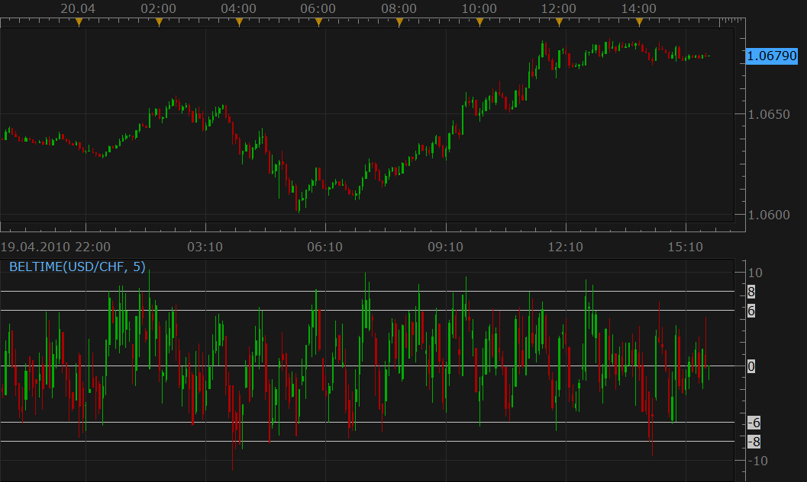

# Belkhayate's Timing Indicator

> Source: https://fxcodebase.com/code/viewtopic.php?f=17&t=715  
> Forum: 17 · Topic 715 · 14 post(s)

---

## Belkhayate's Timing Indicator

**Nikolay.Gekht** · Tue Apr 20, 2010 2:47 pm

Download the indicator:

 [BELTIME.lua](files/1298/BELTIME.lua)

Code: [Select all](https://fxcodebase.com/code/)
`-- Indicator profile initialization routine
-- Defines indicator profile properties and indicator parameters
function Init()
    indicator:name("Belkayate timing indicator");
    indicator:description("");
    indicator:requiredSource(core.Bar);
    indicator:type(core.Oscillator);

    indicator.parameters:addInteger("N", "Number of bars", "No description", 5);
end

-- Indicator instance initialization routine
-- Processes indicator parameters and creates output streams
-- Parameters block
local N;

local first;
local source = nil;

-- Streams block
local O = nil;
local H = nil;
local L = nil;
local C = nil;

-- Routine
function Prepare()
    N = instance.parameters.N;
    source = instance.source;
    first = source:first() + N;

    local name = profile:id() .. "(" .. source:name() .. ", " .. N .. ")";
    instance:name(name);
    O = instance:addStream("O", core.Line, name .. ".O", "O", 0, first);
    H = instance:addStream("H", core.Line, name .. ".H", "H", 0, first);
    L = instance:addStream("L", core.Line, name .. ".L", "L", 0, first);
    C = instance:addStream("C", core.Line, name .. ".C", "C", 0, first);
    O:addLevel(8);
    O:addLevel(6);
    O:addLevel(0);
    O:addLevel(-6);
    O:addLevel(-8);
    instance:createCandleGroup("BT", "BT", O, H, L, C);
end

-- Indicator calculation routine
function Update(period)
    if period >= first then
        local range, sumhigh, sumlow, avg1, avg2;
        range = core.rangeTo(period, N);
        sumhigh = core.sum(source.high, range);
        sumlow = core.sum(source.low, range);
        avg1 = (sumhigh + sumlow) / (2 * N);
        avg2 = (sumhigh - sumlow) / (5 * N);

        O[period] = (source.open[period] - avg1) / avg2;
        H[period] = (source.high[period] - avg1) / avg2;
        L[period] = (source.low[period] - avg1) / avg2;
        C[period] = (source.close[period] - avg1) / avg2;
    end
end`

---

## Re: Belkhayate's Timing Indicator

**TMos1124** · Tue Jun 19, 2012 4:23 pm

Can an alert be made for this indicator? (x > |8|....)

---

## Re: Belkhayate's Timing Indicator

**Apprentice** · Wed Jun 20, 2012 1:40 am

Your request is added to the Development List.

---

## Re: Belkhayate's Timing Indicator

**Apprentice** · Thu Jun 21, 2012 1:52 pm

I have made ​​the update of original indicator.
OB / OS levels can now be changed.
Audio, Email Alerts are now supported.

You can choose from 5 signals, OB1, OB2, OS1, OS2 and Zero Line Cross.

 [BELTIME with Alert.lua](files/35869/BELTIME%20with%20Alert.lua)

Compatibility issue Fix. _Alert helper is not longer needed.
If you want to use the updated version,
please make sure to use latest version of TS.

---

## Re: Belkhayate's Timing Indicator

**TMos1124** · Thu Jun 21, 2012 5:39 pm

Is it possible to have this alert at the tick rather than the close of the candle?

---

## Re: Belkhayate's Timing Indicator

**cccornesss** · Wed Jun 27, 2012 5:48 am

Thanks, amazing job and indicator!

Could it be possible to add another configurable line/level? I mean: another OB3 & OS3, with alert.

Thank you very much in advance

---

## Re: Belkhayate's Timing Indicator

**Apprentice** · Thu Jun 28, 2012 1:16 am

Your request is added to the development list.

---

## Re: Belkhayate's Timing Indicator

**Apprentice** · Fri Jun 29, 2012 6:27 am

3. OB/OS Level Added.

---

## Re: Belkhayate's Timing Indicator

**cccornesss** · Mon Jul 02, 2012 2:13 am

That was quick!!! Thank you very much

---

## Re: Belkhayate's Timing Indicator

**londonfx** · Mon Jul 02, 2012 3:30 pm

Please add Mt4 version. Thank you,

---

## Re: Belkhayate's Timing Indicator

**Apprentice** · Tue Jul 03, 2012 1:59 am

Your request is added to the development list.
(check if there is MT4 indicator)

---

## Re: Belkhayate's Timing Indicator

**Alexander.Gettinger** · Mon Jul 23, 2012 10:06 am

MQL4 version of this indicator: [viewtopic.php?f=38&t=21219](https://fxcodebase.com/code/viewtopic.php?f=38&t=21219)

---

## Re: Belkhayate's Timing Indicator

**Apprentice** · Sun Dec 13, 2015 4:08 pm

Compatibility issue Fix. _Alert helper is not longer needed.

---

## Re: Belkhayate's Timing Indicator

**Apprentice** · Fri Aug 17, 2018 6:29 am

The indicator was revised and updated.
