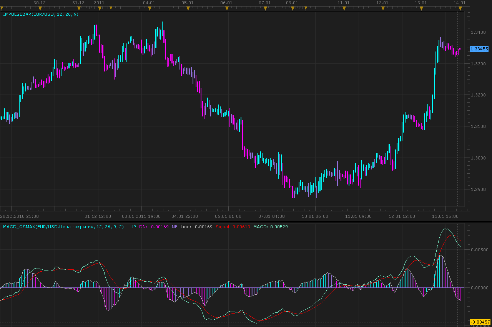

# Best MACD final

> Source: https://fxcodebase.com/code/viewtopic.php?f=17&t=3169  
> Forum: 17 · Topic 3169 · 21 post(s)

---

## Best MACD final

**Alexander.Gettinger** · Fri Jan 14, 2011 12:09 am

Moving Average of Oscillator (OsMA), is an indicator that is calculated by taking the difference between a shorter-term moving average and a longer-term moving average. The two most common are the 12 period moving average and the 26 period moving averages. Because of this fact, it is best described as a modification of the classic MACD Indicator.

These indicators are based on using OsMA rather than EMA.

 

Download:

 [MACD_Osmax.lua](files/7450/MACD_Osmax.lua)

 [ImpulseBar.lua](files/7450/ImpulseBar.lua)

For ImpulseBar indicator must be installed MACD_Osmax indicator.

 

 [MTF MCP ImpulseBar Dashboard.lua](files/7450/MTF%20MCP%20ImpulseBar%20Dashboard.lua)

---

## Re: Best MACD final

**jtatalov** · Sun Oct 16, 2011 6:23 am

I love this indicator! When you have the time could you please write this indicator to have the bigger time frame as you did with the CCI in this post [viewtopic.php?f=17&t=3322](https://fxcodebase.com/code/viewtopic.php?f=17&t=3322)

Thank you guys for all your hard work.

---

## Re: Best MACD final

**Apprentice** · Sun Oct 16, 2011 8:03 am

From now on we do not implemented the BTF version.
This functionality will be available in the next version of Marketscope.
For all of the available indicators.

---

## Re: Best MACD final

**jtatalov** · Sun Oct 16, 2011 8:06 am

Do have any idea on when they plan on rolling out the updated version?

---

## Re: Best MACD final

**Blackcat2** · Mon Oct 17, 2011 11:14 pm

Tested this indi and found that it repaints the MACD histogram bar even go as far as 5-6 previous candles. Could this be fixed please?

---

## Re: Best MACD final

**sunshine** · Tue Oct 18, 2011 2:33 am

> **jtatalov wrote:**
> Do have any idea on when they plan on rolling out the updated version?

The beta version has been published on this site: [viewtopic.php?f=30&t=6490](https://fxcodebase.com/code/viewtopic.php?f=30&t=6490)
The official release is expected by the end of month.

---

## Re: Best MACD final

**ronald3rg** · Tue Oct 18, 2011 6:38 pm

i keep getting an error when i download and try to load. any suggestions?

---

## Re: Best MACD final

**sunshine** · Wed Oct 19, 2011 3:12 am

> **ronald3rg wrote:**
> i keep getting an error when i download and try to load. any suggestions?

Please send me as much information as possible about the error, including the exact error message you are receiving along with screenshots in order for me to be able to best assist you.

---

## Re: Best MACD final

**ronald3rg** · Sat Oct 22, 2011 11:38 pm

> Please send me as much information as possible about the error, including the exact error message you are receiving along with screenshots in order for me to be able to best assist you.
> Learning how to read indicators is more of an art than a science.

Sorry sunshine it was my fault I was tryin to load indicator under strategies, I figured it out. Thanks for the quick response

---

## Re: Best MACD final

**BabyDragonFX** · Fri Mar 20, 2015 8:23 am

Can you please make the lines adjustable in thickness...? They are at 1 and I need them at least a three. Thank you in Advance.

Denny

---

## Re: Best MACD final

**Apprentice** · Sun Mar 22, 2015 8:57 am

Major Indicator Update
Style Option Added.

---

## Re: Best MACD final

**Stance** · Fri Jul 24, 2015 12:29 am

Can a MTF MCP Dashboard be done for this indicator similar to this?

[http://fxcodebase.com/code/viewtopic.php?f=17&t=4504](https://fxcodebase.com/code/viewtopic.php?f=17&t=4504)

---

## Re: Best MACD final

**Stance** · Fri Jul 24, 2015 2:59 am

Can a strategy be created for this?

Buy on UP and Sell on DOWN.

---

## Re: Best MACD final

**Apprentice** · Wed Aug 05, 2015 7:28 am

Your request is added to the development list.

---

## Re: Best MACD final

**Apprentice** · Mon Jul 31, 2017 5:07 am

The indicator was revised and updated.

---

## Re: Best MACD final

**Apprentice** · Mon Jul 31, 2017 6:12 am

ImpulseBar.lua based on strategy Is available here.
[viewtopic.php?f=31&t=64953&p=113885#p113885](https://fxcodebase.com/code/viewtopic.php?f=31&t=64953&p=113885#p113885)

---

## Re: Best MACD final

**Apprentice** · Mon Jul 31, 2017 10:00 am

MTF MCP ImpulseBar Dashboard.lua added.

---

## Re: Best MACD final

**bartwas1** · Tue Aug 01, 2017 3:42 am

Hi

Any chance to create mt4 of MACD_Osmax.lua?
Thanks.

---

## Re: Best MACD final

**Apprentice** · Tue Aug 01, 2017 5:06 am

Your request is added to the development list, Under Id Number 3833
 If someone is interested to do this task, please contact me.

---

## Re: Best MACD final

**Alexander.Gettinger** · Thu Aug 17, 2017 9:31 am

> **bartwas1 wrote:**
> Hi
>
> Any chance to create mt4 of MACD_Osmax.lua?
> Thanks.

[viewtopic.php?f=38&t=65000](https://fxcodebase.com/code/viewtopic.php?f=38&t=65000)

---

## Re: Best MACD final

**Apprentice** · Sun Oct 28, 2018 5:12 am

The indicator was revised and updated.
