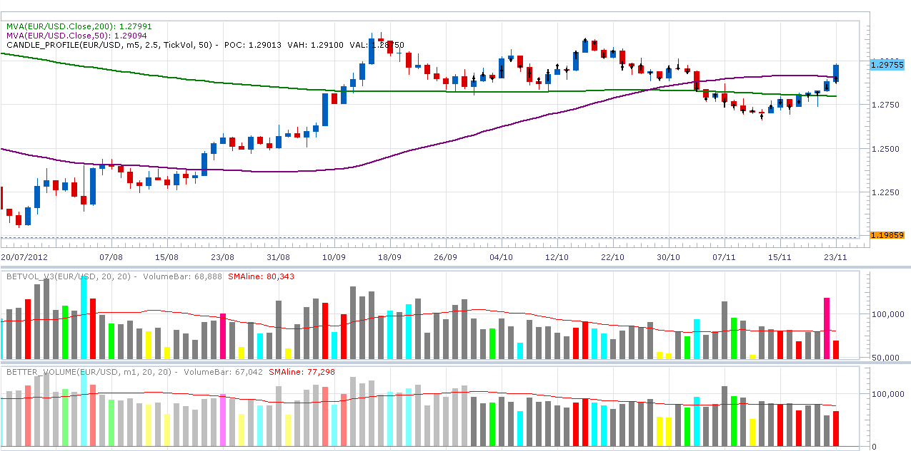
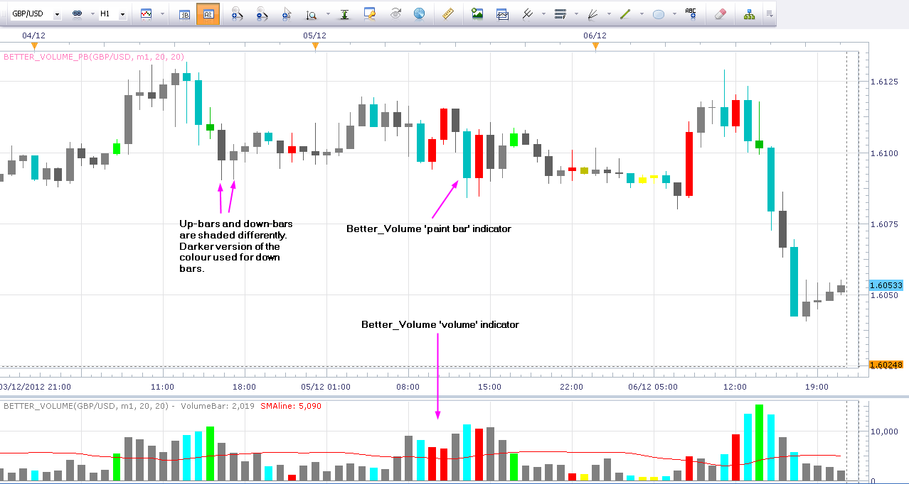

# Better Volume Indicator

> Source: https://fxcodebase.com/code/viewtopic.php?f=17&t=26606  
> Forum: 17 · Topic 26606 · 9 post(s)

---

## Better Volume Indicator

**robocod** · Sun Nov 25, 2012 7:47 am

In order to overcome [problems in the tick volume](https://fxcodebase.com/code/viewtopic.php?f=25&t=25722) from FXCM, I modified the [Better Volume Indicator](https://fxcodebase.com/code/viewtopic.php?f=17&t=4037).

The core functionality and logic of this indicator is not changed. Please refer to the [original author](http://emini-watch.com/free-stuff/volume-indicator/) for any details of its operation. My changes only relate to the technique of reconstructing the tick data volume from lower time-frame source data (e.g. 1min), which mitigates many (but not all) of the problems.

Here's a screenshot. You can see the regular indicator (BETVOL_V3) on top, and the new BETTER_VOLUME indicator below. This is a daily chart. You can see BETVOL incorrectly shows a (magenta coloured) "climax churn" bar for Thursday. This was due to an anomaly in the data. There are often more errors in the data for the current week, e.g. higher tick data values, but some of these are already corrected since the screenshot was taken after the Friday close.

 

Here's the code.

 [better_volume.lua](files/46342/better_volume.lua)

I also wrote a [Volume Indicator](https://fxcodebase.com/code/viewtopic.php?f=17&t=26605) which use this "volume reconstruction" method. Further updates and enhancements will probably go on my [blog](http://robocod.blogspot.co.uk/).

NOTE: The default colour for the climax-down bar is white! If you use a white background like I do, then you should change this (I made it cyan). I left the default colour white, since this is how the original author has it.

The indicator was revised and updated

---

## Re: Better Volume Indicator

**robocod** · Thu Dec 06, 2012 5:14 pm

I made a small change to the Better_Volume indicator (only to correct the name and description text, and to remove some debug code). (The indicator code is updated in the previous post).

I also made a "paint bars" version of the indicator. It works in pretty much the same way, except that it paints the bars with the colour of the climax/churn/low vol/etc. To distinguish the up/down bar, there is an option called "Shade". When set to "Yes" it will use darker colours for the down bars. For example, churn is normally lime green by default, but on the paint bars, it will be a darker shade of green if it was a down bar.

Here's a screenshot.

 

Here's the indicator code.

 [better_volume_pb.lua](files/48026/better_volume_pb.lua)

---

## Re: Better Volume Indicator

**superleo** · Thu Dec 06, 2012 8:07 pm

hi,
thank you for this nice indicator.

can you create SIGNAL with email message based on this indicator.

alert 1:
current bar closed -- climax up and previos bar also climax up
 ----then -- sound one--- alert message" two bar up"

alert 2:
current bar close-- climax down and previous bar also climax down
 then -- sound two--alert message -" two bar down"

alert 3:
 current bar close ---climax up and previous bar -----climax down
 then sound three--alert message "bar revesal up"

alert4:
current bar closed-- climax down and previous bar --- climax up
 then -- sound four-- alert message " bar reversal down"

alert5:
current bar closed--- climax up and previous bar---- churn/ climax churn
 then --sound five--alert message " bottom reversal up"

alert6:
current bar closed---- climax down and previous bar--- churn/ climax churn
 then-- sound six--- alert message " bottom reversal down"

alert7:

current bar closed--- low volume bar ---
 then -- sound seven-- alert message"mid take profit level"

i request this as signal like as follows

example for signals

1.sar signal
[viewtopic.php?f=29&t=1045](http://www.fxcodebase.com/code/viewtopic.php?f=29&t=1045)

2.adx dmi signal
[viewtopic.php?f=29&t=885](http://www.fxcodebase.com/code/viewtopic.php?f=29&t=885)

this will work as a torch when i am travelling in the tunnel of trading charts.
thank you .

---

## Re: Better Volume Indicator

**rose123** · Sat Dec 08, 2012 8:04 am

hi,

can you create mtf mcp list indicator based on this indicator.

i have attached a example for mtf mcp list indicator

if bar closed-- climax up-- green
if bar closed-- climax down -- red
if bar closed---churn-- dark blue
if bar closed -- climaxchurn-- megenta

color dots instead of arrows will be more useful.

thank you

 

---

## Re: Better Volume Indicator

**robocod** · Mon Dec 10, 2012 12:40 pm

> **superleo wrote:**
> hi,
> thank you for this nice indicator.
>
> can you create SIGNAL with email message based on this indicator.

> **rose123 wrote:**
> hi,
>
> can you create mtf mcp list indicator based on this indicator.

Thanks for the comments. However, I don't have any plan to modify, extend or further develop this indicator currently. The lua code is available if someone else wants to take it though.

---

## Re: Better Volume Indicator

**futurenets** · Thu Jan 10, 2013 8:31 am

is it possible to separate bid & ask tick volume?

---

## Re: Better Volume Indicator

**robocod** · Thu Jan 10, 2013 1:22 pm

> **futurenets wrote:**
> is it possible to separate bid & ask tick volume?

It depends what you mean by that.

I assume you mean trades at bid vs trades at ask?

If that's what you mean then basically no. FXCM (and forex in general) is tick volume, i.e. quotes not trades. So, this information is just not available. However, there are some 'models' that can be used to estimate the buy/sell volume from the bid/ask spread.

---

## Re: Better Volume Indicator

**jgras002** · Thu May 16, 2013 12:31 pm

Is it possible to tweak the indicator so that the color of the previous volume bar reflects whether current price is higher or lower than the previous candle close? Thanks.

---

## Re: Better Volume Indicator

**Apprentice** · Tue May 23, 2017 6:14 am

Bump up.
