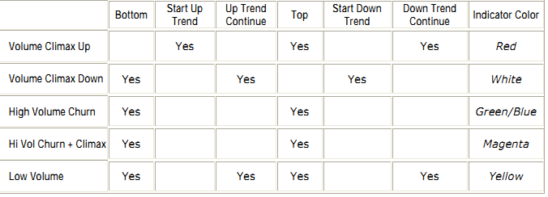
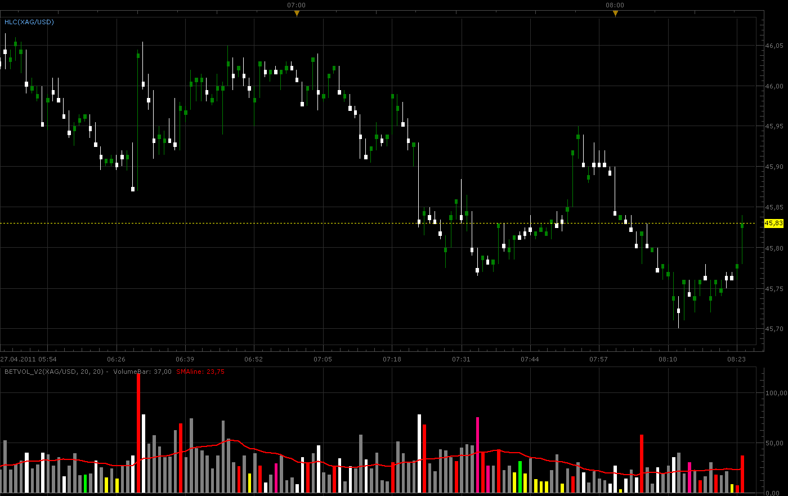
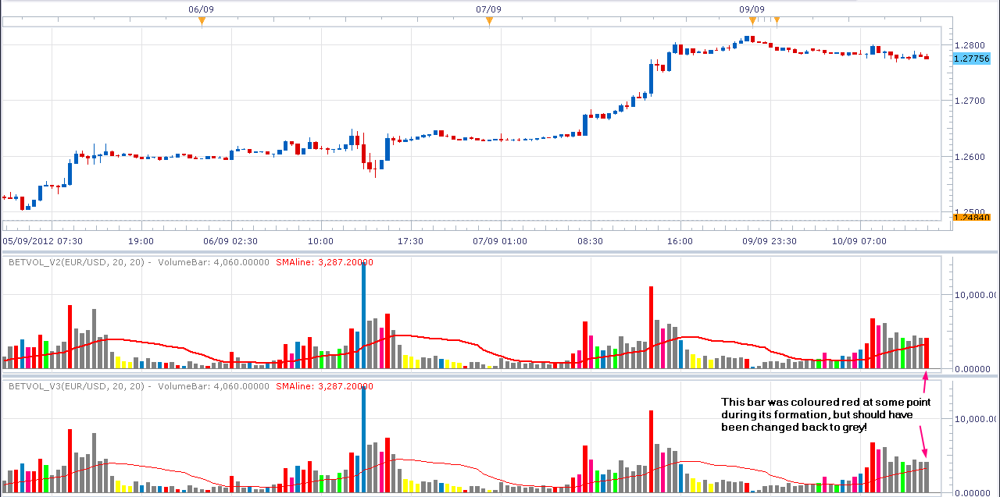
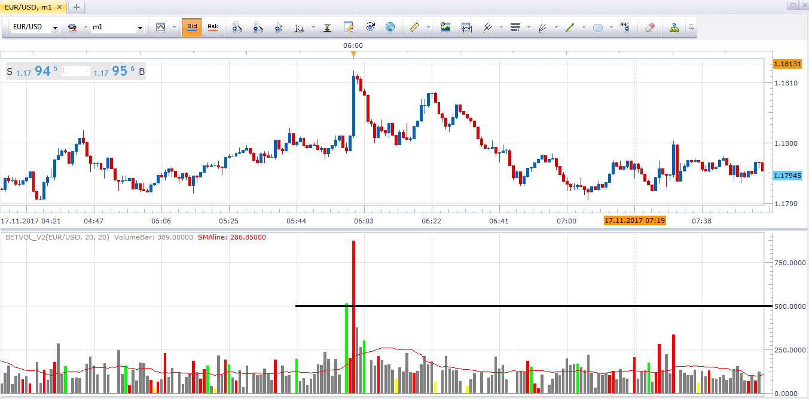

# Better Volume Indicator

> Source: https://fxcodebase.com/code/viewtopic.php?f=17&t=4037  
> Forum: 17 · Topic 4037 · 39 post(s)

---

## Better Volume Indicator

**Gidien** · Wed Apr 27, 2011 1:25 am

This is a better Volume Indicator available on other Plattforms found at this website

[http://emini-watch.com/free-stuff/volume-indicator/](http://emini-watch.com/free-stuff/volume-indicator/)

I used the ProRealTime Code

Short describtion:

 



Chart:

 



Code:

 [BetVol_V2.lua](files/10083/BetVol_V2.lua)

 [BetVol with Level Alert.lua](files/10083/BetVol%20with%20Level%20Alert.lua)

---

## Re: Better Volume Indicator

**Nikolay.Gekht** · Wed Apr 27, 2011 8:46 am

I see that the original version is highlighting the bars as well. You can do the same in your indicator:

1) Create four streams, one indicator's stream and three internals for open, high, low and close prices:

```lua
local O, H, L, C;

function Prepare()
    ...
    O = instance:addStream("O", core.Line, "O", "O", first, 0);
    H = instance:addInternalStream(first, 0);
    L = instance:addInternalStream(first, 0);
    C = instance:addInternalStream(first, 0);
end
```

2) Because your indicator is oscillator and is drawn in separate area - put your open price stream into main chart area:

Code: [Select all](https://fxcodebase.com/code/)
`core.host:execute("attachOuputToChart", "O");`

3) Join O, H, L and C streams into candle group:

Code: [Select all](https://fxcodebase.com/code/)
`instance:createCandleGroup("BH", "BH", O, H, L, C);`

4) In update method, for the bars you need to highlight, fill O, H, L and C streams with candle data and set O stream color to the color you need to highlight the candle with

```lua
function Update(period, mode)
    ...
    if needHighlight then
        O[period] = instance.source.open[period];
        H[period] = instance.source.high[period];
        L[period] = instance.source.low[period];
        C[period] = instance.source.close[period];
        O:setColor(period, highlighColor);
    end
    ...
end
```

---

## Re: Better Volume Indicator

**alpha_bravo** · Thu Apr 28, 2011 10:42 am

Too many signals(99.9% of them false), this is a crazy indicator.

---

## Re: Better Volume Indicator

**Gidien** · Thu Apr 28, 2011 11:33 pm

Did you read the short describtion. This indicator couldn't give you a clear signal. Because every Color have two or more "signals".

for example:
Climax UP RED --
Can be New UP Trend, cont. Down Trend or a new TOP. This are three complete different informations about the market. in sum no clear "signal", but an idea of the market.

The other problem is, that we only have Tickvolumes on FXCM(i think all Forex Brokers) , we don't know anything about the money in the market., we only know how offen Price is updated.

This indicator don't give Buy or Sell signals, but possible can help the trader to make a decision.

---

## Re: Better Volume Indicator

**alpha_bravo** · Fri Apr 29, 2011 9:57 am

What i meant was that the indicator is too busy, this is just an opinion, it may not give direct false signals, but it gives too many false considerations. i.e. it clouds judgement a lot.

Its a good idea and probably works well on CME or exchanges with priced volume, but i dont know about tick volume. Have a look at the pic below for ordinary volume vs. BETVOL; each new successive daily high on ordinary volume(session start 7am) calls a top nearly to the pip(doesn’t happen everyday of course, but its easier to take seriously).

[http://i52.tinypic.com/33pbm2c.png](http://i52.tinypic.com/33pbm2c.png)

What about an indicator that just painted the volume bar black when it hits a new session high,(with an input to denote session start or period lookback). Then 3 other editable parameters, for 3 defined volume thresholds...say for example green for 200, amber for 400, red for 600?

If you cant, could you even edit BETVOL so that it paints a new colour for new highs(from a definable start point)?...this would also work, as i could just make all the other colous the same!

Cheers
AB

---

## Re: Better Volume Indicator

**Laurus12** · Wed Nov 16, 2011 9:06 pm

Many thanks for the BV indicator Gidien. I am also wondering if you would care sharing the HLC bars indicator which you are showing in the picture with the BV indicator? I have tried to find it in the forum, but with no luck.

Thanks,
Laurus

---

## Re: Better Volume Indicator

**Gidien** · Thu Nov 17, 2011 9:04 am

No problem,

here is the HLC HIGH-LOW-CLOSE-BAR Chart indicator.

 [HLC.lua](files/18067/HLC.lua)

---

## Re: Better Volume Indicator

**Laurus12** · Thu Nov 17, 2011 2:45 pm

Great! Thank you very much Gidien. Tried it and works perfectly.

Just some thoughts here. Would it be possible to make it as an option to have the vertical bar line itself thicker? Like weight 1,2,3 and so on? And the same with the closing price "block"?

Thanks,
Laurus

---

## Re: Better Volume Indicator

**Apprentice** · Thu Nov 17, 2011 6:08 pm

Unfortunately not. This option does not exist.

---

## Re: Better Volume Indicator

**Laurus12** · Thu Nov 17, 2011 7:57 pm

Ok. Good to know. Thank you Apprentice

Laurus

---

## Re: Better Volume Indicator

**Merchantprince** · Wed May 09, 2012 11:37 am

I've noticed something disconcerting about this indicator which I hope others can address: it seems the bars repaint.

After you place the indi on a chart and allow it to run for awhile, the indicator repaints if you change time-frames or simply open the Properties window and click 'OK' without changing anything. By switching to a different time frame, then switching back, many Climax Up or Down bars instead become a different color. The same is true when you open the Properties dialog box, the click OK - many Climax bars switch colors to become non-climax bars.

Can anyone explain why this is? It would seem to make the indicator almost entirely unreliable.

---

## Re: Better Volume Indicator

**maweno** · Thu May 10, 2012 1:00 am

Hi Merchantprince!

I know the problem. That's no problem with the indicator, there is a
problem with the tick volume. The IT-Crew of FXCM know the problem,
but that doesn't get solved.
This indicator isn't properly used on the TSII ...
Problem at FXCM - display tick volume.
On the Metatrader there is no problem.

---

## Re: Better Volume Indicator

**Merchantprince** · Thu May 10, 2012 6:53 am

Is this true for all the custom indicators posted on FX Codebase that deal with tick volume?

---

## Re: Better Volume Indicator

**robocod** · Mon Sep 10, 2012 6:56 am

> **maweno wrote:**
> Hi Merchantprince!
>
> I know the problem. That's no problem with the indicator, there is a
> problem with the tick volume. The IT-Crew of FXCM know the problem,
> but that doesn't get solved.
> This indicator isn't properly used on the TSII ...
> Problem at FXCM - display tick volume.
> On the Metatrader there is no problem.

I think I've actually found the issue with this indicator.

Ok, first of all about the tick data...
When you 1st open a chart in MarketScope it backfills all the historic bars with data from the FXCM data server. Once the chart is open, your client receives all the latest tick data from the FXCM live server. Importantly, the historic data and the live data might not be exactly the same. I don't know exactly why - it's just the way FXCM manage their data. You can test it yourself. At the start of day open 2 charts of the same period. At the end of the day they should look the same. But, then refresh one of the charts (or re-open it with same data range). Look closely and you may see small differences - in price data as well as volume. The price differences are usually minuscule (maybe an open/close was was slightly different). The volume data tends to show bigger differences, although they are still small.

There also appears to be a bigger difference when comparing Friday's data and then re-opening the chart on Monday. I didn't investigate this myself, but it was reported somewhere on this forum or perhaps DailFX.

With this in mind, I tested BetVol_V2.lua looking for issues due to such problems. Whilst I did see some differences in tick volume data, there were not significant enough to cause the differently painted bars. So, I had a look at the indicator code itself, and found the issue there.

Basically, the BetVol_V2.lua indicator will analyse the live bar (i.e. before it is closed). If the computation happens to detect it as, for example, a ClimaxUp bar, then the bar is set to red. However, the bar is not closed yet. If that bar later changes to a normal bar, nothing was setting the bar colour back to the default grey colour! If the chart was re-loaded it computes correctly. It was only bars that were coloured from the "live" data which were later recalculated as "normal bars" that were wrong.

Whilst there is still the possibility of minor differences due to tick volume differences, I think this will be a very minor effect and possibly negligible.

Here's a chart showing the issue.

 



I modified the indicator, which is now V3. It is attached. Also the code is posted here.

 [BetVol_V3.lua](files/40015/BetVol_V3.lua)

```lua
-- Indicator profile initialization routine
-- Defines indicator profile properties and indicator parameters
-- TODO: Add minimal and maximal value of numeric parameters and default color of the streams
function Init()
    indicator:name("Climax Volume Spread v2");
    indicator:description("No description");
    indicator:requiredSource(core.Bar);
    indicator:type(core.Oscillator);
    indicator:setTag("group", "GSL");

    indicator.parameters:addInteger("N", "Average Period", "No description", 20);
    indicator.parameters:addInteger("Back", "Analyse Period Back", "No description", 20);
    indicator.parameters:addBoolean("TwoBars", "Use TwoBars", "No description", false);
    --indicator.parameters:addInteger("BidAsk", "Bid or ASK", "No description", 2);
    indicator.parameters:addColor("LowVol_color", "Color of LowVol_color", "Color of LowVol_color", core.rgb(255, 255, 0));
    indicator.parameters:addColor("ClimaxUp_color", "Color of ClimaxUp", "Color of ClimaxUp", core.rgb(255, 0, 0));
    indicator.parameters:addColor("ClimaxDn_color", "Color of ClimaxDn", "Color of ClimaxDn", core.rgb(255, 255, 255));
    indicator.parameters:addColor("DensityUp_color", "Color of Churn", "Color of DensityUp", core.rgb(0, 255, 0));
    indicator.parameters:addColor("DensityDn_color", "Color of ClimaxChurn", "Color of DensityDn", core.rgb(255, 0, 128));
    indicator.parameters:addColor("VolumeBar_color", "Color of VolumeBar", "Color of VolumeBar", core.rgb(128, 128, 128));
    indicator.parameters:addColor("SMAline_color", "Color of SMAline", "Color of SMAline", core.rgb(255, 0, 0));
end

-- Indicator instance initialization routine
-- Processes indicator parameters and creates output streams
-- TODO: Refine the first period calculation for each of the output streams.
-- TODO: Calculate all constants, create instances all subsequent indicators and load all required libraries
-- Parameters block
local N;
local Back;

local first;
local source = nil;

-- Streams block
local ClimaxUp = nil;
local ClimaxDn = nil;
local DensityUp = nil;
local DensityDn = nil;
local VolumeBar = nil;
local SMAline = nil;

-- Routine
function Prepare(nameOnly)
    N = instance.parameters.N;
    Back = instance.parameters.Back;
    source = instance.source;
    first = source:first() + N + Back -1;

    local name = profile:id() .. "(" .. source:name() .. ", " .. tostring(N) .. ", " .. tostring(Back) .. ")";
    instance:name(name);

    if (not (nameOnly)) then
        Value1 = instance:addInternalStream(0,0);
        Value2 = instance:addInternalStream(0,0);
        Value3 = instance:addInternalStream(0,0);
        Value4 = instance:addInternalStream(0,0);
        Value5 = instance:addInternalStream(0,0);
        Value6 = instance:addInternalStream(0,0);
        Value7 = instance:addInternalStream(0,0);
        Value8 = instance:addInternalStream(0,0);
        Value9 = instance:addInternalStream(0,0);
        Value10 = instance:addInternalStream(0,0);
        Value11 = instance:addInternalStream(0,0);
        Value12 = instance:addInternalStream(0,0);
        Value13 = instance:addInternalStream(0,0);
        Value14 = instance:addInternalStream(0,0);
        Value15 = instance:addInternalStream(0,0);
        Value16 = instance:addInternalStream(0,0);
        Value17 = instance:addInternalStream(0,0);
        Value18 = instance:addInternalStream(0,0);
        Value19 = instance:addInternalStream(0,0);
        Value20 = instance:addInternalStream(0,0);
        Value21 = instance:addInternalStream(0,0);
        Value22 = instance:addInternalStream(0,0);
        VolumeBar = instance:addStream("VolumeBar", core.Bar, name .. ".VolumeBar", "VolumeBar", instance.parameters.VolumeBar_color, first);
        VolumeBar:setPrecision(0);
        SMAline = instance:addStream("SMAline", core.Line, name .. ".SMAline", "SMAline", instance.parameters.SMAline_color, first);
        SMAline:setPrecision(0);
    end
end

-- Indicator calculation routine
-- TODO: Add your code for calculation output values
function Update(period)
    local p = period;
        local HIGH = source.high[period];
        local LOW = source.low[period];
        local OPEN = source.open[period];
        local CLOSE = source.close[period];
        local VOLUME = source.volume[period];
        VolumeBar[period] = VOLUME;
        SMAline[period] = 0;
    if period < first then
        Value1[p] = 0;
        Value2[p] = 0;
        Value3[p] = 0;
        Value4[p] = 0;
        Value5[p] = 0;
        Value6[p] = 0;
        Value7[p] = 0;
        Value8[p] = 0;
        Value9[p] = 0;
        Value10[p] = 0;
        Value11[p] = 0;
        Value12[p] = 0;
        Value13[p] = 0;
        Value14[p] = 0;
        Value15[p] = 0;
        Value16[p] = 0;
        Value17[p] = 0;
        Value18[p] = 0;
        Value19[p] = 0;
        Value20[p] = 0;
        Value21[p] = 0;
        Value22[p] = 0;
    end
    if period >= first and source:hasData(period) then
        SMAline[period] = mathex.avg(source.volume,period-N+1,period);
        --if instance.parameters.BidAsk  == 0 then
        --    Range = HIGH-CLOSE;
        --elseif instance.parameters.BidAsk  == 1 then
        --    Range = CLOSE-LOW;
        --else
            Range = HIGH-LOW;
        --end

        if  CLOSE > OPEN then
            Value1[p] = VOLUME*(Range/(2*Range + OPEN - CLOSE));
        elseif CLOSE < OPEN then
            Value1[p] = VOLUME*((Range + CLOSE-OPEN)/(2*Range + CLOSE-OPEN));
        end
        if CLOSE == OPEN then
            Value1[p] = 0.5*VOLUME;
        end
        Value2[p] =     VOLUME - Value1[p];
        Value3[p] =     Value1[p] + Value2[p];
        Value4[p] =     Value1[p] * Range;
        Value5[p] = (   Value1[p]-Value2[p])*Range
        Value6[p] =     Value2[p]*Range;
        Value7[p] = (   Value2[p]-Value1[p])*Range;
        if Range ~= 0 then
            Value8[p]  =    Value1[p]/Range;
            Value9[p]  = (  Value1[p]-Value2[p])/Range;
            Value10[p] =    Value2[p]/Range;
            Value11[p] = (  Value2[p]-Value1[p])/Range;
            Value12[p] =    Value3[p]/Range;
        end

        Value13[p] = Value3[p] + Value3[p-1];
        Value14[p] = (Value1[p]+Value1[p-1])*(mathex.max(source.high,p-2+1,p) - mathex.min(source.low,p-2+1,p));
        Value15[p] = (Value1[p]+Value1[p-1] - Value2[p] - Value2[p-1]) * (mathex.max(source.high,p-2+1,p) - mathex.min(source.low,p-2+1,p));
        Value16[p] = (Value2[p]+Value2[p-1])*(mathex.max(source.high,p-2+1,p) - mathex.min(source.low,p-2+1,p));
        Value17[p] = (Value2[p]+Value2[p-1] - Value1[p] - Value1[p-1]) * (mathex.max(source.high,p-2+1,p) - mathex.min(source.low,p-2+1,p));
        if mathex.max(source.high,p-2+1,p) ~= mathex.min(source.low,p-2+1,p) then
            Value18[p] = (Value1[p] + Value1[p-1])/(mathex.max(source.high,p-2+1,p) - mathex.min(source.low,p-2+1,p));
        end
        Value19[p] = (Value1[p]+Value1[p-1] - Value2[p] - Value2[p-1]) / (mathex.max(source.high,p-2+1,p) - mathex.min(source.low,p-2+1,p));
        Value20[p] = (Value2[p]+Value2[p-1]) / (mathex.max(source.high,p-2+1,p) - mathex.min(source.low,p-2+1,p));
        Value21[p] = (Value2[p]+Value2[p-1] - Value1[p] - Value1[p-1]) / (mathex.max(source.high,p-2+1,p) - mathex.min(source.low,p-2+1,p));
        Value22[p] = Value13[p]/(mathex.max(source.high,p-2+1,p) - mathex.min(source.low,p-2+1,p));

        VolumeBar:setColor(period, instance.parameters.VolumeBar_color); -- Fix to ensure default bar colour is correct
       
        if not instance.parameters.TwoBars then
            --Con 1 or Con 11
            if (Value3[p] == mathex.min(Value3,p-Back+1,p)) then  -- Yellow -- TwoBars or (Vlaue13[p] == mathex.min(Value13,p-Back+1,p)) then
                VolumeBar:setColor(period,instance.parameters.LowVol_color);
            end
            --Con 2 or Con 3 or Con 8 or Con 9 or Con 12 or Con 13 or Con 18 or con 19
            if (Value4[p] == mathex.max(Value4,p-Back+1,p) and CLOSE > OPEN) or
               (Value5[p] == mathex.max(Value5,p-Back+1,p) and CLOSE > OPEN) or
               (Value10[p] == mathex.min(Value10,p-Back+1,p) and CLOSE > OPEN) or
               (Value11[p] == mathex.min(Value11,p-Back+1,p) and CLOSE > OPEN) then  --RED -- TwoBars or (Vlaue13[p] == mathex.min(Value13,p-Back+1,p)) then
                VolumeBar:setColor(period,instance.parameters.ClimaxUp_color);
            end
            --Con 4 or Con 5 or Con 6 or Con 7 or Con 14 or Con 15 or Con 16 or con 17
            if (Value6[p] == mathex.max(Value6,p-Back+1,p) and CLOSE < OPEN) or
               (Value7[p] == mathex.max(Value7,p-Back+1,p) and CLOSE < OPEN) or
               (Value8[p] == mathex.min(Value8,p-Back+1,p) and CLOSE < OPEN) or
               (Value9[p] == mathex.min(Value9,p-Back+1,p) and CLOSE < OPEN) then -- White
                VolumeBar:setColor(period,instance.parameters.ClimaxDn_color);
            end
            -- Churn Con 10
            if Value12[p] == mathex.max(Value12,p-Back+1,p) then -- Green
                VolumeBar:setColor(period,instance.parameters.DensityUp_color);
            end
            --ClimaxChurn
            if (Value12[p] == mathex.max(Value12,p-Back+1,p) ) and
               (    (Value4[p] == mathex.max(Value4,p-Back+1,p) and CLOSE > OPEN) or
                    (Value5[p] == mathex.max(Value5,p-Back+1,p) and CLOSE > OPEN) or
                    (Value10[p] == mathex.min(Value10,p-Back+1,p) and CLOSE > OPEN) or
                    (Value11[p] == mathex.min(Value11,p-Back+1,p) and CLOSE > OPEN) or
                    (Value6[p] == mathex.max(Value6,p-Back+1,p) and CLOSE < OPEN) or
                    (Value7[p] == mathex.max(Value7,p-Back+1,p) and CLOSE < OPEN) or
                    (Value8[p] == mathex.min(Value8,p-Back+1,p) and CLOSE < OPEN) or
                    (Value9[p] == mathex.min(Value9,p-Back+1,p) and CLOSE < OPEN) ) then
                VolumeBar:setColor(period,instance.parameters.DensityDn_color);
            end
        else
            --Con 1 or Con 11
            if (Value13[p] == mathex.min(Value13,p-Back+1,p)) then  -- Yellow -- TwoBars or (Vlaue13[p] == mathex.min(Value13,p-Back+1,p)) then
                VolumeBar:setColor(period,instance.parameters.LowVol_color);
            end
            --Con 2 or Con 3 or Con 8 or Con 9 or Con 12 or Con 13 or Con 18 or con 19
            if ((Value14[p] == mathex.max(Value14,p-Back+1,p)) and (CLOSE > OPEN) and (source.close[p-1] > source.open[p-1])) or
               ((Value15[p] == mathex.max(Value15,p-Back+1,p)) and (CLOSE > OPEN) and (source.close[p-1] > source.open[p-1])) or
               ((Value20[p] == mathex.min(Value20,p-Back+1,p)) and (CLOSE > OPEN) and (source.close[p-1] > source.open[p-1])) or
               ((Value21[p] == mathex.min(Value21,p-Back+1,p)) and (CLOSE > OPEN) and (source.close[p-1] > source.open[p-1])) then  --RED -- TwoBars or (Vlaue13[p] == mathex.min(Value13,p-Back+1,p)) then
                VolumeBar:setColor(period,instance.parameters.ClimaxUp_color);
            end
            --Con 4 or Con 5 or Con 6 or Con 7 or Con 14 or Con 15 or Con 16 or con 17
            if ((Value16[p] == mathex.max(Value16,p-Back+1,p)) and (CLOSE < OPEN) and (source.close[p-1] < source.open[p-1])) or
               ((Value17[p] == mathex.max(Value17,p-Back+1,p)) and (CLOSE < OPEN) and (source.close[p-1] < source.open[p-1])) or
               ((Value18[p] == mathex.min(Value18,p-Back+1,p)) and (CLOSE < OPEN) and (source.close[p-1] < source.open[p-1])) or
               ((Value19[p] == mathex.min(Value19,p-Back+1,p)) and (CLOSE < OPEN) and (source.close[p-1] < source.open[p-1])) then -- White
                VolumeBar:setColor(period,instance.parameters.ClimaxDn_color);
            end
            -- Churn Con 10
            if Value22[p] == mathex.max(Value22,p-Back+1,p) then -- Green
                VolumeBar:setColor(period,instance.parameters.DensityUp_color);
            end
            --ClimaxChurn
            if (Value22[p] == mathex.max(Value22,p-Back+1,p) ) and
               (    ((Value14[p] == mathex.max(Value14,p-Back+1,p)) and (CLOSE > OPEN) and (source.close[p-1] > source.open[p-1])) or
                    ((Value15[p] == mathex.max(Value15,p-Back+1,p)) and (CLOSE > OPEN) and (source.close[p-1] > source.open[p-1])) or
                    ((Value20[p] == mathex.min(Value20,p-Back+1,p)) and (CLOSE > OPEN) and (source.close[p-1] > source.open[p-1])) or
                    ((Value21[p] == mathex.min(Value21,p-Back+1,p)) and (CLOSE > OPEN) and (source.close[p-1] > source.open[p-1])) or
                    ((Value16[p] == mathex.max(Value16,p-Back+1,p)) and (CLOSE < OPEN) and (source.close[p-1] < source.open[p-1])) or
                    ((Value17[p] == mathex.max(Value17,p-Back+1,p)) and (CLOSE < OPEN) and (source.close[p-1] < source.open[p-1])) or
                    ((Value18[p] == mathex.min(Value18,p-Back+1,p)) and (CLOSE < OPEN) and (source.close[p-1] < source.open[p-1])) or
                    ((Value19[p] == mathex.min(Value19,p-Back+1,p)) and (CLOSE < OPEN) and (source.close[p-1] < source.open[p-1])) ) then
                VolumeBar:setColor(period,instance.parameters.DensityDn_color);
            end
        end
    end
end
```

I did not code this indicator and take no credit for it. All I did was the following fix.

Code: [Select all](https://fxcodebase.com/code/)
`VolumeBar:setColor(period, instance.parameters.VolumeBar_color); -- Fix to ensure default bar colour is correct`

EDIT: I also added the "decimal place / precision" change which is mentioned a few posts down.

---

## Re: Better Volume Indicator

**robocod** · Mon Sep 10, 2012 7:04 am

> **Merchantprince wrote:**
> Is this true for all the custom indicators posted on FX Codebase that deal with tick volume?

Please see my previous post. Whilst the tick data can be different from the live and historic data, especially over the weekend, in general it seems adequate. However, tick volume is only an approximation to real volume, and so you have to be very careful when using it.

---

## Re: Better Volume Indicator

**robocod** · Tue Sep 11, 2012 3:20 am

I made another minor modification to this indicator. I set the "precision" of the volume and SMA output to 0, this simply means that the volume does not have decimal places (it was showing things like 6012.0000 ticks). Ticks are always integer values. It is optional to take this fix - it is purely cosmetic.

 [BetVol_V3.lua](files/40062/BetVol_V3.lua)

 


 [Better Volume Overlay.lua](files/40062/Better%20Volume%20Overlay.lua)

 


 [Better Volume Bar.lua](files/40062/Better%20Volume%20Bar.lua)

---

## Re: Better Volume Indicator

**Pavlovsdog** · Thu Oct 04, 2012 9:29 pm

Can you explain what the different color candles represent?

---

## Re: Better Volume Indicator

**robocod** · Fri Oct 05, 2012 7:26 am

> **Pavlovsdog wrote:**
> Can you explain what the different color candles represent?

Please refer to the [inventor](http://emini-watch.com/free-stuff/volume-indicator/) of this indicator.

(I don't use it myself, I just fixed a bug in it).

---

## Re: Better Volume Indicator

**all_in** · Mon Jun 30, 2014 3:25 pm

Hi,

Would it be possible to base this indicator upon the "Real Volume indicator" instead of tick volume?

Many Thanks

P.S. Awesome site BTW

---

## Re: Better Volume Indicator

**robocod** · Tue Jul 01, 2014 7:05 am

> **all_in wrote:**
> Hi,
>
> Would it be possible to base this indicator upon the "Real Volume indicator" instead of tick volume?
>
> Many Thanks
>
> P.S. Awesome site BTW

Oh, I wish that was possible. However, currently I think it is not - I tried. There are many similar cases where indicators use price and volume (On Balance Volume, Chaikin Oscillator, Accumulation / Distribution indicator, etc.). We need a way to replace the regular Tick Volume with the Real Volume in order to use these properly.

Question to FXCodeBase guys: was Real Volume developed by you, or by FXCM directly?

By the way, I did a study of Tick Volume vs Real Volume, on my [blog](http://robocod.blogspot.co.uk/2014/06/real-volume-vs-tick-volume-study.html). The results suggest that that Tick Volume is a reasonable proxy for Real Volume. However, it would always be better to use the proper volume if available.

---

## Re: Better Volume Indicator

**Apprentice** · Tue Jul 01, 2014 1:46 pm

As far as I know it is FXCM baby.

---

## Re: Better Volume Indicator

**all_in** · Wed Jul 02, 2014 10:59 am

Thanks.

It seems logical to overlay an indicator over an indicator, like i.e. overlay a moving average over a MACD, so you overlay the Better Volume algorithm on top of the Real Volume indicator to produce the changes in colour.

---

## Re: Better Volume Indicator

**daniel.kovacik** · Wed Jul 02, 2014 3:07 pm

Hi,

is there any possibility to use this indicator in charts?

Thank you

---

## Re: Better Volume Indicator

**robocod** · Thu Jul 03, 2014 1:24 am

> **all_in wrote:**
> Thanks.
>
> It seems logical to overlay an indicator over an indicator, like i.e. overlay a moving average over a MACD, so you overlay the Better Volume algorithm on top of the Real Volume indicator to produce the changes in colour.

That would be nice wouldn't it. The thing is, BetterVol and Chaikin Oscillator and several others use price & volume data, grouped together in what is known as a "bar_stream".

The way FXCM programmed Real Volume, it is just the volume ("tick_stream"), and so you can't overlay any indicator on it - since it does not contain the prices.

In theory, it should be possible to create an indicator that aggregates the price and Real Volume data into a new "bar_stream" - I tried this, but I was not successful - I think due to the way it is coded.

The simplest way would be for FXCM to improve this indicator. It is only a kind of Beta just now. Maybe they will add it, or provide better access for developers.

---

## Re: Better Volume Indicator

**Apprentice** · Thu Jul 03, 2014 2:25 am

I can do this task.
Can someone please send the Real Volume Indicator to me.
mario(.)jemic(@)gmail(.)com
Looks like FxcmApp site is unavailable.

---

## Re: Better Volume Indicator

**all_in** · Thu Jul 03, 2014 2:58 pm

> **Apprentice wrote:**
> I can do this task.
> Can someone please send the Real Volume Indicator to me.
> mario(.)jemic(@)gmail(.)com
> Looks like FxcmApp site is unavailable.

Done

---

## Re: Better Volume Indicator

**robocod** · Wed Jul 30, 2014 5:18 am

> **Apprentice wrote:**
> I can do this task.
> Can someone please send the Real Volume Indicator to me.
> mario(.)jemic(@)gmail(.)com
> Looks like FxcmApp site is unavailable.

Did you make any progress with this? I had a go, but I could not get the indicator to function properly when used inside another indicator.

---

## Re: Better Volume Indicator

**Apprentice** · Wed Jul 30, 2014 11:04 am

Same problem here.
Tried, was not satisfied with the result, left further development, for now.
Ask FXCM to provide this data via regular source / Price Server stream.

---

## Re: Better Volume Indicator

**MaximeCau** · Fri Feb 13, 2015 3:23 pm

Hi,

Is it be possible to get this indicator for Real Volumes ?

Thank you

---

## Re: Better Volume Indicator

**Apprentice** · Fri Apr 17, 2015 6:07 am

Better Volume Overlay added.

---

## BETTER VOLUME BAR INDICATOR REQUEST

**transformer** · Fri Apr 17, 2015 8:29 am

HI APPRENDICE,

CAN YOU ADD BETTER VOLUME BAR INDICATOR LIKE BWMFI BAR AND PVA BAR

[viewtopic.php?f=17&t=60177](http://www.fxcodebase.com/code/viewtopic.php?f=17&t=60177)

[viewtopic.php?f=17&t=1968](http://www.fxcodebase.com/code/viewtopic.php?f=17&t=1968)

THANK YOU.

---

## Re: Better Volume Indicator

**Apprentice** · Mon Apr 20, 2015 6:26 am

Better Volume Bar added.

---

## Re: Better Volume Indicator

**MaximeCau** · Tue Nov 03, 2015 12:05 pm

Hello, here is bettervolume v3 for ninjatrader. The code has been modified and provides more signals. Could be intersting to have it on marketscope if it is possible. thanks

---

## Re: Better Volume Indicator

**Apprentice** · Wed Nov 04, 2015 8:15 am

Your request is added to the development list.

---

## Re: Better Volume Indicator

**Apprentice** · Sat Aug 05, 2017 4:37 am

The indicator was revised and updated.

---

## Re: Better Volume Indicator

**isamegrelo** · Fri Nov 17, 2017 11:01 am

Please create alert for this indicator when volume is over "500" level

 



---

## Re: Better Volume Indicator

**Apprentice** · Sat Nov 18, 2017 8:22 am

BetVol with Level Alert.lua added.

---

## Re: Better Volume Indicator

**Apprentice** · Sat Apr 21, 2018 9:58 am

The indicator was revised and updated.

---

## Re: Better Volume Indicator

**Alexander.Gettinger** · Fri Mar 15, 2019 7:48 pm

Please try this indicator:

 [BetterVolume3.lua](files/124465/BetterVolume3.lua)
