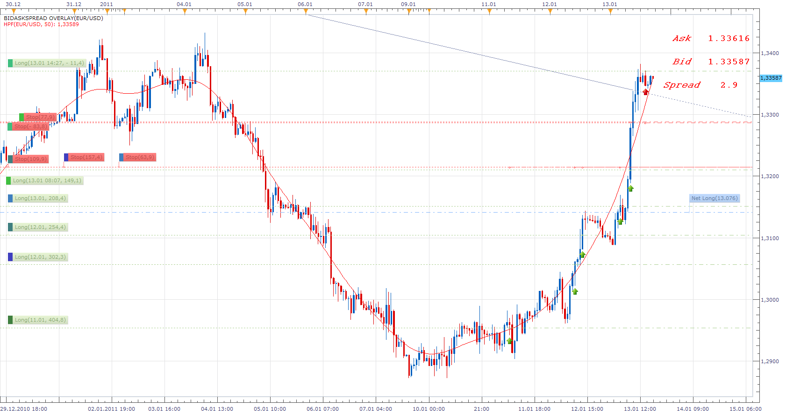

# BidAskSpread Overlay

> Source: https://fxcodebase.com/code/viewtopic.php?f=17&t=3164  
> Forum: 17 · Topic 3164 · 32 post(s)

---

## BidAskSpread Overlay

**Apprentice** · Thu Jan 13, 2011 8:31 am

 [BidAskSpread Overlay.lua](files/7425/BidAskSpread%20Overlay.lua)

The indicator was revised and updated

---

## Re: BidAskSpread Overlay

**DS0167** · Thu Jan 13, 2011 8:50 am

Nice one Apprentice an very useful !

Thank you
Danielle

---

## Re: BidAskSpread Overlay

**Apprentice** · Thu Jan 13, 2011 9:57 am

Update

---

## Re: BidAskSpread Overlay

**alpha_bravo** · Thu Jan 13, 2011 4:20 pm

hello,

Off topic, what is the HPF indicator you are using?

---

## Re: BidAskSpread Overlay

**Nikolay.Gekht** · Thu Jan 13, 2011 4:38 pm

This is Hodrick-Prescott Filter ([viewtopic.php?f=17&t=3024](https://fxcodebase.com/code/viewtopic.php?f=17&t=3024))

---

## Re: BidAskSpread Overlay

**alpha_bravo** · Thu Jan 13, 2011 5:40 pm

OK thanks, just checked this filter out...looks very good indeed.

---

## Re: BidAskSpread Overlay

**DWetherell** · Fri Jan 14, 2011 7:46 am

Hey Apprentice...Would it be possible to make the Font selectable along with Boldness and spacing? This font is fairly small when displayed on a laptop computer. Let me know...Thanks

---

## Re: BidAskSpread Overlay

**DS0167** · Sat Jan 15, 2011 8:46 am

my four-eyes highly appreciate it

Thank one of the master of our indicator
Danielle

---

## Re: BidAskSpread Overlay

**speakinmymind** · Fri Jun 07, 2013 9:44 am

Can you modify this to:

allow for showing of spread olny

allow custom hi/low for spread text to change color

allow for custom positioning (i.e. lower left, lower right)

allow for custom text size.

Thanks, for this indicator, it took me a while to find it!

---

## Re: BidAskSpread Overlay

**speakinmymind** · Fri Jun 07, 2013 9:46 am

sorry, I see the font size option has already been added

---

## Re: BidAskSpread Overlay

**speakinmymind** · Fri Jun 07, 2013 9:48 am

could you please allow for adjustment of the spacing as well? I use this below the chart in an oscillator and the spacing makes for a rather larger oscillator

---

## Re: BidAskSpread Overlay

**Apprentice** · Mon Jun 10, 2013 3:36 am

Your request is added to the development list.

---

## Re: BidAskSpread Overlay

**7510109079** · Thu Jun 20, 2013 7:04 am

Is there any way of writing the Bid/Ask spreads to a text file? possibly with a capture interval specified in seconds?

---

## Re: BidAskSpread Overlay

**Jamwal Suriya** · Thu Jun 27, 2013 1:13 am

Would it be possible to make the Font select able along with Boldness and spacing?
This font is fairly small when displayed on a laptop computer. Let me know..

---

## Re: BidAskSpread Overlay

**Apprentice** · Fri Jun 28, 2013 3:19 am

Try Updated Version.

---

## Re: BidAskSpread Overlay

**7510109079** · Thu Jul 04, 2013 9:05 am

do you have any reply as to whether it is possible to write Spreads to a txt file with timestamp which will allow me to graph them and monitor how spreads are changing with time through the different international markets?

---

## Re: BidAskSpread Overlay

**7510109079** · Fri Jul 19, 2013 9:29 am

could it possibly take the form of a simple log file (txt) output that runs in the background?

---

## Re: BidAskSpread Overlay

**Apprentice** · Sat Jul 20, 2013 9:40 am

Your request is added to the development list.

---

## Re: BidAskSpread Overlay

**7510109079** · Wed Aug 07, 2013 4:31 pm

just checking in. any progress on this one?

---

## Re: BidAskSpread Overlay

**7510109079** · Tue Aug 20, 2013 5:56 am

any idea when you could start on this one?

---

## Re: BidAskSpread Overlay

**Blackcat2** · Fri Dec 27, 2013 6:49 am

Hi apprentice,
Is it possible to move them around? I prefer them on the left hand side so it won't block my candles and if I could customise the color that would be great

Thanks..
Blackcat

---

## Re: BidAskSpread Overlay

**Apprentice** · Sat Dec 28, 2013 4:38 am

Try my quick fix, see top most (first) post .

---

## Re: BidAskSpread Overlay

**Miguelator** · Wed Jun 11, 2014 2:44 am

hello
I have problems with this indicator as shown in the picture
Thanks in advance

---

## Re: BidAskSpread Overlay

**Apprentice** · Wed Jun 11, 2014 5:10 am

I was not able to reproduce this.
Can you describe how you managed to cause this.
From where you called this indicator, which time frame is used and so on.

---

## Re: BidAskSpread Overlay

**Miguelator** · Wed Jun 11, 2014 1:01 pm

> **Apprentice wrote:**
> I was not able to reproduce this.
> Can you describe how you managed to cause this.
> From where you called this indicator, which time frame is used and so on.

For your information I use
Renko_new Brick Chart 4 Hours 10 pips
installed in custom Indicators

---

## Re: BidAskSpread Overlay

**Apprentice** · Thu Jun 12, 2014 2:00 am

Thanks for the information.
As it is it is not designed, tested for views.
Will investigate.

---

## Re: BidAskSpread Overlay

**daniel.kovacik** · Tue Nov 11, 2014 10:45 am

Hello, lately I had this error on USDOLLAR:
An error occurred during the calculation of the indicator 'BIDASKSPREAD OVERLAY'. The error details: BidAskSpread Overlay.lua:153: The ninth parameter must be a number.

on other charts its working correctly. Even on USDOLLAR it worked but suddenly this error.

Is there a possibility to show only spread?

Please, could you help with that error first If you find some time.

Thanks
Daniel Kovacik

---

## Re: BidAskSpread Overlay

**Apprentice** · Wed Nov 12, 2014 6:39 am

Hm. Try this version I used a bit different approach.
I have also introduced the Performance and Presentation update.

---

## Re: BidAskSpread Overlay

**fjasonfx** · Tue Nov 18, 2014 9:17 pm

Hey Apprentice,
Am I missing something because I don't see your new version?

Thanks,
Jason

---

## Re: BidAskSpread Overlay

**Apprentice** · Wed Nov 19, 2014 3:16 am

U have update file from topmost (first) topic of this Topic.

---

## Re: BidAskSpread Overlay

**7510109079** · Wed Jan 14, 2015 12:41 pm

Can you please add an option to just show the spread only, thx

---

## Re: BidAskSpread Overlay

**Apprentice** · Sun Aug 13, 2017 5:44 am

The indicator was revised and updated.
