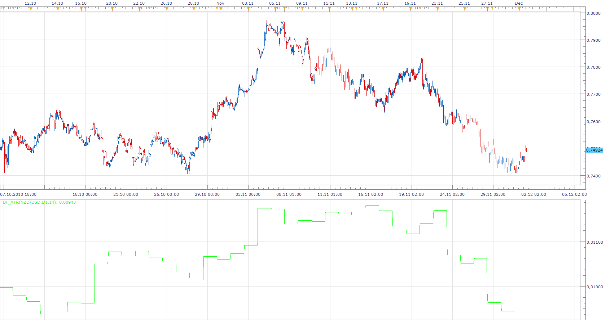

# Biger Time Frame ATR

> Source: https://fxcodebase.com/code/viewtopic.php?f=17&t=2836  
> Forum: 17 · Topic 2836 · 5 post(s)

---

## Biger Time Frame ATR

**Apprentice** · Wed Dec 01, 2010 1:53 pm

Biger Time Frame ATR

 [BF_ATR.lua](files/6484/BF_ATR.lua)

Update
12.5. 2010.

The indicator was revised and updated

---

## Re: Biger Time Frame ATR

**JJBungles** · Sat Jan 01, 2011 7:49 pm

Hello Apprentice,

Thanks for this indicator.

Could you please do a bigger time frame stochastic? I need to be able to adjust the 3 stochastic setting (e.g. 12,8,3) and chosen TF based on the current choice of timeframes (one UTF setting for each TF - so for the 1 hour TF I would like to tell the indicator to show the 4 hour stochastic and on the daily timeframe i would like to select the weekly timeframe so when i switch the chart timeframes thaey automatically adjust). Both lines need to be displayed and colours/thickness/line type of lines require selection. Also I would need to put this indicator and the another indicator in the same frame/window so they overlay eachother.

I hope I am not asking too much.

KR,

JJ

---

## Re: Biger Time Frame ATR

**Apprentice** · Sun Jan 02, 2011 8:45 am

Added to developmental cue.

---

## Re: Biger Time Frame ATR

**Apprentice** · Mon Jan 03, 2011 10:57 am

Simple version can be found here.
[viewtopic.php?f=17&t=3078](https://fxcodebase.com/code/viewtopic.php?f=17&t=3078)
Advanced is in development.

---

## Re: Biger Time Frame ATR

**Apprentice** · Fri Feb 10, 2017 4:40 am

Indicator was revised and updated.
