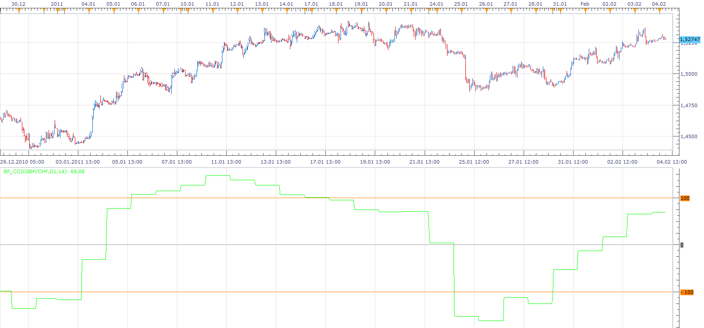

# Biger Time Frame CCI

> Source: https://fxcodebase.com/code/viewtopic.php?f=17&t=3322  
> Forum: 17 · Topic 3322 · 14 post(s)

---

## Biger Time Frame CCI

**Apprentice** · Fri Feb 04, 2011 6:44 am

Biger Time Frame CCI

 [BTF_CCI.lua](files/7921/BTF_CCI.lua)

BTF CCI

The indicator was revised and updated

---

## Re: Biger Time Frame CCI

**Hybrid** · Sun Jun 12, 2011 9:27 pm

Hello fxcodebase team,

Would you please code a strategy that will :
open a long position at the close of a candle when BTF_CCI crosses up the zero ( 0 ) line;
open a short position at the close of a candle when BTF_CCI crosses down the zero ( 0 ) line;
the strategy should close the existing position, before a new position is open in the opposite direction;
the strategy should allow to change the parameters of BTF_CCI.

Thank you.

---

## Re: Biger Time Frame CCI

**Hybrid** · Thu Jun 16, 2011 4:11 pm

Hi,

Would someone please respond whether it is possible to create this strategy?

Thanks.

---

## Re: Biger Time Frame CCI

**Apprentice** · Fri Jun 17, 2011 1:53 am

No need to write a new strategy.
Just use one of the existing CCI strategy.
Like this one.
[viewtopic.php?f=31&t=4562&p=11332&hilit=CCI#p11332](https://fxcodebase.com/code/viewtopic.php?f=31&t=4562&p=11332&hilit=CCI#p11332)

Simple select trading time frame.

---

## Re: Biger Time Frame CCI

**Hybrid** · Fri Jun 17, 2011 7:52 am

Could you please explain how to set this strategy to work on a 15 min chart with 2 Hour BTF_CCI and achieve to following:
On a close of a 15 min candle to enter long if 2 Hour BTF_CCI has crossed up the Zero line.
No limit in pips, no stop loss, the trade has to be closed when (on a close of a 15 min candle)
the 2 Hour BTF_CCI has crossed down the Zero line. At the same time the long trade has been closed, the sreategy has to open a short trade, and so on...
I will be testing the strategy on my life account and I would like to be sure that I understand what I am doing.
If someone could provide a detailed explanation how to set the parameters of the strategy to work on these conditions, I will be very grateful.

[http://fxcodebase.com/code/viewtopic.php?f=31&t=4562](https://fxcodebase.com/code/viewtopic.php?f=31&t=4562)

P.S.
Can the strategy work on two different time frames at the same time, same currency pair(with different period and time settings for BTF_CCI), and also on multiple currency pairs?

Thanks.

---

## Re: Biger Time Frame CCI

**Apprentice** · Fri Jun 17, 2011 12:54 pm

This strategy does not support more than one time frame.
You should write a new strategy that would enable such a thing.

For every pair you need to run a separate strategy.

---

## Re: Biger Time Frame CCI

**Hybrid** · Fri Jun 17, 2011 4:20 pm

Hi Apprentice,

Thanks for the reply!
Can you create a strategy that can work with the settings discribed in my previous post?
The important thing is to be set on a smaller time frame chart with bigger time frame CCI (with option to change the number of periods for CCI), and exit on the next entry, whithout having to choose limit and stop loss.
If this could be done, it would be great!

---

## Re: Biger Time Frame CCI

**Apprentice** · Sat Jun 18, 2011 4:00 am

Your request is added to the developmental cue.

---

## Re: Biger Time Frame CCI

**cruiser** · Fri Oct 14, 2011 3:22 pm

hello,i agree with hybrid.Is it possible to create a bigger time frame cci strategy?

---

## Re: Biger Time Frame CCI

**Apprentice** · Sat Oct 15, 2011 5:48 pm

BTF will be a standard functionality available in the next version.
Please be patient.
Until then, you may used.
[viewtopic.php?f=17&t=3322](https://fxcodebase.com/code/viewtopic.php?f=17&t=3322)
MFT version, however, can be written.

---

## Re: Biger Time Frame CCI

**jtatalov** · Sun Oct 16, 2011 6:11 am

You guys can also higher them to develop the strategies for you, I've used them in the past and they are quite responsive, exhibit willingness to make your program work to your needs, and are very reasonable price-wise.

---

## Re: Biger Time Frame CCI

**4x4partners** · Thu May 07, 2015 1:39 pm

Hi -

I'm getting an error on this indy when backtesting.

An error occurred during the calculation of the indicator 'BTF_CCI'. The error details: BTF_CCI.lua:199: BTF_CCI.lua:173: (null).

---

## Re: Biger Time Frame CCI

**Apprentice** · Fri May 08, 2015 4:36 am

Try updated version.

 

Although this indicator is obsolete.
For some time now, you can select higher time frame source for most of the standard indicator.

---

## Re: Biger Time Frame CCI

**Apprentice** · Mon Jul 03, 2017 7:47 am

The indicator was revised and updated.
