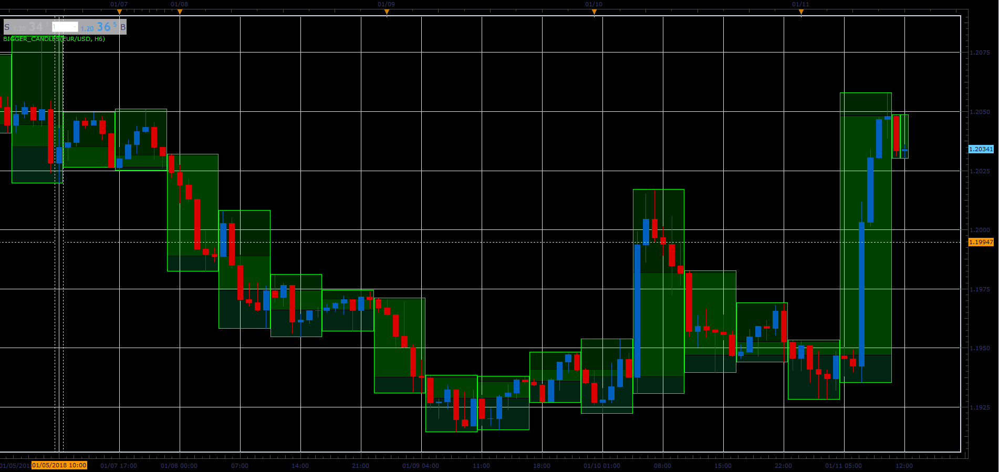

# Bigger Candles

> Source: https://fxcodebase.com/code/viewtopic.php?f=17&t=65623  
> Forum: 17 · Topic 65623 · 7 post(s)

---

## Bigger Candles

**Alexander.Gettinger** · Thu Jan 11, 2018 2:04 pm

Based on request: [viewtopic.php?f=27&t=63673](https://fxcodebase.com/code/viewtopic.php?f=27&t=63673)

The indicator shows candles from bigger timeframe.

 

Download:

 [Bigger_Candles.lua](files/116989/Bigger_Candles.lua)

 [Bigger_Candles with Alert.lua](files/116989/Bigger_Candles%20with%20Alert.lua)

---

## Re: Bigger Candles

**abhijit070** · Sat Apr 14, 2018 8:11 am

Hi,
Is it possible to add bigger candle indicator with alert on time frame?
Kindly send your feedback asap. Your quick response is highly
appreciated.

Thanking you,

---

## Re: Bigger Candles

**Apprentice** · Mon Apr 16, 2018 4:52 am

Your request is added to the development list under Id Number 4110

---

## Re: Bigger Candles

**Apprentice** · Mon May 07, 2018 5:08 am

Can you clarify the conditions for alert.
A.
If any new higher time frame candle appears.
B.
If the new higher time frame candle direction change.

---

## Re: Bigger Candles

**Apprentice** · Tue Jun 26, 2018 6:17 pm

Bigger_Candles with Alert added.

---

## Re: Bigger Candles

**bruno2017** · Thu Jun 28, 2018 7:03 am

hello,
 what is the black line
thank you

---

## Re: Bigger Candles

**Apprentice** · Thu Jun 28, 2018 3:32 pm

Open/Close price level.
