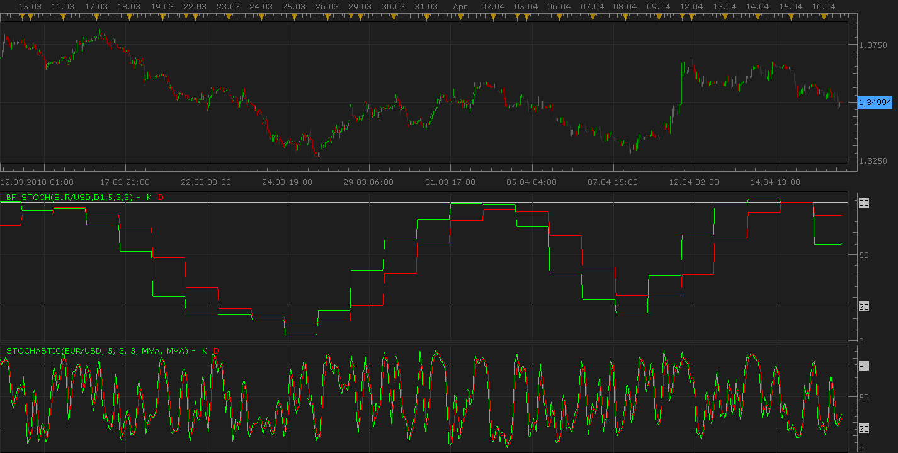

# Bigger frame stochastic

> Source: https://fxcodebase.com/code/viewtopic.php?f=17&t=672  
> Forum: 17 · Topic 672 · 2 post(s)

---

## Bigger frame stochastic

**Nikolay.Gekht** · Fri Apr 16, 2010 12:20 pm

The indicator shows the stochastic indicator applied on other (bigger) time frame. For example you can show hour stochastic on 5-minute chart, or daily stochastic on 1-hour chart.

 

Download the indicator:

 [BF_STOCH.lua](files/1213/BF_STOCH.lua)

The developers can use this indicator as a pattern for the similar indicators. Just change the parameter's set, the output streams for the indicator you want to apply on the bigger time frame, change the creating of this indicator (line 121) and change the data copying.

The indicator was revised and updated

---

## Re: Bigger frame stochastic

**Apprentice** · Sun Dec 25, 2016 7:11 am

Indicator was revised and updated.
