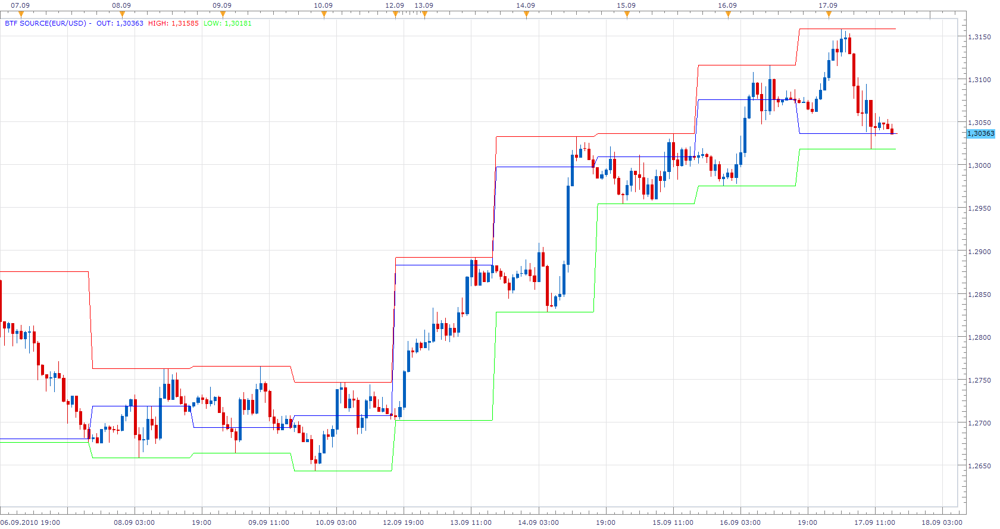

# Bigger Time Frame High/Low (BTF Source)

> Source: https://fxcodebase.com/code/viewtopic.php?f=17&t=2213  
> Forum: 17 · Topic 2213 · 2 post(s)

---

## Bigger Time Frame High/Low (BTF Source)

**Apprentice** · Sat Sep 18, 2010 1:44 pm

This is a derivative of one of my previous project.
It is also building blocks for a project on which I currently work.

Could be interesting to someone, and as an independent indicator.

Displays open, close, high and low Price values for Biger Time Frames.
Giving us HTF Candle or Higher Time Frame overlay.

 [BTF SOURCE.lua](files/4613/BTF%20SOURCE.lua)

MT4/MQ4 version
[viewtopic.php?f=38&t=63985](https://fxcodebase.com/code/viewtopic.php?f=38&t=63985)

---

## Re: Bigger Time Frame High/Low (BTF Source)

**Apprentice** · Tue Jan 17, 2017 6:14 am

Indicator was revised and updated.
