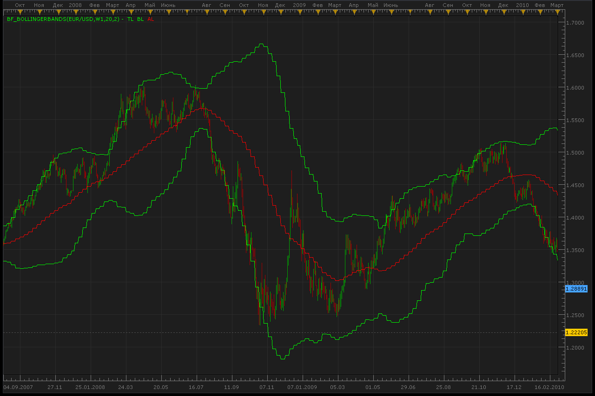

# Bigger timeframe bollinger bands

> Source: https://fxcodebase.com/code/viewtopic.php?f=17&t=963  
> Forum: 17 · Topic 963 · 4 post(s)

---

## Bigger timeframe bollinger bands

**Alexander.Gettinger** · Wed May 05, 2010 11:05 am

This indicator applies the Bollinger Bands on the data of the same instrument but in bigger timeframe (for example week candles on day chart).

 

 [BF_BollingerBands.lua](files/1770/BF_BollingerBands.lua)

MQ4/MT4 version
[viewtopic.php?f=38&t=64216](https://fxcodebase.com/code/viewtopic.php?f=38&t=64216)

The indicator was revised and updated

---

## Re: Bigger timeframe bollinger bands

**prelambang** · Wed May 05, 2010 11:37 pm

thanks for the help!

---

## Re: Bigger timeframe bollinger bands

**skipper** · Wed Nov 17, 2010 3:36 pm

Version 1.1.
commented out timeframe restrictions
synch parameters with hosted BB

---

## Re: Bigger timeframe bollinger bands

**Apprentice** · Thu Feb 02, 2017 4:12 pm

Indicator was revised and updated.
