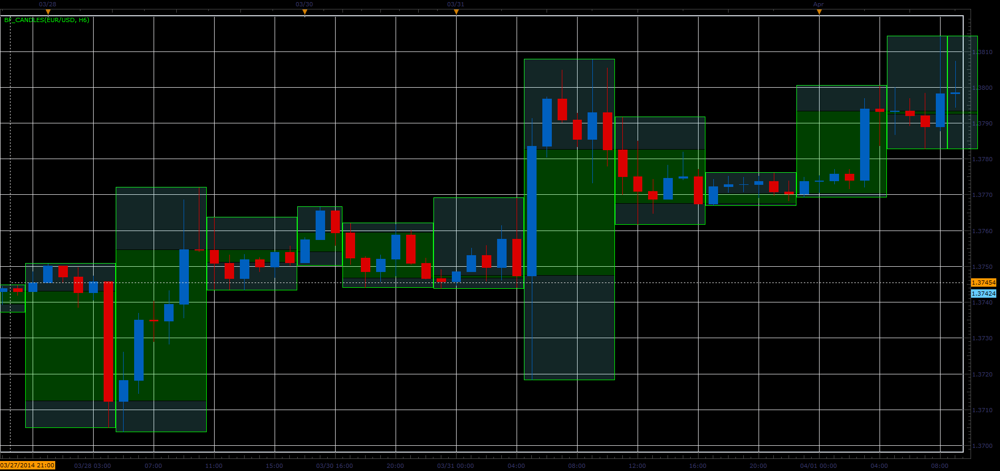

# Bigger timeframe candles

> Source: https://fxcodebase.com/code/viewtopic.php?f=17&t=60511  
> Forum: 17 · Topic 60511 · 8 post(s)

---

## Bigger timeframe candles

**Alexander.Gettinger** · Mon Apr 07, 2014 9:11 am

The indicator draws a larger timeframe candles on the main chart.

 

Download:

 [BF_Candles.lua](files/93413/BF_Candles.lua)

The indicator was revised and updated

---

## Re: Bigger timeframe candles

**forextrader77** · Tue Apr 08, 2014 2:19 pm

Hi. Thanks for programming this. Could you please look over the logic for the drawing of the weekly levels on a daily chart and correct this.

Kind regards forextrader77

---

## Re: Bigger timeframe candles

**forextrader77** · Mon Jun 09, 2014 2:47 pm

Could you please make an option to display the previous period instead of current period, or post a new modified indicator.

---

## Re: Bigger timeframe candles

**Apprentice** · Wed Jun 11, 2014 6:14 am

Try my modified version.

---

## Re: Bigger timeframe candles

**forextrader77** · Wed Jun 11, 2014 12:43 pm

Hey that's great, thanks a lot.

---

## Re: Bigger timeframe candles

**forextrader77** · Wed Jun 25, 2014 5:06 am

> **Apprentice wrote:**
> Try my modified version.

Could you please be so kind to add a function to exclude the weekend data.

Regards

---

## Re: Bigger timeframe candles

**Apprentice** · Thu Jun 26, 2014 2:46 am

Your request is added to the developmental list.

---

## Re: Bigger timeframe candles

**Apprentice** · Sat Jul 01, 2017 4:47 am

The indicator was revised and updated.
