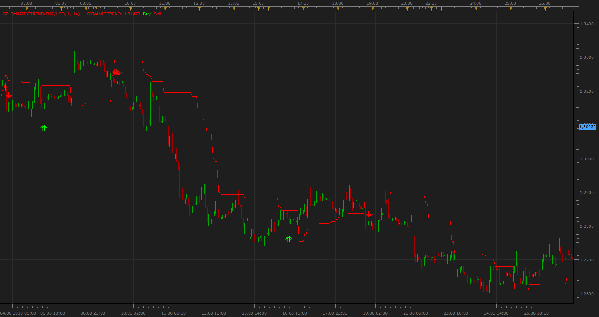

# Bigger Timeframe Dynamic Trend

> Source: https://fxcodebase.com/code/viewtopic.php?f=17&t=2223  
> Forum: 17 · Topic 2223 · 2 post(s)

---

## Bigger Timeframe Dynamic Trend

**Apprentice** · Mon Sep 20, 2010 5:37 am

 [BF_DynamicTrend.lua](files/4638/BF_DynamicTrend.lua)

In order to work you need to have the updated version of Dynamic Trend
[viewtopic.php?f=17&t=1839&p=3662#p3662](https://fxcodebase.com/code/viewtopic.php?f=17&t=1839&p=3662#p3662)

MT4/MQ4 version
[viewtopic.php?f=38&t=64018](https://fxcodebase.com/code/viewtopic.php?f=38&t=64018)

The indicator was revised and updated

---

## Re: Bigger Timeframe Dynamic Trend

**Apprentice** · Fri Jan 20, 2017 6:43 am

Indicator was revised and updated.
