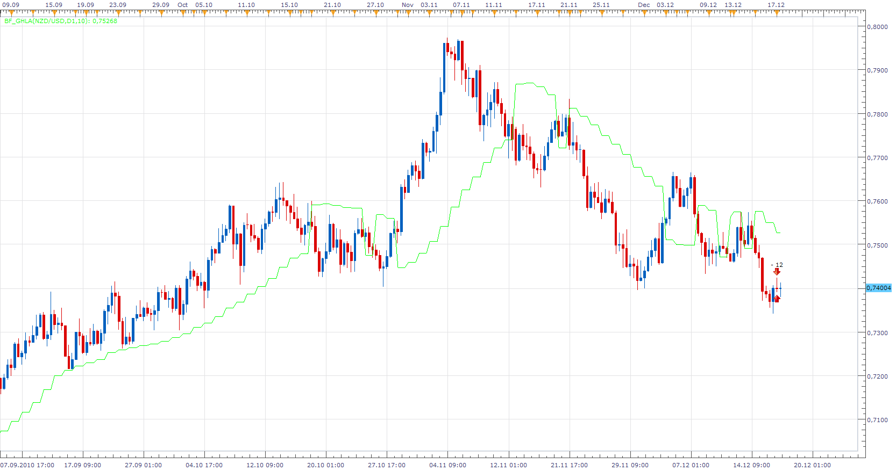

# Bigger timeframe Gann High Low Activator

> Source: https://fxcodebase.com/code/viewtopic.php?f=17&t=2978  
> Forum: 17 · Topic 2978 · 3 post(s)

---

## Bigger timeframe Gann High Low Activator

**Apprentice** · Fri Dec 17, 2010 4:33 am

That this indicator is able to work, you must install GHLA Indicator
[viewtopic.php?f=17&t=227](https://fxcodebase.com/code/viewtopic.php?f=17&t=227)

 [BF_GHLA.lua](files/6835/BF_GHLA.lua)

The indicator was revised and updated

---

## Re: Bigger timeframe Gann High Low Activator

**coldrecs** · Fri Dec 17, 2010 6:12 am

Apprentice, thank you very much for this. I was really looking forward to it

Thanks again!

Coldrecs

---

## Re: Bigger timeframe Gann High Low Activator

**Apprentice** · Wed Feb 01, 2017 7:27 am

Indicator was revised and updated.
