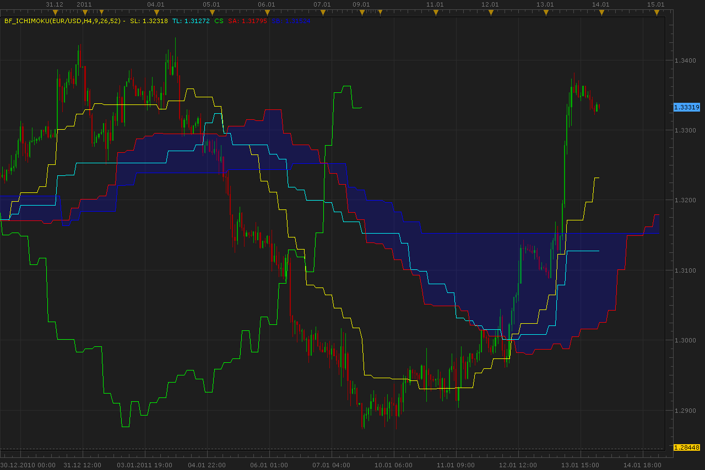

# Bigger timeframe Ichimoku indicator

> Source: https://fxcodebase.com/code/viewtopic.php?f=17&t=3168  
> Forum: 17 · Topic 3168 · 4 post(s)

---

## Bigger timeframe Ichimoku indicator

**Alexander.Gettinger** · Thu Jan 13, 2011 11:47 pm

Download:

 [BF_ICHIMOKU.lua](files/7448/BF_ICHIMOKU.lua)

The indicator was revised and updated

---

## Re: Bigger timeframe Ichimoku indicator

**boursicoton** · Fri Jan 14, 2011 7:39 am

you are the best team !

---

## Re: Bigger timeframe Ichimoku indicator

**deltayod** · Wed Jan 19, 2011 10:43 am

This is a great idea!! However I think that the code is off. As you can see on the pic attached, the Chinkou Shift (CS) should be symmetrical with the Future Cloud (FC). By definition, the second parameter in the Ichimoku system determines the shift in both directions and should be equidistant. The Chinkou tells us the price action X periods ago and the Future Cloud forecasts trend X periods into the future. On a Bigger Timeframe scenario, if we are on H1 chart and we set BF_Ichimoku for H4 (9,26,52), the CS should be 104 periods shifted backward and the Future Cloud also 104 shifted forward. It is very unlikely to use regular Ichimoku AND BF_Ichimoku on same chart because of high complexity and difficulty to read. However, to accomplish same results as Bigger Timerframe Ichimoku, you can set your regular Ichimoku indicator with settings according to the bigger timeframe. For example, on the H1 chart, if you want to see the H4 ichi with (9,26,52) settings, all you have to do is set the settings x4:

 9 x 4 = 36
26 x 4 = 104
52 x 4 = 208

thus your H4 settings would be (36,104,208)

I hope this helps.

---

## Re: Bigger timeframe Ichimoku indicator

**Apprentice** · Sun Feb 12, 2017 7:42 am

Indicator was revised and updated.
