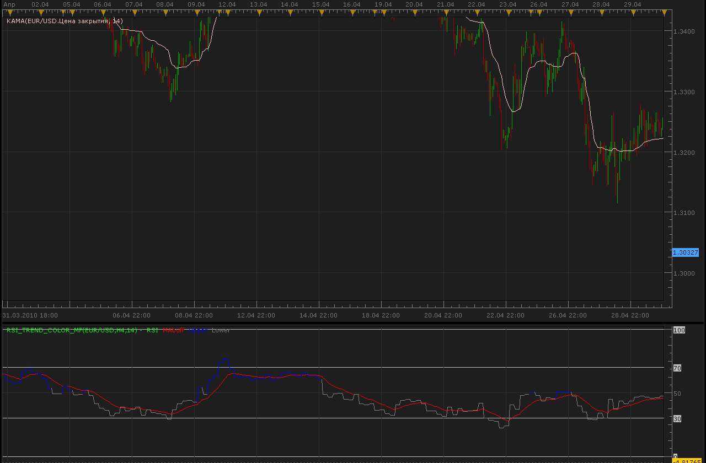

# Bigger timeframe RSI trend color indicator

> Source: https://fxcodebase.com/code/viewtopic.php?f=17&t=948  
> Forum: 17 · Topic 948 · 2 post(s)

---

## Bigger timeframe RSI trend color indicator

**Alexander.Gettinger** · Tue May 04, 2010 10:53 am

This indicator applies the RSI trend coor ([viewtopic.php?f=17&t=947](https://fxcodebase.com/code/viewtopic.php?f=17&t=947)) on the data of the same instrument but in bigger timeframe.

 

Code: [Select all](https://fxcodebase.com/code/)
`-- todo: support week offset

function Init()
    indicator:name("Bigger timeframe RSI");
    indicator:description("");
    indicator:requiredSource(core.Bar);
    indicator:type(core.Oscillator);

    indicator.parameters:addGroup("Calculation");
    indicator.parameters:addString("BS", "Time frame to calculate RSI", "", "D1");
    indicator.parameters:setFlag("BS", core.FLAG_PERIODS);
    indicator.parameters:addInteger("N", "Number of periods for RSI", "", 14, 1, 200);
    indicator.parameters:addInteger("EMA_Period", "EMA_Period", "Period of EMA", 25);
    indicator.parameters:addInteger("overBought", "overBought", "overBought", 50);
    indicator.parameters:addInteger("overSold", "overSold", "overSold", 50);
    indicator.parameters:addGroup("Display");
    indicator.parameters:addColor("RSI_color", "Color of RSI", "Color of RSI", core.rgb(0, 255, 0));
    indicator.parameters:addColor("MA_color", "Color of MA", "Color of MA", core.rgb(255, 0, 0));
    indicator.parameters:addColor("Upper_color", "Color of Upper", "Color of Upper", core.rgb(0, 0, 255));
    indicator.parameters:addColor("Lower_color", "Color of Lower", "Color of Lower", core.rgb(128, 128, 128));

end

local source;                   -- the source
local bf_data = nil;          -- the high/low data
local N;
local BS;
local MA;
local bf_length;                 -- length of the bigger frame in seconds
local dates;                    -- candle dates
local host;
local RSIout;
local day_offset;
local week_offset;
local extent;
local overBought;
local overSold;
local MAbuff;
local data;

function Prepare()
    source = instance.source;
    host = core.host;

    day_offset = host:execute("getTradingDayOffset");
    week_offset = host:execute("getTradingWeekOffset");

    BS = instance.parameters.BS;
    N = instance.parameters.N;
    overBought=instance.parameters.overBought;
    overSold=instance.parameters.overSold;
    EMA_Period=instance.parameters.EMA_Period;
    extent = N*2;

    local s, e, s1, e1;

    s, e = core.getcandle(source:barSize(), core.now(), 0, 0);
    s1, e1 = core.getcandle(BS, core.now(), 0, 0);
    assert ((e - s) <= (e1 - s1), "The chosen time frame must be bigger than the chart time frame!");
    bf_length = math.floor((e1 - s1) * 86400 + 0.5);
    data = instance:addInternalStream(0, 0);
    MA = core.indicators:create("EMA", data, EMA_Period);
    local name = profile:id() .. "(" .. source:name() .. "," .. BS .. "," .. N .. ")";
    instance:name(name);
    RSIout = instance:addStream("RSIout", core.Line, name .. ".RSI", "RSI", instance.parameters.RSI_color, 0);
    MAbuff = instance:addStream("MAbuff", core.Line, name .. ".MAbuff", "MAbuff", instance.parameters.MA_color, 0);
    Upper = instance:addStream("Upper", core.Line, name .. ".Upper", "Upper", instance.parameters.Upper_color, 0);
    Lower = instance:addStream("Lower", core.Line, name .. ".Lower", "Lower", instance.parameters.Lower_color, 0);
    RSIout:addLevel(0);   
    RSIout:addLevel(30);   
    RSIout:addLevel(70);   
    RSIout:addLevel(100);   

end

local loading = false;
local loadingFrom, loadingTo;
local pday = nil;

-- the function which is called to calculate the period
function Update(period, mode)
    -- get date and time of the hi/lo candle in the reference data
    local bf_candle;
    bf_candle = core.getcandle(BS, source:date(period), day_offset, week_offset);

    -- if data for the specific candle are still loading
    -- then do nothing
    if loading and bf_candle >= loadingFrom and (loadingTo == 0 or bf_candle <= loadingTo) then
        return ;
    end

    -- if the period is before the source start
    -- the do nothing
    if period < source:first() then
        return ;
    end

    -- if data is not loaded yet at all
    -- load the data
    if bf_data == nil then
        -- there is no data at all, load initial data
        local to, t;
        local from;

        if (source:isAlive()) then
            -- if the source is subscribed for updates
            -- then subscribe the current collection as well
            to = 0;
        else
            -- else load up to the last currently available date
            t, to = core.getcandle(BS, source:date(period), day_offset, week_offset);
        end

        from = core.getcandle(BS, source:date(source:first()), day_offset, week_offset);
        RSIout:setBookmark(1, period);
        -- shift so the bigger frame data is able to provide us with the stoch data at the first period
        from = math.floor(from * 86400 - (bf_length * extent) + 0.5) / 86400;
        local nontrading, nontradingend;
        nontrading, nontradingend = core.isnontrading(from, day_offset);
        if nontrading then
            -- if it is non-trading, shift for two days to skip the non-trading periods
            from = math.floor((from - 2) * 86400 - (bf_length * extent) + 0.5) / 86400;
        end
        loading = true;
        loadingFrom = from;
        loadingTo = to;
        bf_data = host:execute("getHistory", 1, source:instrument(), BS, loadingFrom, to, source:isBid());
        RSI = core.indicators:create("RSI", bf_data.close, N);
       
        return ;
    end

    -- check whether the requested candle is before
    -- the reference collection start
    if (bf_candle < bf_data:date(0)) then
        SK:setBookmark(1, period);
        if loading then
            return ;
        end
        -- shift so the bigger frame data is able to provide us with the stoch data at the first period
        from = math.floor(bf_candle * 86400 - (bf_length * extent) + 0.5) / 86400;
        local nontrading, nontradingend;
        nontrading, nontradingend = core.isnontrading(from, day_offset);
        if nontrading then
            -- if it is non-trading, shift for two days to skip the non-trading periods
            from = math.floor((from - 2) * 86400 - (bf_length * extent) + 0.5) / 86400;
        end
        loading = true;
        loadingFrom = from;
        loadingTo = bf_data:date(0);
        host:execute("extendHistory", 1, bf_data, loadingFrom, loadingTo);
        return ;
    end

    -- check whether the requested candle is after
    -- the reference collection end
    if (not(source:isAlive()) and bf_candle > bf_data:date(bf_data:size() - 1)) then
        RSIout:setBookmark(1, period);
        if loading then
            return ;
        end
        loading = true;
        loadingFrom = bf_data:date(bf_data:size() - 1);
        loadingTo = bf_candle;
        host:execute("extendHistory", 1, bf_data, loadingFrom, loadingTo);
        return ;
    end

    RSI:update(mode);
    local p;
    p = findDateFast(bf_data, bf_candle, true);
    if p == -1 then
        return ;
    end
    if RSI:getStream(0):hasData(p) then
        RSIout[period] = RSI:getStream(0)[p];
        data[period]=RSIout[period]
        MA:update(mode);
        MAbuff[period]=MA.DATA[period];
       
       
     if period>source:first()+2 then   
     if RSIout[period]>overBought then
      Upper[period]=RSIout[period];
      Upper[period-1]=RSIout[period-1];
     else
      Upper[period]=nil;
      if Upper[period-2]==nil then
       Upper[period-1]=nil;
      end
      if RSIout[period]<overSold then
       Lower[period]=RSIout[period];
      Lower[period-1]=RSIout[period-1];
      else
       Lower[period]=nil;
       if Lower[period-2]==nil then
        Lower[period-1]=nil;
       end
      end
     end
     end   
     
    end
end

-- the function is called when the async operation is finished
function AsyncOperationFinished(cookie)
    local period;

    pday = nil;
    period = RSIout:getBookmark(1);

    if (period < 0) then
        period = 0;
    end
    loading = false;
    instance:updateFrom(period);
end

function findDateFast(stream, date, precise)
    local datesec = nil;
    local periodsec = nil;
    local min, max, mid;

    datesec = math.floor(date * 86400 + 0.5)

    min = 0;
    max = stream:size() - 1;

    while true do
        mid = math.floor((min + max) / 2);
        periodsec = math.floor(stream:date(mid) * 86400 + 0.5);
        if datesec == periodsec then
            return mid;
        elseif datesec > periodsec then
            min = mid + 1;
        else
            max = mid - 1;
        end
        if min > max then
            if precise then
                return -1;
            else
                return min - 1;
            end
        end
    end
end`

---

## Re: Bigger timeframe RSI trend color indicator

**Apprentice** · Sun Jan 08, 2017 10:19 am

Indicator was revised and updated.
