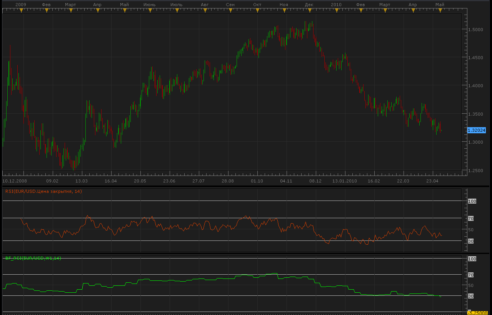
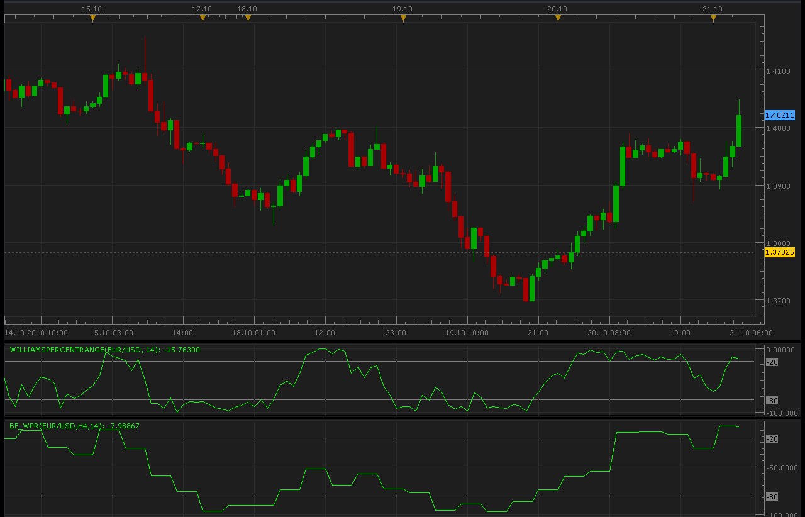
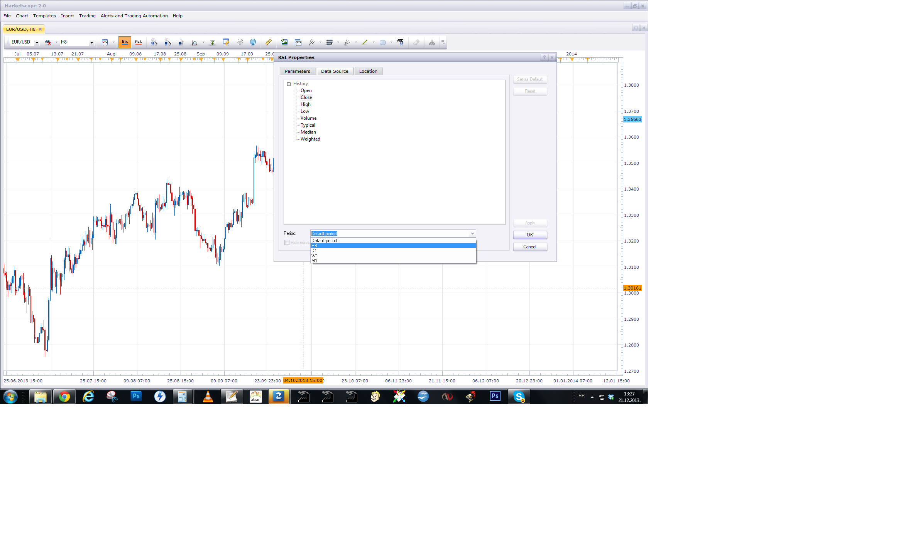

# Bigger timeframe RSI

> Source: https://fxcodebase.com/code/viewtopic.php?f=17&t=942  
> Forum: 17 · Topic 942 · 9 post(s)

---

## Bigger timeframe RSI

**Alexander.Gettinger** · Mon May 03, 2010 11:25 pm

This indicator applies the RSI on the data of the same instrument but in bigger timeframe (for example week candles on day chart).

 

The indicator was revised and updated

 [BF_RSI.lua](files/1721/BF_RSI.lua)

---

## Re: Bigger timeframe RSI

**simniskis** · Tue Oct 19, 2010 5:19 pm

Thanks Alexander,
very usefull for me. Do you think it is possible to make the same indicator with Williams%R (instead RSI)?
Thanks a lot.
Sergio

---

## Re: Bigger timeframe RSI

**Alexander.Gettinger** · Wed Oct 20, 2010 2:36 am

OK.
I shall do this.

---

## Re: Bigger timeframe RSI

**Alexander.Gettinger** · Thu Oct 21, 2010 3:57 am

Bigger timeframe Williams Percent Range (WPR).

 

Code: [Select all](https://fxcodebase.com/code/)
`function Init()
    indicator:name("Bigger timeframe WPR");
    indicator:description("");
    indicator:requiredSource(core.Bar);
    indicator:type(core.Oscillator);

    indicator.parameters:addGroup("Calculation");
    indicator.parameters:addString("BS", "Time frame to calculate WPR", "", "D1");
    indicator.parameters:setFlag("BS", core.FLAG_PERIODS);
    indicator.parameters:addInteger("N", "Number of periods for WPR", "", 14, 1, 200);
    indicator.parameters:addGroup("Display");
    indicator.parameters:addColor("WPRclr", "Color of WPR", "Color of WPR", core.rgb(0, 255, 0));
end

local source;                   -- the source
local bf_data = nil;          -- the high/low data
local N;
local BS;
local bf_length;                 -- length of the bigger frame in seconds
local dates;                    -- candle dates
local host;
local WPRout;
local day_offset;
local week_offset;
local extent;
local WPR;

function Prepare()
    source = instance.source;
    host = core.host;

    day_offset = host:execute("getTradingDayOffset");
    week_offset = host:execute("getTradingWeekOffset");

    BS = instance.parameters.BS;
    N = instance.parameters.N;
    extent = N*2;

    local s, e, s1, e1;

    s, e = core.getcandle(source:barSize(), core.now(), 0, 0);
    s1, e1 = core.getcandle(BS, core.now(), 0, 0);
    assert ((e - s) <= (e1 - s1), "The chosen time frame must be bigger than the chart time frame!");
    bf_length = math.floor((e1 - s1) * 86400 + 0.5);

    local name = profile:id() .. "(" .. source:name() .. "," .. BS .. "," .. N .. ")";
    instance:name(name);
    WPRout = instance:addStream("WPRout", core.Line, name .. ".WPR", "WPR", instance.parameters.WPRclr, 0);
    WPRout:addLevel(-20);   
    WPRout:addLevel(-80);   

end

local loading = false;
local loadingFrom, loadingTo;
local pday = nil;

-- the function which is called to calculate the period
function Update(period, mode)
    -- get date and time of the hi/lo candle in the reference data
    local bf_candle;
    bf_candle = core.getcandle(BS, source:date(period), day_offset, week_offset);

    -- if data for the specific candle are still loading
    -- then do nothing
    if loading and bf_candle >= loadingFrom and (loadingTo == 0 or bf_candle <= loadingTo) then
        return ;
    end

    -- if the period is before the source start
    -- the do nothing
    if period < source:first() then
        return ;
    end

    -- if data is not loaded yet at all
    -- load the data
    if bf_data == nil then
        -- there is no data at all, load initial data
        local to, t;
        local from;

        if (source:isAlive()) then
            -- if the source is subscribed for updates
            -- then subscribe the current collection as well
            to = 0;
        else
            -- else load up to the last currently available date
            t, to = core.getcandle(BS, source:date(period), day_offset, week_offset);
        end

        from = core.getcandle(BS, source:date(source:first()), day_offset, week_offset);
        WPRout:setBookmark(1, period);
        -- shift so the bigger frame data is able to provide us with the stoch data at the first period
        from = math.floor(from * 86400 - (bf_length * extent) + 0.5) / 86400;
        local nontrading, nontradingend;
        nontrading, nontradingend = core.isnontrading(from, day_offset);
        if nontrading then
            -- if it is non-trading, shift for two days to skip the non-trading periods
            from = math.floor((from - 2) * 86400 - (bf_length * extent) + 0.5) / 86400;
        end
        loading = true;
        loadingFrom = from;
        loadingTo = to;
        bf_data = host:execute("getHistory", 1, source:instrument(), BS, loadingFrom, to, source:isBid());
        WPR = core.indicators:create("WILLIAMSPERCENTRANGE", bf_data, N);
        return ;
    end

    -- check whether the requested candle is before
    -- the reference collection start
    if (bf_candle < bf_data:date(0)) then
        WPRout:setBookmark(1, period);
        if loading then
            return ;
        end
        -- shift so the bigger frame data is able to provide us with the stoch data at the first period
        from = math.floor(bf_candle * 86400 - (bf_length * extent) + 0.5) / 86400;
        local nontrading, nontradingend;
        nontrading, nontradingend = core.isnontrading(from, day_offset);
        if nontrading then
            -- if it is non-trading, shift for two days to skip the non-trading periods
            from = math.floor((from - 2) * 86400 - (bf_length * extent) + 0.5) / 86400;
        end
        loading = true;
        loadingFrom = from;
        loadingTo = bf_data:date(0);
        host:execute("extendHistory", 1, bf_data, loadingFrom, loadingTo);
        return ;
    end

    -- check whether the requested candle is after
    -- the reference collection end
    if (not(source:isAlive()) and bf_candle > bf_data:date(bf_data:size() - 1)) then
        WPRout:setBookmark(1, period);
        if loading then
            return ;
        end
        loading = true;
        loadingFrom = bf_data:date(bf_data:size() - 1);
        loadingTo = bf_candle;
        host:execute("extendHistory", 1, bf_data, loadingFrom, loadingTo);
        return ;
    end

    WPR:update(mode);
    local p;
    p = findDateFast(bf_data, bf_candle, true);
    if p == -1 then
        return ;
    end
    if WPR:getStream(0):hasData(p) then
        WPRout[period] = WPR:getStream(0)[p];
    end
end

-- the function is called when the async operation is finished
function AsyncOperationFinished(cookie)
    local period;

    pday = nil;
    period = WPRout:getBookmark(1);

    if (period < 0) then
        period = 0;
    end
    loading = false;
    instance:updateFrom(period);
end

function findDateFast(stream, date, precise)
    local datesec = nil;
    local periodsec = nil;
    local min, max, mid;

    datesec = math.floor(date * 86400 + 0.5)

    min = 0;
    max = stream:size() - 1;

    while true do
        mid = math.floor((min + max) / 2);
        periodsec = math.floor(stream:date(mid) * 86400 + 0.5);
        if datesec == periodsec then
            return mid;
        elseif datesec > periodsec then
            min = mid + 1;
        else
            max = mid - 1;
        end
        if min > max then
            if precise then
                return -1;
            else
                return min - 1;
            end
        end
    end
end`

For this indicator must be installed Williams Percent Range (WPR) indicator ([viewtopic.php?f=17&t=898&p=1640](https://fxcodebase.com/code/viewtopic.php?f=17&t=898&p=1640)).

---

## Re: Bigger timeframe RSI

**simniskis** · Thu Oct 21, 2010 7:41 am

You answer my question very fast !!!
Thank you very much.

---

## Re: Bigger timeframe RSI

**Apprentice** · Wed Dec 01, 2010 1:50 pm

BF RSI Update.
Bug Fix.

---

## Re: Bigger timeframe RSI

**Pride80** · Thu Dec 19, 2013 2:55 pm

Thank you Alexander, great job.

Could i have a version of this indicator that allows me to zoom the RSI so that i have a range between 30 to 70 (for example) displayed? I dislike the default range from 0 to 100, cause i don't see properly the zone that i care more about, the 40-60 one.

Thank you very much

---

## Re: Bigger timeframe RSI

**Apprentice** · Sat Dec 21, 2013 7:28 am

Try Updated Version.

 

FYI.
We have ceased to provide support for Bigger time frame Indicators.
As TS now supports this functionality.

---

## Re: Bigger timeframe RSI

**Apprentice** · Sun Aug 06, 2017 7:19 am

The indicator was revised and updated.
