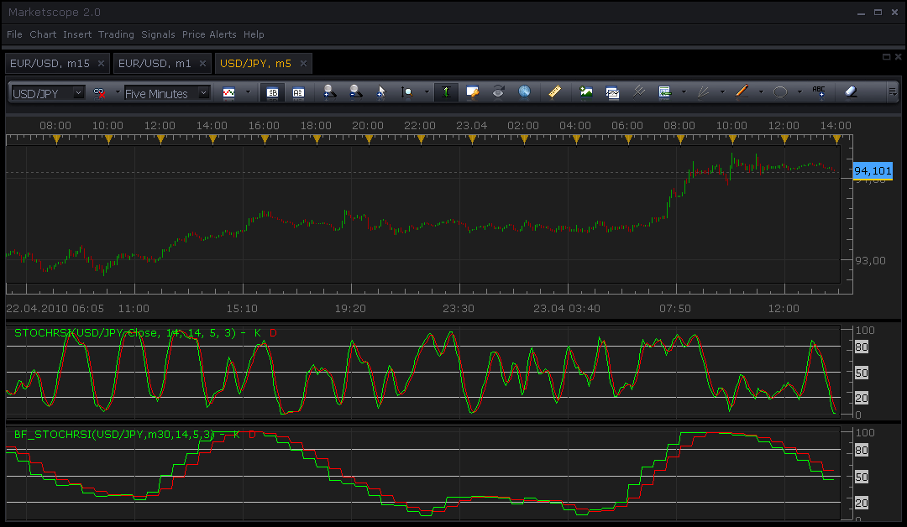

# Bigger timeframe Stochastic RSI

> Source: https://fxcodebase.com/code/viewtopic.php?f=17&t=761  
> Forum: 17 · Topic 761 · 3 post(s)

---

## Bigger timeframe Stochastic RSI

**Nikolay.Gekht** · Fri Apr 23, 2010 1:02 pm

This indicator applies the [Stochastic RSI](https://fxcodebase.com/code/viewtopic.php?f=17&t=451) on the data of the same instrument but in bigger timeframe (for example 30 minute candles on 5 minute chart).

 

Download:

 [BF_STOCHRSI.lua](files/1403/BF_STOCHRSI.lua)

The [Stochastic RSI](https://fxcodebase.com/code/viewtopic.php?f=17&t=451) must be also installed!

The indicator was revised and updated

---

## Re: Bigger timeframe Stochastic RSI

**li521798** · Mon Apr 26, 2010 9:33 am

---

## Re: Bigger timeframe Stochastic RSI

**Apprentice** · Sun Dec 25, 2016 7:06 am

Indicator was revised and updated.
