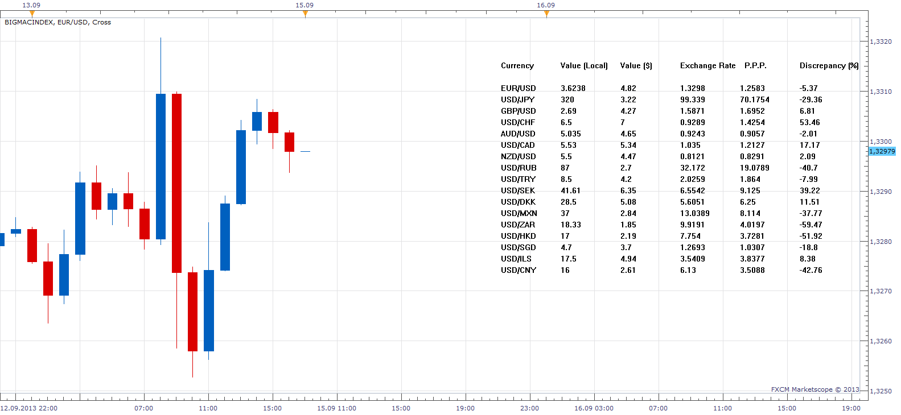
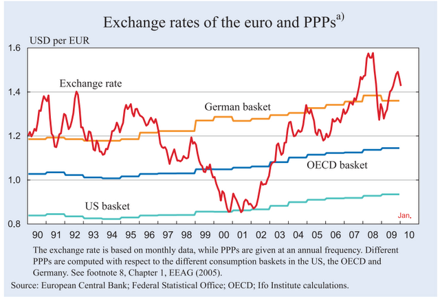

# BigMacIndex

> Source: https://fxcodebase.com/code/viewtopic.php?f=17&t=4237  
> Forum: 17 · Topic 4237 · 11 post(s)

---

## BigMacIndex

**Apprentice** · Sat May 14, 2011 11:02 am

 [BigMacIndex.bin](files/10627/BigMacIndex.bin)

The content is encrypted.
Bin extension is identical to Lua extension.

Please be subscribed to the following currency pairs (It is not mandatory)
EUR/USD","USD/JPY", "GBP/USD", "USD/CHF", "AUD/USD", "USD/CAD", "NZD/USD","USD/RUB", "USD/TRY", "USD/SEK", "USD/DKK", "USD/MXN", "USD/ZAR", "USD/HKD", "USD/SGD", "USD/ILS"

If the maximum number of subscriptions in your account is 20.
Ask the FXCM support to cancel this restriction.

One request.
In order to keep Big Mac Index up to date.
Post any changes in the price of Big Mac in observed countries.

---

## Re: BigMacIndex

**Apprentice** · Sat May 14, 2011 11:04 am

The Big Mac Index is an informal way of measuring of Purchasing power parity (PPP) between two currencies.

 Even quite serious economists, such as those from the Federal Reserve Bank of Dallas use it.
[The Big Mac: A Global-to-Local Look at Pricing .](http://www.dallasfed.org/research/eclett/2008/el0809.html)

The premise of the Big Mac Index is the existence of LOP (Eng. Law of One Price)
Burger dollar price should not vary from country to country.
Commodity prices should be the same in both countries observed.
And the main role of the exchange rate is to correct any disproportion.

Exchange rates obtained by purchasing power parity balances cost of goods and services in both countrys.

Price of BigMac in US * Exchange rates = Price of BigMac in observed country.

In one sentence, the Purchasing power parity is Target exchange rate for the observed currency.

Burger method for estimating the PPP has its limitations.
Differences may arise due to transport costs, higher tax rates, labor costs, levels of competition and trade barriers.

Note.
Big Mac Index is not full-blooded counterpart of P.P.P.
Has lower accuracy, but its calculation is simpler.
Genuine PPP requires the use of Data sources, which I do not have available to me.

 

Euro Dollar target rate using both methods.
Big Mac Index - 1.1035
Purchasing power parity -1,16636
(Data for the last year)

---

## Re: BigMacIndex

**Apprentice** · Wed May 23, 2012 12:05 pm

I need help from you.
Can you help me update this indicator.
I need a Big Mac Price, in local curency, for add currency from list.

---

## Re: BigMacIndex

**Nikolay.Gekht** · Mon Jun 11, 2012 12:39 pm

[http://www.economist.com/blogs/graphicd ... ly-chart-3](http://www.economist.com/blogs/graphicdetail/2012/01/daily-chart-3)

---

## Re: BigMacIndex

**Apprentice** · Tue Jun 12, 2012 3:13 am

Thank you, Nikolay.
The indicator has now been updated to reflect the impact of inflation.
Plus I added Israeli Shekel and Chinese yuan.
Interestingly, inflation is significantly different from country to country.
From negative, zero, to positive.
And as you know inflation is one of the major fundamentals that moves the markets.

---

## Re: BigMacIndex

**Apprentice** · Tue Jun 12, 2012 4:57 am

It would be interesting to see BigMacIndex for some of the eurozone countries.
Like Germany or and PIGS ( Portugal, Italy, Greece, Spain).
If you have price for a Big Mac for this country.
I can add this indices also.

---

## Re: BigMacIndex

**Apprentice** · Sun Sep 15, 2013 9:24 am

Big Mac prices updated.
Minor Bug Fix
U.S. Dollar denominated parameter added.

---

## Re: BigMacIndex

**SANTOSH** · Wed Jul 22, 2015 3:29 am

> **Apprentice wrote:**
> Big Mac prices updated.
> Minor Bug Fix
> U.S. Dollar denominated parameter added.

where can i find the updated big mac price indicator with minor bug fixed , i mean the recent fixed file ,one that you mentioned above ?

---

## Re: BigMacIndex

**Apprentice** · Wed Jul 22, 2015 4:08 am

Top/First topic of this topic.

---

## Re: BigMacIndex

**Apprentice** · Wed Jul 22, 2015 4:37 am

Data is Now up to date

---

## Re: BigMacIndex

**Apprentice** · Wed Jul 19, 2017 8:37 am

Bump up.
